I've been working on AI projects for a while now—from building [VulcanAI](https://stevengann.com/posts/VulcanAI/) as a modular agent framework to wrestling with [LIDAR data in my robot projects](https://stevengann.com/posts/Robot/). What I've learned is that while everyone wants to talk about neural networks and large language models, the real workhorses behind intelligent systems are the unsexy algorithms that have been around for decades.

This is the first post in a series about machine learning foundations, but I'm deliberately starting with the building blocks that predated the current AI boom. These are the techniques that still power the pathfinding in your GPS, the decision making in game AI, and the optimization routines that train those fancy neural networks everyone obsesses over.

## Backstory: Why Classical Techniques Still Matter

When I started building the Mite robot, I needed it to navigate around obstacles and map unknown environments. Sure, I could have thrown a neural network at the problem, but what I actually needed was A* pathfinding running on a grid built from LIDAR data organized in spatial data structures. No deep learning required—just solid fundamentals applied intelligently.

The same pattern appears everywhere. My [VulcanAI](https://stevengann.com/posts/VulcanAI/) project uses knowledge bases for structured information storage, and when I need to optimize hyperparameters or solve complex scheduling problems, I reach for genetic algorithms or simulated annealing long before I consider training a model.

These classical approaches have a few advantages that modern AI sometimes forgets: they're interpretable, they work with small datasets, and when they fail, you can usually figure out why. Plus, understanding them makes you a better AI practitioner overall.

## Data Structures: How Machines Actually Store Knowledge

### Graph Structures: Everything is Connected

[Graph theory](https://en.wikipedia.org/wiki/Graph_theory) is one of those mathematical concepts that shows up everywhere once you start looking for it. I've used graphs to represent state spaces in game AI, dependency relationships between system components, and knowledge networks in my AI projects.

**Undirected graphs** work great when relationships are symmetric—think of social connections or mutual dependencies between services. **Directed graphs** handle asymmetric relationships like web links, causal chains, or the control flow in a program.

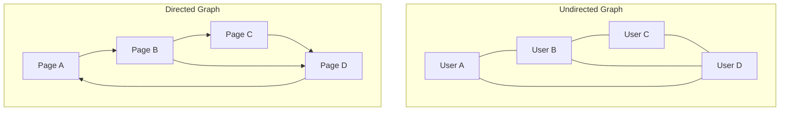

_Note: At the time of this writing there is a bug in my website's Mermaid diagram renderer. The Undirected Graph's connections should not have arrows, just lines connecting without any implied direction._

What makes graphs particularly useful in AI is their flexibility. The same graph representation can model a robot's state space (nodes = positions, edges = possible moves) or a knowledge network in a chatbot (nodes = concepts, edges = relationships). It's a universal language for describing relationships, which is why graph databases are having a moment in AI applications.

### Binary Trees: Hierarchical Organization

[Binary trees](https://en.wikipedia.org/wiki/Binary_tree) are one of those fundamental data structures that show up everywhere once you start looking. A binary tree is simply a hierarchical structure where each node has at most two children, typically called left and right. What makes them powerful isn't complexity—it's their elegant simplicity and the efficient algorithms they enable.

I've used binary trees in everything from building expression parsers to implementing efficient search structures. The key insight is that binary trees provide O(log n) operations for many common tasks when properly balanced, turning what would be linear searches through arrays into logarithmic tree traversals.

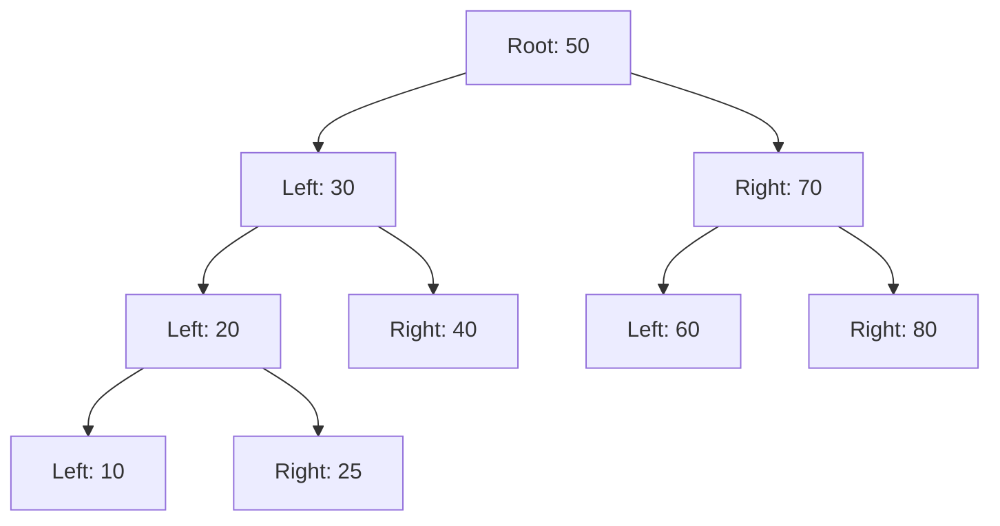

**Binary Search Trees** are probably the most common application I encounter. They maintain the property that left children are smaller than their parent, and right children are larger. This ordering enables efficient searching, insertion, and deletion operations. When I need to maintain a sorted collection that supports fast lookups and modifications, BSTs are my go-to choice.

**Expression Trees** represent mathematical or logical expressions in tree form, where operators are internal nodes and operands are leaves. I've built several parsers that construct expression trees to evaluate complex formulas. The tree structure makes it easy to handle operator precedence and enables straightforward evaluation through tree traversal.

Binary trees also serve as the foundation for more complex structures like heaps (priority queues), tries (for string matching), and even as building blocks in some neural network architectures. The hierarchical nature makes them natural for representing recursive relationships and enabling divide-and-conquer algorithms.

### Spatial Data Structures: Making Sense of Space

When I started working with LIDAR data from the Mite robot, I quickly discovered that naive approaches to spatial queries don't scale. Checking distances between thousands of points every frame becomes computationally expensive fast. That's where [quadtrees](https://en.wikipedia.org/wiki/Quadtree) and [octrees](https://en.wikipedia.org/wiki/Octree) saved the day.

Quadtrees recursively subdivide 2D space into quadrants, while octrees do the same for 3D space with eight octants. Instead of checking every point against every other point, you can eliminate entire regions from consideration with a single comparison.

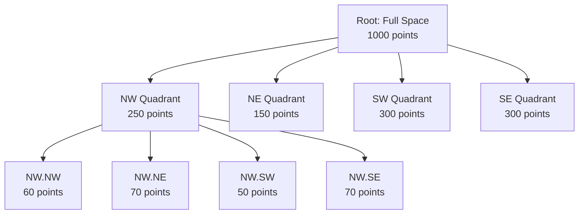

The performance improvement is dramatic—what used to be O(n²) operations become O(log n) in most cases. For real-time robotics applications, this difference determines whether your robot can navigate smoothly or jerks around like it's thinking too hard about every move.

### Knowledge Bases: Structured Thinking

Before neural networks learned to embed knowledge in weight matrices, AI systems stored information in [knowledge bases](https://en.wikipedia.org/wiki/Knowledge_base)—explicit collections of facts, rules, and relationships. I'm using a variation of this approach in VulcanAI, where structured knowledge complements the more flexible but less predictable LLM responses.

Knowledge bases have a clarity that neural networks lack. You can inspect exactly what the system knows, trace how it reaches conclusions, and debug problems by examining the logical connections.

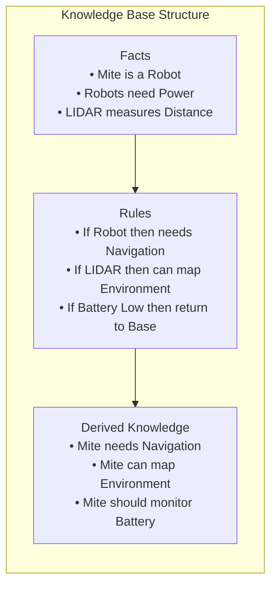

The trade-off is flexibility. Knowledge bases require explicit programming of relationships, while neural networks can learn patterns from data. But for applications where you need explainable reasoning or reliable behavior in edge cases, explicit knowledge representation still has advantages.

## Search Algorithms: Finding Solutions in Complex Spaces

### Breadth-First Search: The Methodical Approach

[Breadth-First Search (BFS)](https://en.wikipedia.org/wiki/Breadth-first_search) is like that methodical colleague who always finds the optimal solution by checking everything systematically. It explores every node at the current distance before moving to nodes further away, guaranteeing the shortest path in unweighted graphs.

I've used BFS countless times for pathfinding in game projects and analyzing network structures in graph databases. Its systematic approach makes it reliable, even if it's not always the most efficient option.

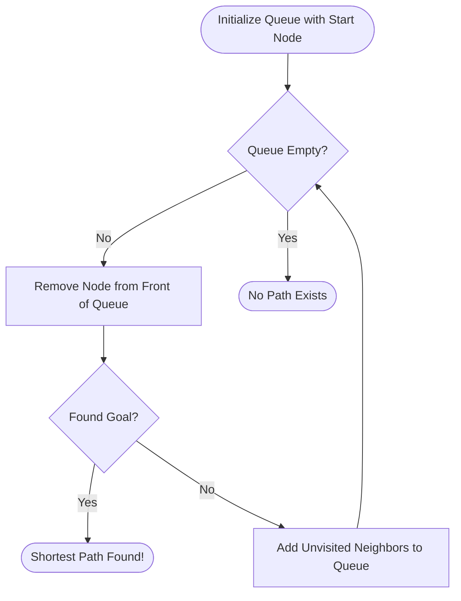

The key insight with BFS is that it trades memory for optimality. It might use more RAM than other approaches, but you can trust that the first solution it finds is the shortest possible. For applications where "good enough" isn't good enough, BFS delivers.

### Depth-First Search: Going Deep Fast

[Depth-First Search (DFS)](https://en.wikipedia.org/wiki/Depth-first_search) is BFS's impulsive cousin—it picks a direction and commits, exploring as far as possible before backtracking. While it doesn't guarantee the shortest path, it uses less memory and can be surprisingly effective for certain types of problems.

DFS shines when you need to explore all possible solutions or when you're working with deep, narrow search spaces. I've used it for maze generation, dependency analysis, and situations where finding any solution quickly matters more than finding the optimal solution.

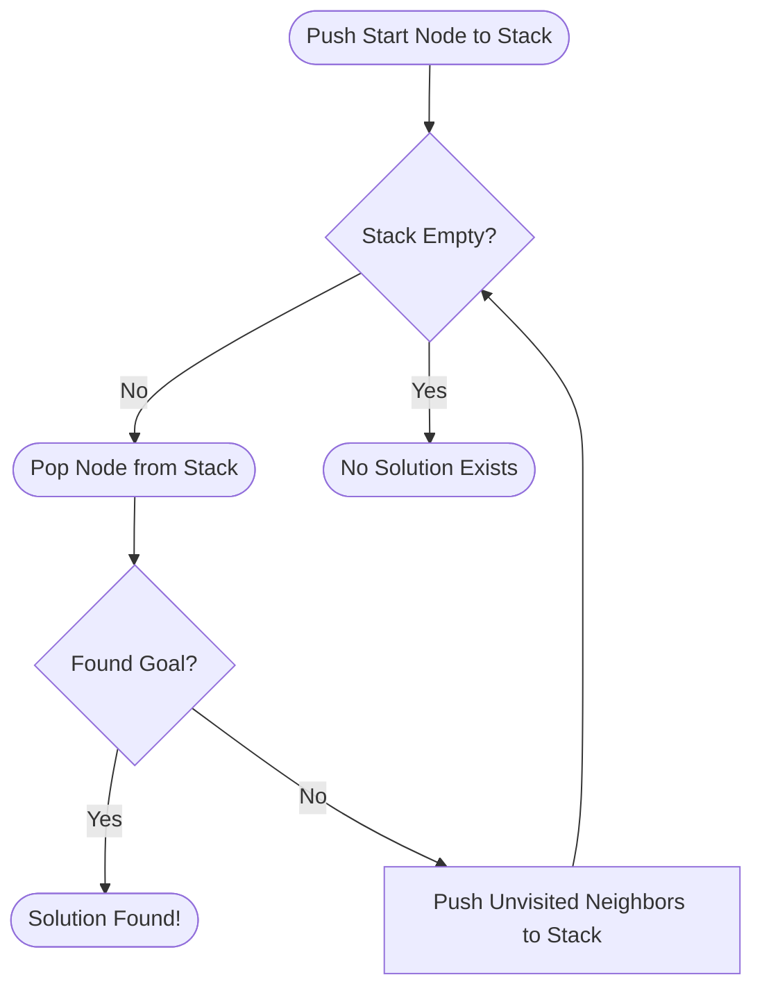

The recursive nature of DFS makes it intuitive to implement, but be careful with deep recursion in languages that don't optimize tail calls. I learned this the hard way debugging stack overflow errors in a C# maze solver.

### Dijkstra's Algorithm: When Every Step Has a Cost

[Dijkstra's algorithm](https://en.wikipedia.org/wiki/Dijkstra%27s_algorithm) extends pathfinding to weighted graphs, where moving from one node to another has different costs. It's the algorithm behind GPS navigation—finding the fastest route when some roads are slower than others.

The algorithm maintains a priority queue of nodes sorted by their total distance from the start, ensuring that shorter paths are always explored before longer ones. This guarantee of optimality makes it essential for applications where the cost of suboptimal solutions is high.

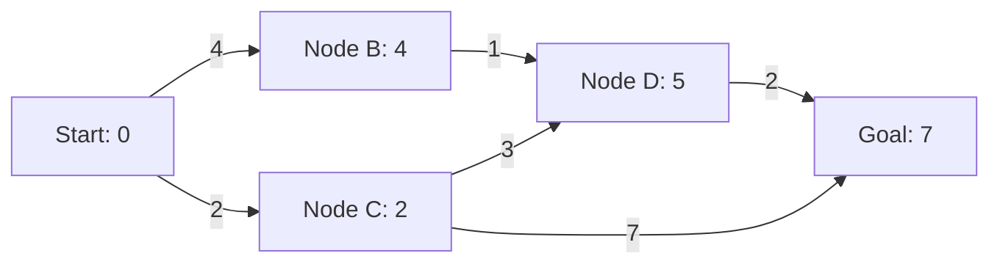

What I appreciate about Dijkstra is its reliability. Once you understand the algorithm, you can implement it confidently knowing it will find the optimal path every time. The performance cost is usually worth it when correctness matters more than speed.

### A* Algorithm: Pathfinding with Intuition

[A* (A-star)](https://en.wikipedia.org/wiki/A*_search_algorithm) is where pathfinding gets interesting. It combines Dijkstra's optimality with heuristic guidance, using both the actual cost from the start and an estimated cost to the goal. The result is an algorithm that finds optimal paths while searching far fewer nodes than Dijkstra alone.

The magic happens in the heuristic function—your estimate of remaining cost. A good heuristic guides the search toward the goal, while a bad one can make performance worse than Dijkstra. The classic example is Euclidean distance for grid-based pathfinding, which provides a lower bound on the actual remaining cost.

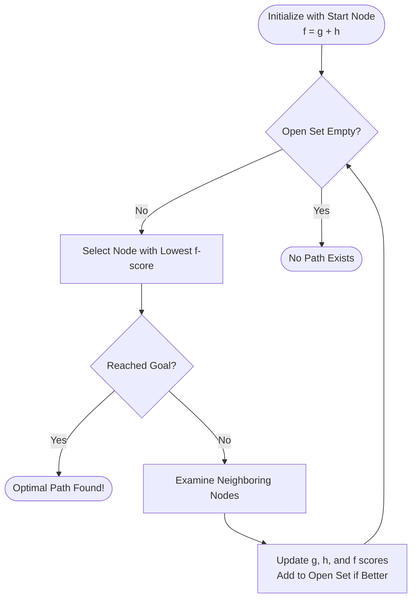

I've implemented A* more times than I can count, and it never gets old seeing how the heuristic focuses the search. Instead of expanding in all directions like Dijkstra, A* makes a beeline toward the goal while still guaranteeing optimality. It's pathfinding with intuition.

## Optimization Algorithms: Finding the Best Solutions

### Hill Climbing: The Greedy Approach

[Hill climbing](https://en.wikipedia.org/wiki/Hill_climbing) is optimization at its most intuitive—always move toward better solutions until you can't improve anymore. Like a hiker following the steepest upward slope, it makes locally optimal choices at each step.

The algorithm is simple and often effective, but it has a fatal flaw: local optima. Sometimes the best nearby solution isn't the global optimum, and hill climbing gets stuck. Despite this limitation, I still reach for hill climbing when I need quick improvements to an existing solution.

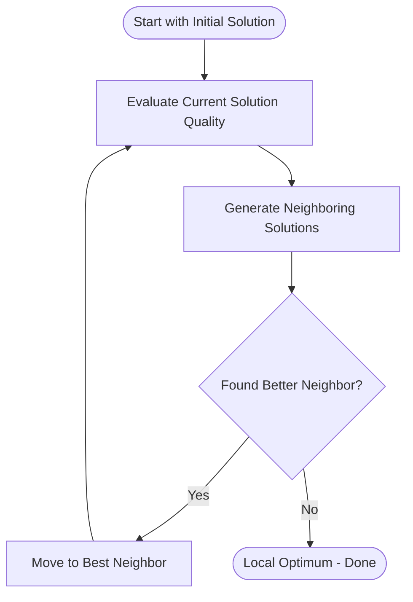

Hill climbing works well for parameter tuning and incremental improvements, but you need strategies for escaping local optima in complex optimization landscapes. That's where the next algorithms come in.

### Simulated Annealing: Accepting Temporary Setbacks

[Simulated annealing](https://en.wikipedia.org/wiki/Simulated_annealing) solves hill climbing's local optimum problem by occasionally accepting worse solutions. The probability of accepting a worse move decreases over time, like metal cooling and becoming less flexible.

I've used simulated annealing for scheduling problems and neural network training, where the solution space has many local optima. The key insight is balancing exploration (accepting bad moves early) with exploitation (being selective later).

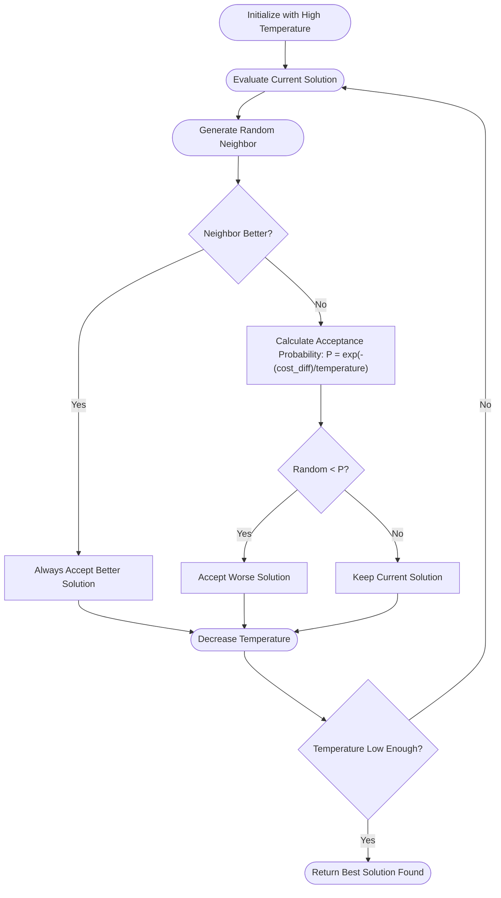

The temperature schedule is crucial—cool too fast and you get stuck in local optima like hill climbing, cool too slow and you waste time on random moves. Getting this right often requires experimentation with your specific problem.

### Genetic Algorithms: Evolution in Silicon

[Genetic algorithms](https://en.wikipedia.org/wiki/Genetic_algorithm) take inspiration from biological evolution, maintaining a population of candidate solutions that compete, reproduce, and mutate over generations. I've found them particularly effective for problems where the solution structure can be naturally encoded as chromosomes.

The beauty of genetic algorithms is their population-based approach. Instead of following a single path through the solution space, they explore multiple regions simultaneously and combine successful strategies through crossover operations.

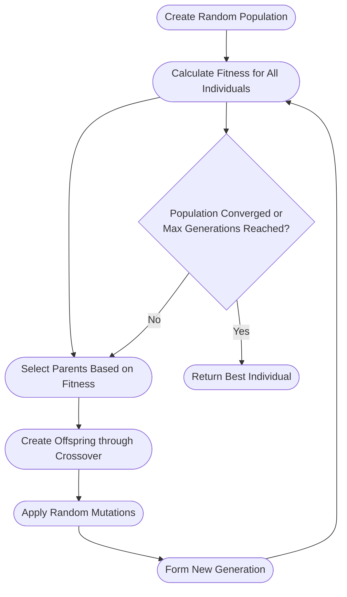

I've used genetic algorithms for evolving neural network architectures, optimizing game AI parameters, and solving complex scheduling problems. The key is designing good chromosome representations and crossover operations that preserve successful traits while enabling innovation.

### Particle Swarm Optimization: Collective Intelligence

[Particle Swarm Optimization (PSO)](https://en.wikipedia.org/wiki/Particle_swarm_optimization) models the social behavior of flocking birds or schooling fish. Each particle represents a potential solution, moving through the solution space influenced by its own experience and the collective wisdom of the swarm.

PSO often converges faster than genetic algorithms and requires fewer parameters to tune. I've found it particularly effective for continuous optimization problems where you need good solutions quickly.

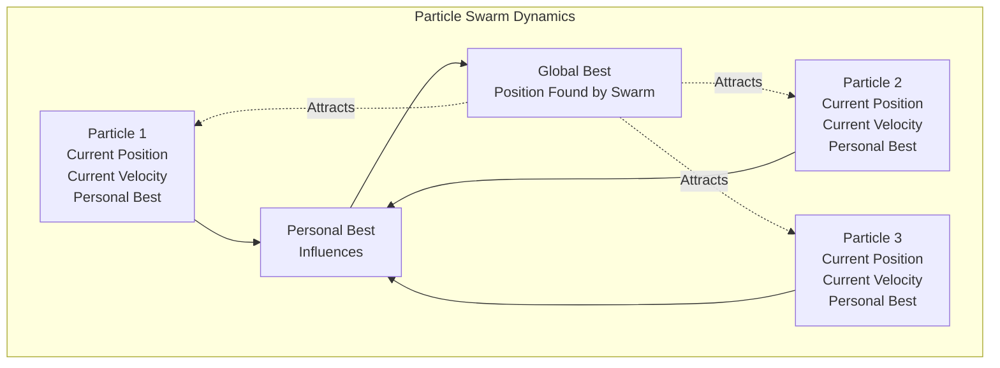

The algorithm balances individual learning (moving toward personal best positions) with social learning (moving toward the global best). This creates emergent collective intelligence that often finds good solutions with minimal parameter tuning.

## Practical Lessons Learned

After using these algorithms across various projects, I've developed some practical guidelines:

**Start simple.** Hill climbing or a basic search algorithm often works better than you'd expect. I've seen too many projects bog down trying to implement sophisticated optimization when a simple approach would have sufficed.

**Understand your constraints.** Real-time robotics applications need algorithms that produce good-enough solutions quickly. Offline optimization problems can afford more computational expense for better solutions.

**Measure what matters.** In my [particle simulation project](https://stevengann.com/posts/Particle-Sim/), I learned that algorithmic complexity matters less than cache performance for certain workloads. Profile first, optimize second.

**Know when to stop.** These algorithms can run indefinitely, but diminishing returns kick in quickly. Set reasonable stopping criteria and stick to them.

## Building Toward Modern AI

These classical techniques haven't disappeared with the rise of neural networks—they've become the infrastructure that makes modern AI possible. Graph structures underlie transformer architectures, search algorithms inspire reinforcement learning exploration strategies, and optimization techniques drive the training of large language models.

When I'm debugging a neural network that won't converge, I often fall back to simulated annealing for hyperparameter search. When VulcanAI needs to plan a sequence of actions, it uses A* pathfinding on a state graph. When the Mite robot maps an environment, it organizes LIDAR data in spatial trees for efficient collision detection.

Understanding these foundations makes you a better AI practitioner, not just because you know more algorithms, but because you understand the principles that make intelligent systems work. Every fancy neural architecture builds on these same concepts: representing relationships, searching solution spaces, and optimizing objective functions.

The current AI boom is exciting, but it's built on decades of foundational work. These classical techniques provide the stability and interpretability that production AI systems need, even when they're powered by cutting-edge neural networks under the hood.

---

*Next in this series: We'll explore how these foundational concepts evolved into statistical learning methods and early machine learning algorithms, setting the stage for the neural network revolution that dominates today's AI landscape.*
