I've been fascinated with neural networks for years, mostly because they're one of those things that look simple until you try to make them actually work. In my [previous post on Machine Learning Foundations](https://stevengann.com/posts/ML-Foundations/), I explored the classical algorithms and data structures that power intelligent systems. Now we're moving into the territory that gets all the attention—neural networks. But here's the thing: neural networks aren't magic. They're just another way to solve the same problems we've been tackling with classical techniques, but with a different approach to representing and learning patterns.

I've used neural networks in various projects, from simple classifiers in my [robot navigation systems](https://stevengann.com/posts/Robot/) to more complex architectures for processing sensor data. What I've learned is that understanding the fundamentals—how individual neurons work, how networks learn, and why different architectures exist—makes you much more effective at applying them to real problems.

This post builds on those classical foundations and shows how neural networks represent a different way of thinking about the same core problems: representing relationships, searching solution spaces, and optimizing objective functions.

## Basic Concepts: From Fuzzy Logic to Artificial Neurons

### Fuzzy Logic: Embracing Uncertainty

Before we dive into neural networks, let's talk about [fuzzy logic](https://en.wikipedia.org/wiki/Fuzzy_logic), which represents a fundamental shift from traditional binary logic. Classical logic deals in absolutes—something is either true (1) or false (0). But the real world is rarely that clear-cut.

I learned this the hard way when I was trying to build a simple classifier for my robot project. The traditional approach would say "if distance < 10cm, then obstacle detected." But what about 9.5cm? Or 10.1cm? The binary approach created jerky, unreliable behavior.

Fuzzy logic introduces the concept of partial truth, where statements can be true to some degree between 0 and 1. This is crucial for neural networks because it allows us to model uncertainty and gradual transitions, which is exactly what biological neurons do.

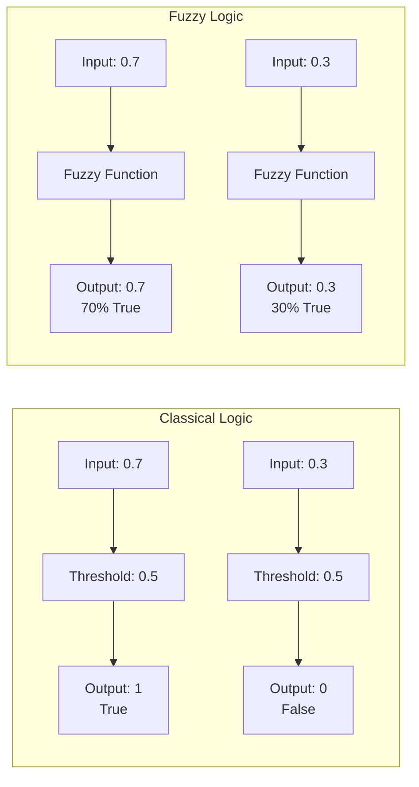

This fuzzy approach is what makes neural networks so powerful for pattern recognition. Instead of making hard decisions, they can express confidence levels and handle ambiguous inputs gracefully.

### The Perceptron: A Single Artificial Neuron

The [perceptron](https://en.wikipedia.org/wiki/Perceptron), introduced by Frank Rosenblatt in 1957, is the simplest form of a neural network—a single artificial neuron. It takes multiple inputs, applies weights to them, sums them up, and passes the result through an activation function to produce an output.

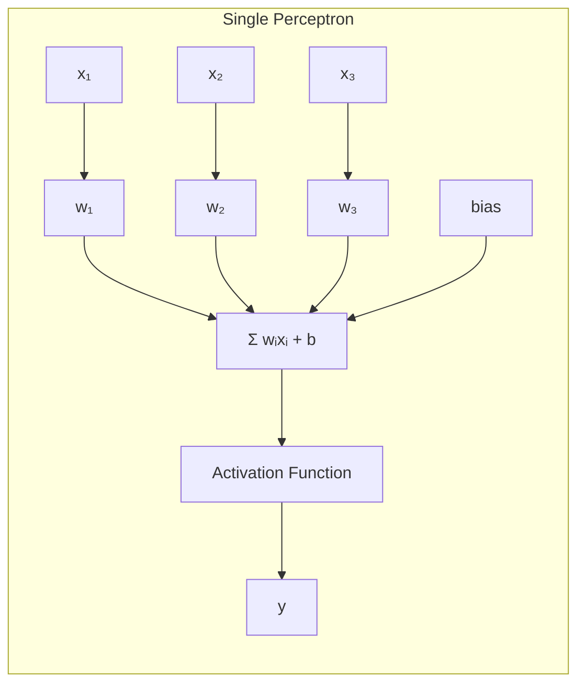

The mathematical representation is straightforward:

$$y = f(\sum_{i=1}^{n} w_i x_i + b)$$

Where:
- $x_i$ are the input values
- $w_i$ are the weights (learnable parameters)
- $b$ is the bias term
- $f()$ is the activation function

The activation function is what makes the perceptron non-linear and capable of learning complex patterns. Common choices include:

- **Step function**: Outputs 0 or 1 based on a threshold
- **Sigmoid**: Outputs values between 0 and 1, smooth transition
- **ReLU**: Outputs the input if positive, 0 otherwise
- **Tanh**: Outputs values between -1 and 1

I've implemented perceptrons for simple classification tasks, and they're surprisingly effective for linearly separable problems. The first time I got one working—classifying whether sensor readings indicated "safe" or "obstacle" for my robot—I was amazed at how such a simple concept could solve real problems. But their real power comes when you combine many of them into networks.

### Neural Networks: Combining Neurons

A neural network is simply multiple perceptrons connected together, organized in layers. Each neuron in one layer connects to every neuron in the next layer (fully connected), creating a web of weighted connections.

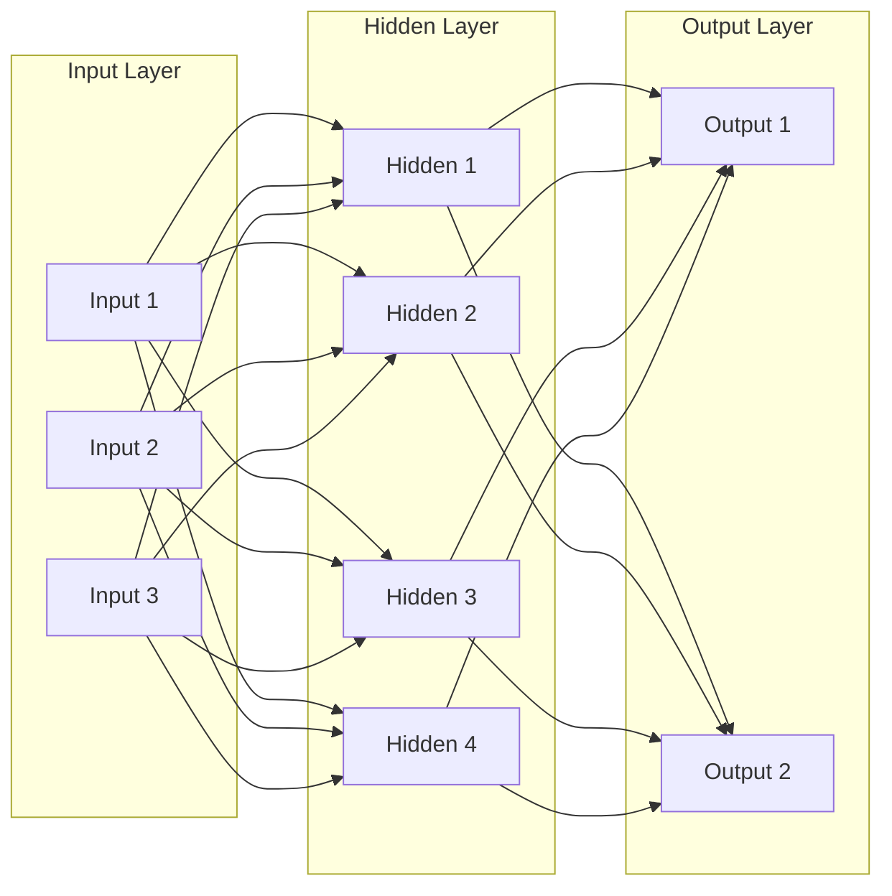

The key insight is that each layer learns to represent the input data at different levels of abstraction. The first hidden layer might learn simple features (edges, curves), while deeper layers combine these into more complex patterns (shapes, objects).

The weights on connections are what the network learns during training. They determine how strongly each input influences each neuron, and finding the right weights is the core challenge of training neural networks.

## Training a Neural Network: Making the Artificial Brain Learn

The weights between neurons is where the magic is. They encode the information and patterns in ways that are not intuitive, and attempting to set those weights manually is impractical or impossible so you need to some up with some method of training the network's weights. Training neural networks is fundamentally an optimization problem, and we can apply the techniques from my [ML Foundations post](https://stevengann.com/posts/ML-Foundations/).

### Finding the Best Weights: Optimization Strategies

Training a neural network means finding the optimal set of weights that minimize the error between predicted and actual outputs. This is fundamentally an optimization problem, and we can apply the techniques from my [ML Foundations post](https://stevengann.com/posts/ML-Foundations/).

**Hill Climbing** in neural networks means adjusting weights in the direction that reduces error. While simple, it often gets stuck in local minima where small changes don't improve performance. I learned this the hard way when my first neural network got stuck at 85% accuracy and refused to improve no matter how long I let it train.

**Simulated Annealing** allows the network to occasionally accept worse solutions early in training, helping escape local optima. I've used this for hyperparameter optimization, where the "temperature" controls how much randomness to allow. The key insight is that early in training, you want to explore widely; later, you want to fine-tune.

**Genetic Algorithms** can evolve neural network architectures and weights simultaneously. Each network becomes a chromosome, and crossover/mutation operations create new generations. This is particularly useful when you're not sure what architecture will work best. I've used this approach when I had no idea what the optimal network structure should be for a given problem.

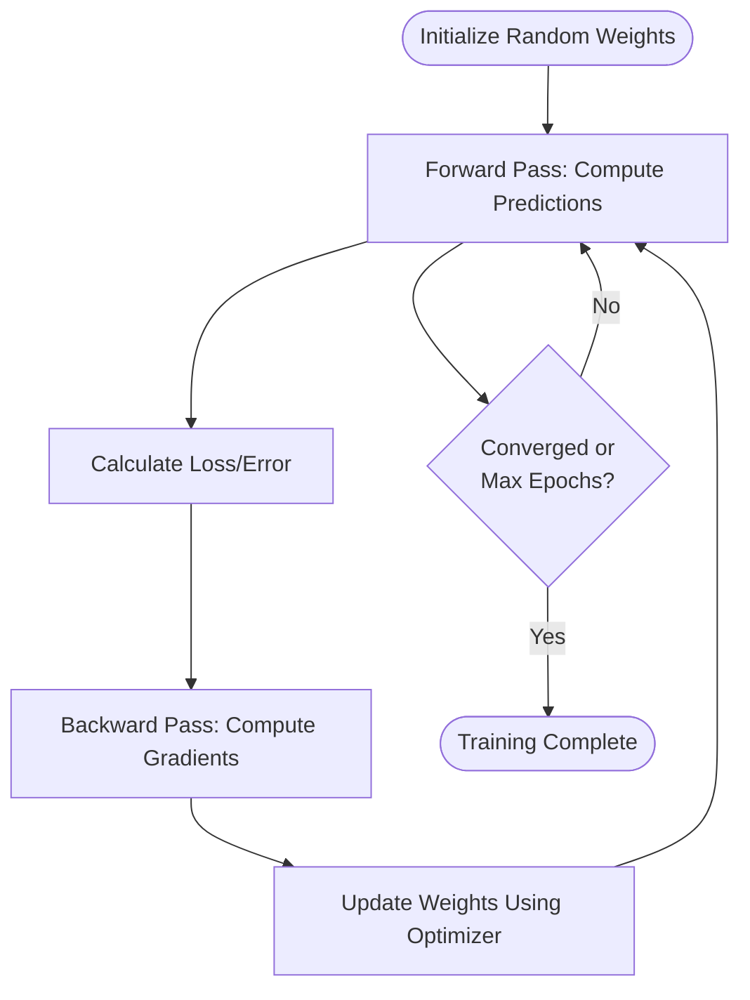

### Backpropagation: The Learning Algorithm

[Backpropagation](https://en.wikipedia.org/wiki/Backpropagation) is the algorithm that makes neural network training practical. It efficiently computes how much each weight should be adjusted by propagating the error backward through the network.

I remember the first time I implemented backpropagation from scratch. It was one of those moments where the math finally clicked—suddenly I understood why neural networks could learn complex patterns. The key insight is the chain rule from calculus. If we want to know how much a weight in an early layer affects the final error, we multiply the gradients from later layers:

$$\frac{\partial E}{\partial w_{ij}} = \frac{\partial E}{\partial y_j} \cdot \frac{\partial y_j}{\partial net_j} \cdot \frac{\partial net_j}{\partial w_{ij}}$$

Where:
- $E$ is the error
- $y_j$ is the output of neuron j
- $net_j$ is the weighted sum of inputs to neuron j
- $w_{ij}$ is the weight from neuron i to neuron j

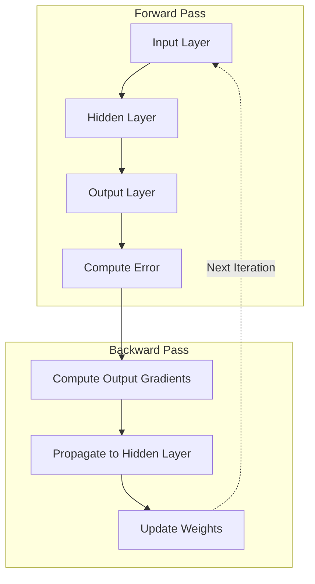

Backpropagation is a process that starts with a forward pass, where the network uses its current weights to make predictions. After seeing how those predictions compare to the actual values, it calculates the error. Then, in the backward pass, the network figures out how much each weight contributed to that error by computing gradients. Finally, it updates the weights, tweaking them in a way that reduces the error for future predictions.

The beauty of backpropagation is that it automatically handles the complexity of multiple layers. You don't need to manually derive gradients for each layer—the algorithm does it systematically.

## Advanced Neural Network Concepts

### The Evolution: From Deep to Wide

The history of neural networks shows an interesting trend. Early networks were deep but narrow (many layers, few neurons per layer). Modern architectures often use fewer layers but make them much wider (more neurons per layer).

I've seen this evolution firsthand in my own projects. My early attempts at neural networks used deep architectures with many small layers, and they were a nightmare to train. The networks would get stuck in local minima, suffer from vanishing gradients, and take forever to converge. When I switched to wider, shallower architectures, suddenly everything started working much better.

This shift really highlights how our understanding of neural network design has evolved. Deep networks, with many layers, are great at learning hierarchical representations, but they can be tricky to train and often run into issues like vanishing gradients. On the other hand, wide networks—those with more neurons per layer—tend to pick up complex patterns more easily, though they come with the tradeoff of needing more parameters and computational resources. Ultimately, the best results come from finding the right balance between depth and width, tailoring the architecture to fit the specific problem you're trying to solve.

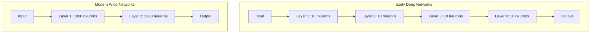

### Engineered Networks: Specialized Architectures

Modern AI systems often combine multiple specialized networks, each optimized for specific tasks. This modular approach allows for more efficient training and better performance on complex problems.

For example, a computer vision system might use:
- A CNN for feature extraction
- An RNN for temporal reasoning
- A transformer for attention mechanisms
- A classifier for final predictions

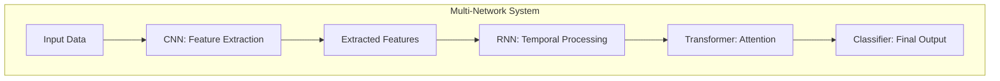

### Convolutional Neural Networks (CNNs): Processing Images

[Convolutional Neural Networks](https://en.wikipedia.org/wiki/Convolutional_neural_network) revolutionized computer vision by introducing the concept of local receptive fields. Instead of connecting every input to every neuron, CNNs use filters that slide across the input, detecting patterns at different locations.

I first encountered CNNs when I was trying to process camera data from my robot project. The traditional approach of flattening images into long vectors and feeding them to a fully connected network was computationally expensive and didn't capture the spatial relationships that make images meaningful. CNNs changed everything by treating images as 2D data with local structure.

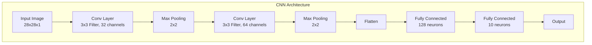

What makes CNNs so effective are a few clever design choices. First, convolutional layers are great at picking out local patterns in data—think edges or textures in an image. Then, pooling layers come into play, helping to shrink the spatial dimensions while still keeping the most important features intact. Another smart trick is parameter sharing, where the same filter is used across the entire input, making the network much more efficient. Finally, CNNs learn in a hierarchical way: the early layers focus on simple features, and as you go deeper, the network starts to combine those into more complex patterns.

I've used CNNs for image classification in robotics applications, where they can identify objects from camera feeds in real-time. The ability to process spatial data efficiently makes them ideal for visual tasks. The first time I got a CNN working on my robot's camera feed and it correctly identified obstacles, I was amazed at how well it worked despite the noisy, low-resolution images from the Raspberry Pi camera.

### Recurrent Neural Networks (RNNs): Processing Sequences

[Recurrent Neural Networks](https://en.wikipedia.org/wiki/Recurrent_neural_network) are designed for sequential data, where the order of inputs matters. They maintain internal state (memory) that allows them to process sequences of arbitrary length.

I discovered RNNs when I was trying to make sense of the LIDAR data from my robot. The sensor readings came in as a stream of distance measurements, and I needed to understand how the environment was changing over time. Traditional neural networks treated each reading as independent, but RNNs could capture the temporal relationships that made the data meaningful.

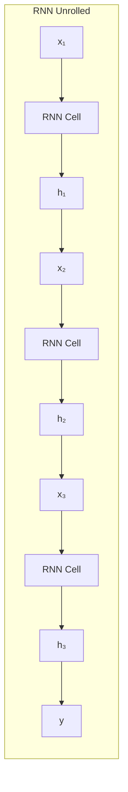

The key insight is that each RNN cell takes both the current input and the previous hidden state:

$$h_t = f(W_h h_{t-1} + W_x x_t + b)$$

Where:
- $h_t$ is the hidden state at time t
- $x_t$ is the input at time t
- $W_h$ and $W_x$ are weight matrices
- $f()$ is the activation function

RNNs really shine when it comes to handling tasks where the order of information matters. For example, they're great at language modeling, where the goal is to predict the next word in a sentence based on the words that came before. They're also well-suited for time series prediction, helping to forecast future values by learning from patterns in past data. In speech recognition, RNNs can convert audio signals into text by processing the sequence of sounds over time. And when it comes to machine translation, they can take a sentence in one language and generate its equivalent in another, all by understanding the sequence of words and their relationships.

However, traditional RNNs suffer from the vanishing gradient problem, where gradients become too small to effectively train deep networks. I ran into this issue when trying to train an RNN to predict robot movement patterns—the network would learn short-term dependencies but completely fail at longer sequences. This led to the development of LSTM and GRU cells, which use gating mechanisms to control information flow.

### Transformers: Attention is All You Need

[Transformers](https://en.wikipedia.org/wiki/Transformer_(machine_learning)) represent a fundamental shift in how neural networks process sequential data. Instead of processing sequences step-by-step like RNNs, transformers use attention mechanisms to process all positions simultaneously.

When I first read the "Attention is All You Need" paper, I was skeptical. How could a model that processed all positions at once possibly work for sequential data? But the results were undeniable—transformers outperformed RNNs on virtually every task. The key insight was that attention mechanisms could capture long-range dependencies more effectively than recurrent connections.

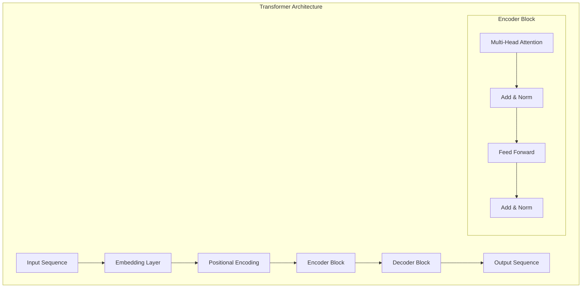

The key innovation is the **attention mechanism**, which allows the model to focus on different parts of the input sequence when processing each position:

$$\text{Attention}(Q, K, V) = \text{softmax}\left(\frac{QK^T}{\sqrt{d_k}}\right)V$$

Where:
- $Q$ (Query): What we're looking for
- $K$ (Key): What we're matching against
- $V$ (Value): What we're retrieving
- $d_k$: Dimension of the key vectors

This attention mechanism brings several important advantages. First, it allows the model to process all positions in a sequence at the same time, rather than step-by-step, which makes things much faster and more efficient. It also means the model can easily capture relationships between distant parts of the input—so if the first and last words in a sentence are related, the model can connect them directly. Finally, because the attention weights show which parts of the input the model is focusing on, it's much easier to interpret and understand what the model is actually doing.

### Large Language Models (LLMs): Scaling Up

[Large Language Models](https://en.wikipedia.org/wiki/Large_language_model) are transformers scaled to massive sizes, trained on vast amounts of text data. They represent the current state-of-the-art in natural language processing.

I've been following the development of LLMs since GPT-2, and the pace of progress has been astonishing. What started as a research curiosity has become a fundamental technology that's reshaping how we think about AI. My [VulcanAI project](https://stevengann.com/posts/VulcanAI/) uses LLMs as a core component, and the capabilities they provide—from natural language understanding to code generation—are genuinely transformative.

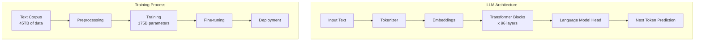

Large Language Models have a few standout traits that make them so powerful. First, they're absolutely massive—think billions of parameters, which gives them the capacity to learn incredibly complex patterns. They learn in a self-supervised way, meaning they get really good at predicting the next word in a sequence just by reading huge amounts of text. What's really fascinating is that as these models get bigger, they start to develop abilities that weren't explicitly programmed in—these are called emergent abilities. And perhaps most impressively, they can pick up new tasks from just a handful of examples, a skill known as few-shot learning.

The success of LLMs demonstrates that scaling up simple architectures with massive amounts of data can achieve remarkable results. However, this approach also highlights the importance of data quality, computational resources, and careful training procedures.

## Practical Applications and Limitations

After working with neural networks across various projects, I've developed some practical guidelines for when they're the right tool for the job.

### When to Use Neural Networks

Neural networks really shine when you're dealing with pattern recognition tasks like processing images, audio, or text—areas where traditional algorithms struggle to capture the subtle nuances that make the data meaningful. They're particularly powerful for complex mappings where the relationship between inputs and outputs is highly non-linear, something I've experienced firsthand when working with sensor data that had intricate dependencies. If you have large datasets with sufficient training examples, neural networks can learn representations that would be nearly impossible to hand-craft. Once trained, they're also excellent for real-time processing since inference is typically very fast.

However, there are situations where I've learned to be cautious about using neural networks. When working with small datasets, they tend to overfit badly—I've seen networks memorize training data perfectly while failing completely on new examples. Their black-box nature makes debugging difficult when things go wrong, which can be frustrating when you need to understand why a decision was made. Training is computationally expensive and time-consuming, so they're not suitable when you need real-time learning. Most importantly, they learn correlations rather than causation, so while they might predict that umbrellas and rain occur together, they won't understand that rain causes people to use umbrellas.

### Integration with Classical Methods

The most effective AI systems often combine neural networks with classical techniques. I learned this lesson when building my robot's navigation system—the neural network could identify obstacles, but the pathfinding algorithm from my [ML Foundations post](https://stevengann.com/posts/ML-Foundations/) was what actually planned the route.

For example:
- Use CNNs for feature extraction, then classical algorithms for reasoning
- Apply neural networks for pattern recognition, then knowledge bases for structured information
- Combine transformers with graph algorithms for complex reasoning tasks

## Looking Ahead: The Next Frontier

The field of neural networks continues to evolve rapidly. Every time I think I understand the current state of the art, something new comes along that changes everything. Researchers are actively pursuing several fascinating directions. There's significant work on developing efficient architectures that reduce computational requirements, making advanced models accessible to more developers and organizations. Another major focus is interpretability—helping us understand and explain what these complex models are actually doing when they make decisions. The field is also pushing hard on robustness, ensuring models perform well even when faced with data that's different from what they were trained on. Perhaps most exciting is the advancement in multimodal learning, where networks can process and understand multiple types of data simultaneously, like combining vision, text, and audio in ways that mirror human perception.

## Conclusion

Neural networks represent a powerful approach to solving the same problems we've been tackling with classical algorithms, but with a different perspective on representation and learning. Understanding both approaches—classical and neural—makes you a more effective AI practitioner.

What I've learned from working with both classical techniques and neural networks is that the most successful AI systems use the right tool for each part of the problem. Sometimes that's a neural network for pattern recognition, sometimes it's a classical algorithm for structured reasoning, and often it's a combination of both.

The key insight is that neural networks aren't replacing classical techniques; they're complementing them. The most successful AI systems use the right tool for each part of the problem, whether that's a neural network for pattern recognition or a classical algorithm for structured reasoning.

---

*Next in this series: We'll explore practical applications of neural networks, including Retrieval-Augmented Generation (RAG) systems and AI agents that combine multiple AI techniques to solve complex real-world problems.*
