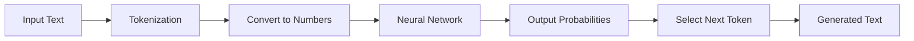
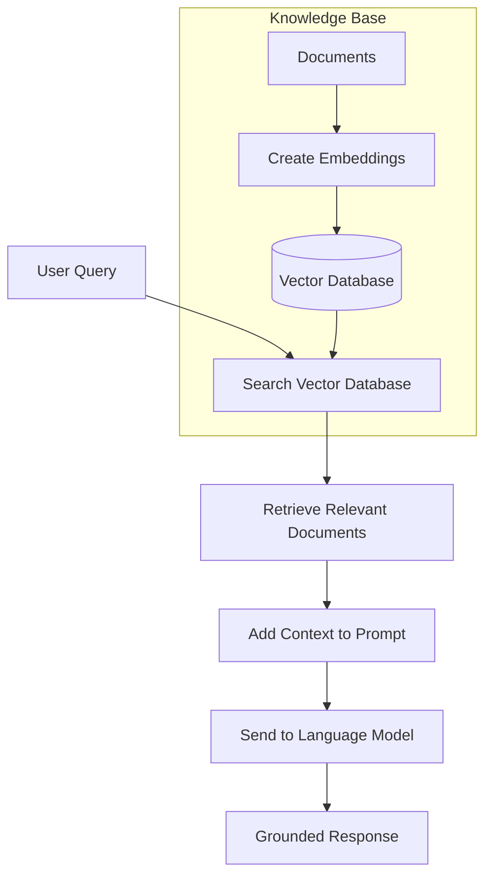
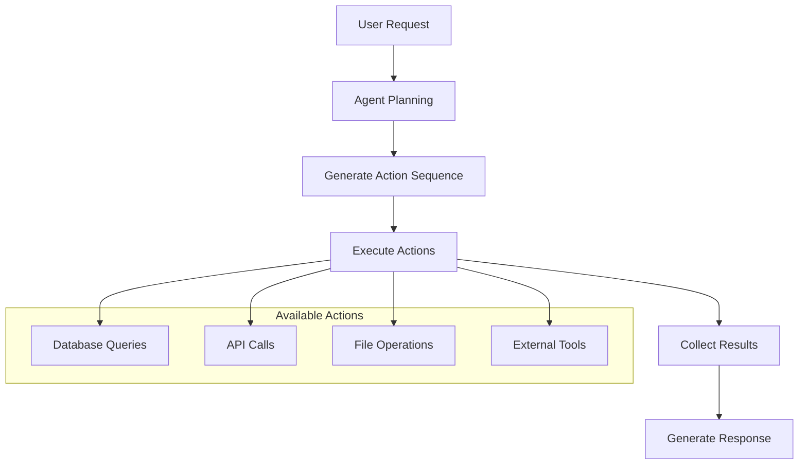
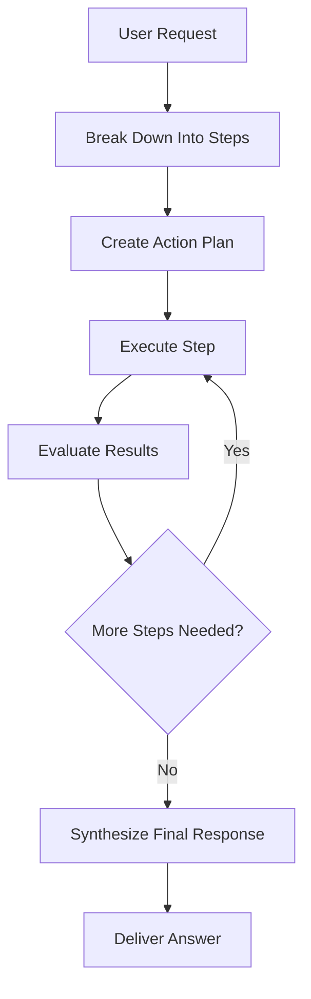

I've been building AI systems since the 00s, and one thing that becomes clear when you work with these models is that they're simultaneously incredibly powerful and frustratingly limited. In my [previous posts on neural networks](https://stevengann.com/posts/Neural-Networks/), I covered how these systems work at a fundamental level. Now we're getting to the practical applications—how to build AI systems that actually do useful work in the real world.

The key insight is that raw LLMs are just very sophisticated autocomplete systems. They predict the next token in a sequence based on their training data, nothing more. But when you combine them with external knowledge sources through RAG (Retrieval-Augmented Generation) and give them the ability to take actions through agent frameworks, they transform into something much more capable. I've implemented both approaches in my [VulcanAI project](https://stevengann.com/posts/VulcanAI/), and the difference in practical utility is night and day.

## Understanding LLMs: The Foundation Layer

### Pure Input-Output Systems with No Memory

At their core, [Large Language Models](https://en.wikipedia.org/wiki/Large_language_model) are stateless functions. You feed them text, they output text, and they retain no memory of previous interactions. Each conversation turn starts fresh—the model only "remembers" what you include in the current input.

This stateless nature is actually a feature, not a bug. It makes LLMs highly parallelizable and predictable. But it also means that all context must be explicitly provided with each request, which is where most of the complexity in LLM applications comes from.



### From Text to Numbers and Back

The process inside an LLM is surprisingly mechanical. Your input text gets chopped up into tokens (roughly words or word fragments), which are converted into high-dimensional numerical vectors called embeddings. These vectors flow through the transformer architecture we discussed in my [neural networks post](https://stevengann.com/posts/Neural-Networks/), producing probability distributions over the vocabulary for what token should come next.

The model doesn't "understand" language in any human sense—it's learned statistical patterns from massive amounts of text. When you ask it about the capital of France, it's not retrieving a fact from memory; it's predicting that "Paris" is the most likely continuation based on similar patterns it saw during training.

### The Next-Word Prediction Game

This brings us to the fundamental limitation: LLMs are playing an incredibly sophisticated game of "what word comes next?" They excel at this game because they've seen patterns across billions of documents, but they're prone to confident-sounding hallucinations when asked about information they've never seen or when their training data contained errors.

I learned this lesson when I first tried using GPT for technical documentation. The model would confidently generate API documentation that looked correct but contained entirely fictional method names and parameters. It had learned the *pattern* of API docs without having access to the actual API.

### The Hallucination Problem

[Hallucination](https://en.wikipedia.org/wiki/Hallucination_(artificial_intelligence)) in LLMs isn't a bug—it's an inevitable consequence of how they work. When faced with a prompt, the model must generate *something*. If it doesn't have relevant training data, it fills in gaps using the most statistically plausible continuation, even if that continuation is factually wrong.

This is where the rubber meets the road for practical AI applications. Pure LLMs are impressive for creative writing and general conversation, but for applications where accuracy matters—like my robot navigation system or the knowledge management features in VulcanAI—you need additional techniques to ground the model's responses in verifiable information.

## Retrieval-Augmented Generation: Adding Knowledge Context

### The Core Concept

[Retrieval-Augmented Generation](https://en.wikipedia.org/wiki/Retrieval-augmented_generation) solves the hallucination problem by providing relevant context alongside user prompts. Instead of relying solely on training data, RAG systems search through external knowledge sources to find relevant information and include it in the prompt.

The approach is elegantly simple: before sending a question to the LLM, search through your documents to find the most relevant pieces, then include those pieces as context when asking the model to generate an answer. This grounds the response in actual information rather than statistical patterns.



I implemented RAG in VulcanAI when I realized that asking the model questions about my own projects was producing beautifully written but completely inaccurate responses. With RAG, the system could search through my actual documentation and code comments to provide accurate, source-backed answers.

### Vector Databases: The Search Engine

The magic of RAG happens in the search phase, which relies on [vector databases](https://en.wikipedia.org/wiki/Vector_database) to find semantically similar content. Traditional keyword search fails here because users might ask "How do I configure the bot?" while the documentation says "Setting up agent parameters."

#### Text Vectorization Process

Vector databases work by converting text into high-dimensional numerical representations using [embedding models](https://en.wikipedia.org/wiki/Word_embedding). These embeddings capture semantic meaning—similar concepts end up close together in vector space, even if they use different words.

```pseudocode
function createEmbedding(text):
    tokens = tokenize(text)
    embedding = embeddingModel(tokens)
    return normalize(embedding)

function searchSimilar(queryText, vectorDB):
    queryEmbedding = createEmbedding(queryText)
    results = vectorDB.similarity_search(queryEmbedding, top_k=5)
    return results
```

The process of creating embeddings transforms human-readable text into mathematical representations that capture meaning. Words like "car," "vehicle," and "automobile" end up near each other in this high-dimensional space, while unrelated concepts like "banana" and "telescope" are far apart.

#### Storage and Retrieval

Vector databases store these embeddings alongside either the full text or references to source documents. When you submit a query, the system:

1. Converts your query to an embedding using the same model
2. Searches for vectors with the smallest [cosine distance](https://en.wikipedia.org/wiki/Cosine_similarity) or highest dot product
3. Returns the associated text or document references
4. Includes this retrieved information as context in the LLM prompt

I've experimented with several vector database implementations in my projects. The choice depends on your scale and requirements—simple applications can use in-memory solutions like [Faiss](https://github.com/facebookresearch/faiss), while production systems might need distributed solutions like [Pinecone](https://www.pinecone.io/) or [Weaviate](https://weaviate.io/).

### Enhancing LLM Responses

The retrieved context transforms LLM responses from educated guesses into informed answers. Instead of:

> "The API probably supports authentication through standard OAuth flows..."

You get:

> "According to the documentation, the API supports authentication through OAuth 2.0. Here's the specific configuration from the docs: [retrieved text]. To set this up, you'll need to..."

The model can now cite specific sources, provide accurate details, and admit when information isn't available in the knowledge base. This transparency makes RAG systems much more reliable for production use.

## AI Agents: Beyond Text Generation

### Action-Oriented AI Systems

While RAG solves the knowledge problem, [AI agents](https://en.wikipedia.org/wiki/Intelligent_agent) tackle the action problem. Pure LLMs can only generate text, but agents can interact with external systems—calling APIs, manipulating databases, controlling hardware, or executing code.

The key insight is that we can teach LLMs to generate structured outputs that represent actions rather than just human-readable text. Instead of generating "I should check the database for user information," an agent generates a function call like `database.query("SELECT * FROM users WHERE id = 123")`.



I've built several agent implementations in VulcanAI, from simple Discord bots that can look up information to more complex systems that can analyze code repositories and generate reports. The transformation from "chatbot that talks about doing things" to "system that actually does things" opens up entirely new categories of applications.

### Action Models and Tool Integration

Agent frameworks give LLMs the ability to perform a wide range of actions. For example, an agent might interact with a database to query or update records, access the file system to read documents or create directories, connect to external APIs for services like weather or email, execute code to process data or generate visualizations, or even control hardware in robotics projects like my Mite robot.

The LLM learns to use these tools by seeing examples during training or through carefully crafted prompts that describe when and how to use each tool. Modern frameworks like [LangChain](https://langchain.readthedocs.io/) and [AutoGPT](https://github.com/Significant-Gravitas/AutoGPT) provide extensive libraries of pre-built tools.

```pseudocode
class DatabaseTool:
    def query(self, sql_query: str) -> List[Dict]:
        # Execute SQL and return results
        return database.execute(sql_query)

class WeatherTool:
    def get_forecast(self, location: str) -> Dict:
        # Call weather API
        return weather_api.get_forecast(location)

agent_tools = [DatabaseTool(), WeatherTool()]
agent = Agent(llm=my_llm, tools=agent_tools)
```

### Thinking Mode: Complex Reasoning

Advanced agents implement what's often called "thinking mode"—they can break down complex requests into multiple steps and reason about the best way to tackle a problem. This is where agents move beyond simply using tools and start engaging in genuine problem-solving.

For example, if you ask an agent to analyze sales trends and suggest optimizations, it doesn't just perform a single action. Instead, it might start by querying the database for recent sales data, then look for patterns in what it finds. It could go on to research industry benchmarks by searching the web, generate visualizations to help illustrate the trends, and use all of this information to come up with specific, actionable recommendations. Finally, it would present its findings in a well-structured report, tying everything together in a way that's easy to understand.



This multi-step reasoning is what distinguishes agents from simple chatbots. The agent maintains context across multiple actions and can adapt its plan based on intermediate results. I've found this particularly valuable in VulcanAI for tasks like code analysis, where the agent needs to examine multiple files, understand relationships between components, and generate comprehensive documentation.

### Self-Directed Behavior and Autonomous Operation

The most sophisticated agents can operate with minimal human oversight, setting their own goals and working toward them over extended periods. This is the direction I'm heading with VulcanAI—systems that can monitor their environment, identify opportunities for improvement, and take action without constant guidance. For example, an autonomous agent might monitor system logs for recurring errors, research solutions by searching documentation, test fixes in a safe environment, deploy improvements if tests pass, and document changes for human review. This level of autonomy requires careful consideration of safety and reliability. Agents need robust error handling, clear operational boundaries, and mechanisms for human oversight. The goal isn't to replace human judgment but to handle routine tasks that follow predictable patterns.


## Practical Implementation Considerations

### Combining RAG and Agents

The most effective AI systems often combine both approaches. A customer service agent might use RAG to find relevant policy information, then use action capabilities to update customer records or schedule follow-ups. In my experience building VulcanAI, this hybrid approach delivers much better results than either technique alone.

The architecture typically looks like this:

1. User submits a request
2. Agent uses RAG to gather relevant context
3. Agent plans a sequence of actions based on retrieved information
4. Agent executes actions and collects results
5. Agent synthesizes a response grounded in both retrieved knowledge and action results

### Performance and Scaling Challenges

Real-world deployment brings practical challenges that don't exist in demos. Vector searches need to be fast enough for interactive use, which means investing in proper indexing and caching strategies. Agent actions need robust error handling because external APIs fail, databases go offline, and file systems fill up.

I learned this the hard way when my first VulcanAI deployment would hang for minutes waiting for slow vector searches. The solution involved implementing asynchronous operations, caching frequent queries, and setting reasonable timeouts for all external operations.

## Looking Forward: The Evolution of AI Applications

The combination of RAG and agents represents a significant step toward AI systems that are both knowledgeable and capable. We're moving from impressive demos to practical tools that can handle real-world complexity and variability.

The next frontiers I'm watching include multimodal agents that can process images, audio, and video alongside text, and self-improving systems that can update their own knowledge bases and capabilities over time. The [VulcanAI toolkit](https://stevengann.com/posts/VulcanAI/) I'm building is designed with these possibilities in mind.

What excites me most is how these technologies lower the barrier to building sophisticated AI applications. You no longer need a PhD in machine learning to create systems that can understand complex queries, search through vast amounts of information, and take meaningful actions in the world. That democratization is going to unleash creativity in ways we're only beginning to imagine.

The key insight from building these systems is that the most powerful AI applications combine multiple techniques rather than relying on any single approach. RAG provides the knowledge foundation, agents provide the action capability, and traditional algorithms from my [ML foundations post](https://stevengann.com/posts/ML-Foundations/) handle the structured reasoning that ties everything together.
