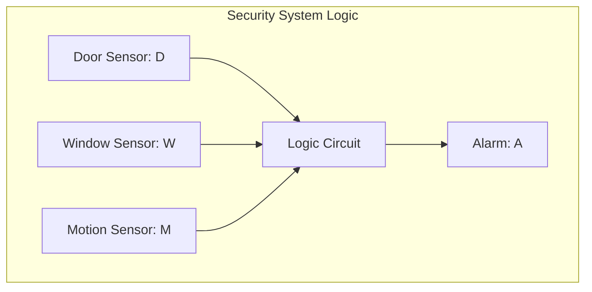
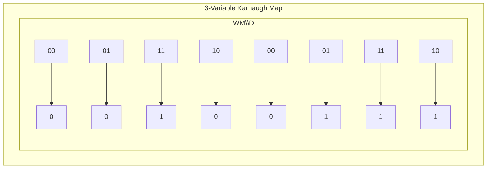
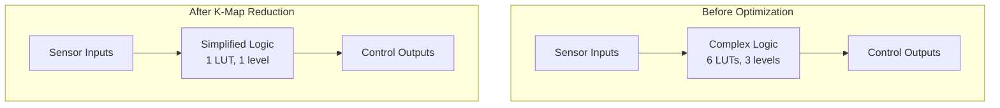

I've been wrestling with Boolean logic since my first digital circuits class, but it wasn't until I started building actual hardware projects that I truly appreciated the elegance of logic simplification. When you're trying to pack more functionality into an FPGA or minimize the gate count in a custom circuit, every unnecessary logic operation costs you real resources—and often real money.

This became crystal clear when I was designing control logic for my [robot project](https://stevengann.com/posts/Robot/). The initial truth table implementation worked, but it was eating up valuable FPGA resources with redundant logic gates. That's when I rediscovered Karnaugh maps—not as an academic exercise, but as a practical tool that could literally make the difference between fitting my design on the target hardware or needing a bigger, more expensive chip.

The same principles apply in software optimization. Modern compilers are smart, but understanding Boolean reduction helps you write more efficient conditional logic and can dramatically speed up algorithms that process large amounts of binary data. Whether you're working with hardware or software, Boolean algebra is the fundamental language of digital logic, and mastering its simplification techniques opens up performance optimizations that most developers never consider.

## From Reality to Truth Tables: Capturing Logic

Before we can simplify Boolean expressions, we need to understand how real-world problems get translated into the mathematical framework of Boolean algebra. Every digital system starts with some collection of inputs and desired outputs, and truth tables are our way of capturing that relationship systematically.

### Building Truth Tables from Requirements

Let's start with a concrete example that mirrors something I actually had to implement. Imagine you're designing a simple security system with three sensors: a door sensor (D), window sensor (W), and motion detector (M). The alarm should trigger if the door is open AND motion is detected, or if the window is open AND motion is detected, or if both door and window are open regardless of motion.



This verbal description becomes a truth table by systematically examining every possible combination of inputs:

| D | W | M | A | Reasoning |
|---|---|---|---|-----------|
| 0 | 0 | 0 | 0 | All secure, no motion |
| 0 | 0 | 1 | 0 | Motion but all secure |
| 0 | 1 | 0 | 0 | Window open but no motion |
| 0 | 1 | 1 | 1 | Window open AND motion |
| 1 | 0 | 0 | 0 | Door open but no motion |
| 1 | 0 | 1 | 1 | Door open AND motion |
| 1 | 1 | 0 | 1 | Both door and window open |
| 1 | 1 | 1 | 1 | Both open AND motion |

This systematic approach ensures we don't miss any edge cases. I learned this the hard way when an early version of my robot's collision avoidance system had a gap in the truth table that caused it to drive straight into obstacles under specific sensor combinations.

### From Truth Tables to Boolean Expressions

Once we have the truth table, we can write the Boolean expression by identifying when the output is 1. Each row where A = 1 becomes a term in our expression. For our security system, we get terms from rows 4, 6, 7, and 8:

Row 4: D = 0, W = 1, M = 1 becomes $\overline{D}WM$
Row 6: D = 1, W = 0, M = 1 becomes $D\overline{W}M$
Row 7: D = 1, W = 1, M = 0 becomes $DW\overline{M}$
Row 8: D = 1, W = 1, M = 1 becomes $DWM$

The complete expression becomes:
$$A = \overline{D}WM + D\overline{W}M + DW\overline{M} + DWM$$

This is called the Sum of Products (SOP) form—we sum (OR) together all the product (AND) terms where the output is true. There's also the Product of Sums (POS) form, which works with the rows where the output is false, but SOP is more intuitive for most applications and translates more directly to hardware implementations.

## Boolean Algebra Laws: The Rules of Logic Manipulation

Boolean algebra operates under specific laws that allow us to manipulate and simplify expressions. These aren't arbitrary mathematical curiosities—they represent fundamental properties of digital logic that translate directly into circuit optimizations.

### Identity and Complement Laws

The identity laws establish how Boolean operations behave with constants. A + 0 = A means that ORing any expression with false leaves it unchanged, while A · 1 = A shows that ANDing with true does the same. Conversely, A + 1 = 1 because ORing with true always yields true, and A · 0 = 0 because ANDing with false always yields false.

The complement laws define the relationship between a variable and its negation. A + $\overline{A}$ = 1 because a variable OR its complement covers all possibilities, while A · $\overline{A}$ = 0 because a variable can't simultaneously be true and false.

### Commutative, Associative, and Distributive Laws

The commutative laws allow us to rearrange terms (A + B = B + A and A · B = B · A), while the associative laws let us regroup them ((A + B) + C = A + (B + C)). The distributive law A(B + C) = AB + AC is particularly powerful for expanding and factoring expressions.

These manipulation rules become crucial when you're trying to minimize logic gates in a hardware implementation. Every term you can eliminate or factor out represents gates you don't need to implement.

### De Morgan's Laws: The Great Converters

De Morgan's laws are probably the most practically useful laws in Boolean algebra: $\overline{A + B} = \overline{A} \cdot \overline{B}$ and $\overline{A \cdot B} = \overline{A} + \overline{B}$. These laws let you convert between AND and OR operations, which is incredibly useful when you're trying to implement logic using only NAND or NOR gates (which are often cheaper and faster in hardware).

I use De Morgan's laws constantly when optimizing the conditional logic in my [particle simulation](https://stevengann.com/posts/Particle-Sim/). Converting complex nested conditionals into their complement forms often reveals opportunities for optimization that aren't obvious in the original form.

## Karnaugh Maps: Visual Logic Simplification

Karnaugh maps (K-maps) are a visual method for simplifying Boolean expressions that turns the algebraic manipulation process into a pattern recognition problem. Instead of applying laws mechanically, you can see the optimization opportunities laid out spatially.

### Understanding K-Map Structure

A Karnaugh map is essentially a truth table rearranged into a grid where adjacent cells differ by only one variable. This arrangement makes it easy to spot terms that can be combined using the law A + $\overline{A}$ = 1.

For our three-variable security system example, the K-map looks like this:



Actually, let me represent this more clearly as a proper K-map table:

|   | 00 | 01 | 11 | 10 |
|---|----|----|----|----|
| **0** | 0  | 0  | 1  | 0  |
| **1** | 0  | 1  | 1  | 1  |

The rows represent D (0 = $\overline{D}$, 1 = D) and the columns represent WM combinations in Gray code order (00 = $\overline{W}\overline{M}$, 01 = $\overline{W}M$, 11 = WM, 10 = $W\overline{M}$).

### Finding Groups and Simplifications

The power of K-maps comes from grouping adjacent 1s. Each group represents a simplified term. Looking at our map, I can identify the optimal groupings:

Group 1: The vertical pair in column 11 (WM = 11) covers both D=0 and D=1. Since D appears as both 0 and 1 in this group, the D variable is eliminated, leaving just $WM$.

Group 2: The horizontal pair in row D=1, columns 01 and 11, covers the terms $\overline{W}M$ and $WM$ with D=1. Since W appears as both 0 and 1 in this group, the W variable is eliminated, leaving us with $DM$.

The optimal grouping gives us:
$$A = WM + DM$$

We can factor this further: $A = M(W + D)$

This is dramatically simpler than our original expression: $\overline{D}WM + D\overline{W}M + DW\overline{M} + DWM$. The K-map reduction eliminated two terms and simplified the logic significantly.

### K-Maps for Larger Systems

As the number of variables increases, K-maps become more complex but follow the same principles. Four-variable maps are arranged as 4×4 grids, and five-variable maps require two 4×4 grids. Beyond five variables, K-maps become unwieldy and computer-aided tools become necessary.

The key insight is that larger maps allow for larger groupings, leading to more dramatic simplifications. A group of 8 adjacent 1s in a 4-variable map eliminates 3 variables from that term, leaving only a single variable.

## Hardware Applications: FPGAs and Circuit Optimization

The practical importance of Boolean simplification becomes clear when you're implementing digital logic in hardware. Every logic gate costs area, power, and money, so minimizing gate count directly translates to better, cheaper designs.

### FPGA Resource Optimization

Modern FPGAs contain lookup tables (LUTs) that can implement any Boolean function of their inputs. A 4-input LUT can implement any function of 4 variables, but if your simplified expression requires only 2 variables, you're wasting 75% of that LUT's capability.

I ran into this exact situation when designing the control logic for my robot's sensor fusion system. The original Boolean expressions required multiple 6-input LUTs, but after applying K-map simplification, the entire system fit into a single 4-input LUT. That's not just a resource savings—it also improved timing because there were fewer logic levels to propagate through.



### Custom Silicon and Gate Count Minimization

For custom silicon implementations, gate count reduction directly affects die area and manufacturing cost. A chip that requires 10,000 fewer gates can be significantly cheaper to manufacture, especially in high volumes.

The optimization principles apply at multiple levels of abstraction. Individual logic functions benefit from K-map reduction, but higher-level optimizations like sharing common subexpressions across multiple functions can yield even greater savings.

### Timing and Power Considerations

Simplified logic doesn't just save space—it improves timing and reduces power consumption. Fewer logic levels mean shorter propagation delays, enabling higher clock frequencies. Fewer transistors switching means lower dynamic power consumption, which is crucial for battery-powered devices.

In my robot projects, power efficiency directly translates to longer autonomous operation time. Every milliwatt saved through logic optimization is a milliwatt that can extend the mission duration.

## Software Applications: Algorithmic Acceleration

While hardware benefits are obvious, Boolean simplification also provides significant advantages in software, particularly for algorithms that process large amounts of binary data or make complex decisions based on multiple conditions.

### Conditional Logic Optimization

Consider a software implementation of our security system logic. The original expression requires multiple comparisons and logical operations:

```csharp
bool alarm = (!door && window && motion) ||
             (door && !window && motion) ||
             (door && window && !motion) ||
             (door && window && motion);
```

The simplified version is much cleaner:

```csharp
bool alarm = (window && motion) || (door && motion);
```

This isn't just more readable—it's faster. The simplified version performs fewer logical operations and has better branch prediction characteristics because there are fewer conditional branches.

### Bit Manipulation and Parallel Processing

Boolean simplification becomes even more powerful when applied to bit manipulation algorithms. In my [particle simulation project](https://stevengann.com/posts/Particle-Sim/), I use bitwise operations to pack multiple boolean flags into single integers, then process them in parallel using SIMD instructions.

The optimization techniques from Boolean algebra directly apply to these bitwise operations. Simplifying the logic reduces the number of bitwise operations needed, which translates to better performance when processing thousands of particles in parallel.

### Machine Learning and Decision Trees

Boolean simplification principles also appear in machine learning algorithms, particularly in decision tree optimization. The process of pruning decision trees to prevent overfitting is essentially Boolean simplification applied to learned decision rules.

In my exploration of [machine learning foundations](https://stevengann.com/posts/ML-Foundations/), I discussed how classical optimization techniques underpin modern AI systems. Boolean simplification is one of those foundational techniques that appears throughout computer science, from low-level hardware design to high-level machine learning algorithms.

### Database Query Optimization

Database query optimizers routinely apply Boolean simplification to WHERE clauses and JOIN conditions. Understanding these principles helps you write queries that the optimizer can simplify effectively, leading to better execution plans and faster query performance.

Complex conditional logic in database queries often benefits from the same K-map analysis techniques used in hardware design. Identifying redundant conditions and factoring common subexpressions can dramatically improve query performance, especially on large datasets.

## Modern Relevance and Future Applications

Boolean algebra might seem like an old-fashioned topic in an era of machine learning and cloud computing, but its principles remain fundamentally important. Modern processor architectures, compiler optimizations, and even neural network implementations rely on the logical foundations that Boolean algebra provides.

### Compiler Optimizations

Modern compilers are incredibly sophisticated at optimizing Boolean expressions, but understanding the underlying principles helps you write code that the compiler can optimize effectively. When you understand how Boolean simplification works, you can structure your conditional logic to give the compiler the best opportunities for optimization.

### Quantum Computing Connections

Interestingly, quantum computing algorithms often involve Boolean logic optimization as a preprocessing step. Quantum circuits implement unitary operations that can be decomposed into sequences of quantum gates, and minimizing gate count is just as important in quantum systems as in classical digital circuits.

### Neural Network Architectures

Even neural networks benefit from Boolean optimization principles. The attention mechanisms in transformer architectures essentially implement Boolean-like selection logic, and optimizing these selection patterns can improve both training efficiency and inference performance.

## Practical Tools and Techniques

While K-maps are great for learning and small problems, practical Boolean simplification often requires computer-aided tools. The Quine-McCluskey algorithm provides a systematic method for minimizing Boolean functions of any size, and modern electronic design automation (EDA) tools incorporate sophisticated optimization engines.

For software developers, understanding these principles helps you recognize optimization opportunities that tools might miss. Compilers are good, but they're not perfect, and sometimes manual optimization based on Boolean algebra principles can yield significant improvements.

## Looking Forward

Boolean algebra and K-map simplification represent timeless principles that transcend specific technologies. Whether you're designing custom silicon, optimizing software algorithms, or building machine learning systems, the fundamental goal remains the same: express complex logic as simply and efficiently as possible.

The techniques I've discussed here form the foundation for more advanced optimization methods. Understanding Boolean simplification gives you the conceptual framework to tackle optimization problems across multiple domains, from the lowest-level hardware design to the highest-level algorithmic optimization.

As computing systems become more complex and resource constraints become more critical—whether due to power limitations in mobile devices or cost constraints in large-scale deployments—these fundamental optimization principles become more valuable, not less. The developer who understands Boolean algebra has tools that remain relevant regardless of what new technologies emerge.

The marriage of classical Boolean algebra with modern computational techniques continues to drive innovation across the industry. Whether you're building the next generation of processors, optimizing machine learning algorithms, or designing efficient software systems, these timeless mathematical principles provide the foundation for creating better, faster, more efficient solutions.

---

*The principles explored in this post connect to broader themes in computational efficiency and optimization, topics I've explored in my work on [particle simulation performance](https://stevengann.com/posts/Particle-Sim/) and [machine learning foundations](https://stevengann.com/posts/ML-Foundations/). Understanding these fundamental concepts provides the groundwork for tackling optimization challenges across multiple domains.*
