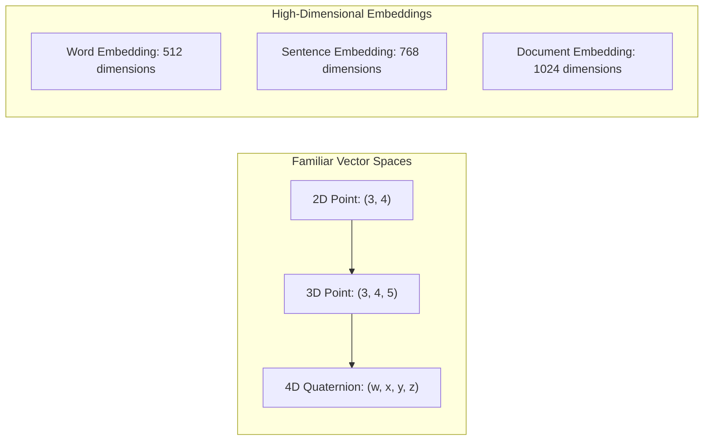
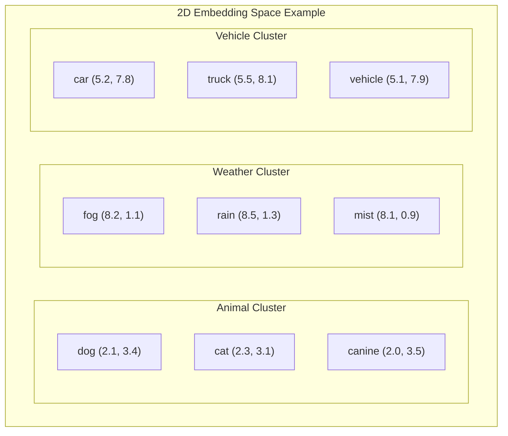
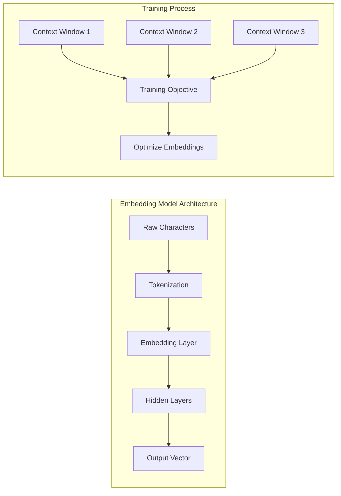
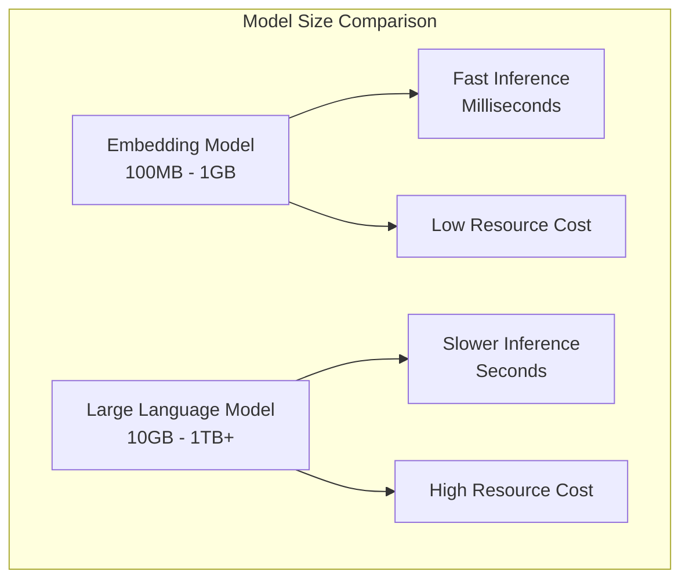
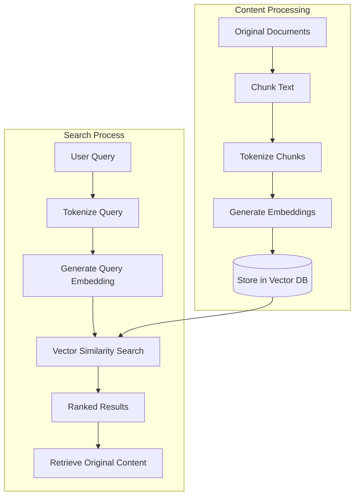
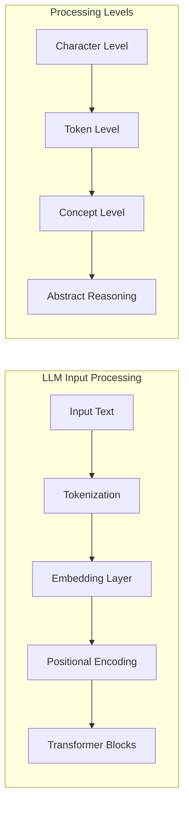

In my [RAGs and Agents post](https://stevengann.com/posts/RAGs-And-Agents/), I covered how Retrieval-Augmented Generation systems use vector databases to find relevant information before generating responses. I glossed over the technical details of how this actually works—specifically, what embeddings are and how they enable semantic search. This post digs into those fundamentals.

Embeddings are one of those concepts that seem magical until you understand the math behind them. Once you grasp how text gets converted into high-dimensional numerical vectors and why semantically similar content ends up clustered together in vector space, the entire foundation of modern AI search becomes clear. I've implemented embedding systems in several projects, and understanding these concepts has been crucial for building effective search and recommendation systems.

This builds directly on the neural network concepts from my [previous post](https://stevengann.com/posts/Neural-Networks/), where we explored how networks transform inputs through learned representations. Embeddings are essentially the output of specialized neural networks designed specifically for creating meaningful numerical representations of text.

## The Math Behind Embeddings: From Words to Vectors

### What Vectors Actually Are

At their core, vectors are simply lists of numerical values. You're probably familiar with 2D vectors that represent points on a plane with x and y coordinates, or 3D vectors that add a z coordinate for depth. In computer graphics and robotics applications, I've worked with quaternions, which are 4-dimensional vectors used to represent rotations efficiently.



The mathematical beauty is that you can extend this concept to any number of dimensions. While we can't visualize a 512-dimensional space, the mathematical operations remain the same. An embedding is simply a vector that represents some piece of content—usually text—in a high-dimensional space, typically ranging from hundreds to thousands of dimensions.

The dimensionality matters because it determines how much information the embedding can encode. A 2D vector can represent position on a plane, but a 512-dimensional vector can capture subtle semantic relationships between concepts, grammatical structures, and contextual meanings that would be impossible to represent in lower dimensions.

### Why High Dimensions Matter for Meaning

The key insight is that meaning requires many dimensions to represent accurately. Consider how many different ways two words can be related: synonymous, antonymous, part-whole relationships, categorical relationships, functional relationships, and countless others. Each dimension in an embedding vector can contribute to representing these different aspects of meaning.

The mathematical relationship we're trying to capture is:

$$\text{similarity}(\text{word}_1, \text{word}_2) = \cos(\theta)$$

Where $\theta$ is the angle between their embedding vectors. When two words are semantically similar, their embedding vectors point in similar directions, resulting in a high cosine similarity (close to 1). When they're unrelated, the vectors point in different directions, resulting in a low similarity (close to 0).

## What the Numbers Actually Mean

### Clustering Similar Concepts

An embedding is a vector that represents a token, where the numerical values are optimized so that conceptually similar tokens end up clustered together in the high-dimensional space. This isn't arbitrary—the numbers encode learned relationships between concepts based on how they appear together in text.

To understand this intuitively, imagine we're working with a simple 2D embedding space. The coordinates for "dog" should be positioned much closer to "canine" than to "fog," even though "dog" and "fog" share more letters. The embedding has learned that "dog" and "canine" appear in similar contexts and refer to related concepts, while "fog" appears in completely different contexts.



In real embedding spaces with hundreds or thousands of dimensions, these clusters become much more sophisticated. The model learns to group not just obvious synonyms, but also words that serve similar functions, appear in similar contexts, or relate to similar concepts through complex chains of association.

### Understanding Tokens: The Basic Units

Before we can embed text, we need to break it down into tokens. A token represents some chunk of text, and different models use different strategies for tokenization. While you can think of a token as roughly equivalent to a word, the reality is more complex.

Sometimes a single word gets split into multiple tokens—especially for rare words or compound terms that the model hasn't seen frequently. Other times, a single token might represent multiple words, common phrases, or even punctuation marks. What matters is that tokenization allows the AI to process text with enough granularity that individual units retain their meaning in context.

For example, the sentence "The dog's owner walked quickly" might be tokenized as:

```
["The", " dog", "'s", " owner", " walked", " quickly"]
```

Each token gets its own embedding vector, and the model learns to understand how these tokens relate to each other and combine to form meaningful phrases and sentences.

## Where Do These Numbers Come From?

### Embedding Models: Specialized Neural Networks

Embeddings are produced by specialized neural networks called embedding models. These are typically much simpler than the massive language models we hear about in the news—they're focused specifically on the task of converting text tokens into meaningful vector representations.



The architecture is straightforward: the model takes raw characters of a token as input, and each output neuron corresponds to one dimension in the embedding vector. If you're creating 512-dimensional embeddings, the output layer has 512 neurons, each producing a real number that becomes one component of the final vector.

### Training Through Context Prediction

Embedding models learn through traditional neural network training techniques, primarily using [backpropagation](https://en.wikipedia.org/wiki/Backpropagation) to optimize their parameters. The key insight is in the training objective: these models are optimized to predict the context of a token based on how that context is defined in the training data.

Different embedding models use different definitions of "context," but common approaches include:

- **Skip-gram models** learn to predict surrounding words given a target word
- **CBOW (Continuous Bag of Words)** models learn to predict a target word given surrounding context
- **Sentence-level models** learn to predict whether two sentences are related or similar

### Backpropagation in Embedding Training

The backpropagation process for embedding models follows the same fundamental algorithm I described in my [Neural Networks post](https://stevengann.com/posts/Neural-Networks/). The network makes predictions about token relationships, compares those predictions to the training data, and adjusts the embedding weights to reduce prediction error.

The mathematical foundation is the same chain rule from calculus:

$$\frac{\partial L}{\partial w_{ij}} = \frac{\partial L}{\partial \hat{y}} \cdot \frac{\partial \hat{y}}{\partial z} \cdot \frac{\partial z}{\partial w_{ij}}$$

Where:
- $L$ is the loss function (how wrong the prediction was)
- $\hat{y}$ is the predicted output
- $z$ is the weighted sum of inputs
- $w_{ij}$ is the weight connecting neuron i to neuron j

The training process iteratively adjusts these weights so that tokens appearing in similar contexts develop similar embedding vectors. Over thousands or millions of training examples, the model learns to encode semantic relationships directly into the numerical structure of the embedding space.

### Size and Efficiency: Small Models, Big Impact

Compared to Large Language Models, embedding models are remarkably compact and efficient. While LLMs require tens of gigabytes to multiple terabytes of storage and massive computational resources, embedding models typically range from tens of kilobytes to hundreds of megabytes, with most production models like `all-MiniLM-L6-v2` being 22-90MB and sentence transformers ranging 100MB-400MB. This size difference reflects their focused purpose—instead of learning to generate coherent text, they only need to learn meaningful representations.



This efficiency makes embedding models practical for real-time applications where you need to convert text to vectors quickly and frequently. In production systems, you can run embedding inference on modest hardware while still maintaining the semantic understanding capabilities that make vector search effective.

## How Embeddings Enable Semantic Search

### Vector Databases: The Search Infrastructure

Vector databases store and search through collections of embedding vectors alongside pointers to the original content. The process begins with content preparation: documents, paragraphs, or sentences are tokenized and converted to embeddings using the same model that will be used for query processing.



The stored embeddings are indexed using specialized data structures optimized for high-dimensional similarity search. Popular approaches include [Hierarchical Navigable Small World (HNSW)](https://en.wikipedia.org/wiki/Hierarchical_navigable_small_world) graphs and [Locality-Sensitive Hashing (LSH)](https://en.wikipedia.org/wiki/Locality-sensitive_hashing), which allow efficient approximate nearest neighbor search in high-dimensional spaces. HNSW has largely become the dominant approach in modern vector databases due to its superior performance characteristics.

### Similarity Computation: Finding Related Content

When you submit a search query, the system tokenizes and vectorizes your query text using the same embedding model used to process the stored content. The database then searches for stored vectors that are "close" to your query vector in the high-dimensional space.

The most common similarity metrics are:

**Cosine Similarity**: Measures the angle between vectors, ignoring magnitude
$$\text{similarity} = \frac{\mathbf{A} \cdot \mathbf{B}}{||\mathbf{A}|| \cdot ||\mathbf{B}||}$$

**Euclidean Distance**: Measures straight-line distance in vector space
$$\text{distance} = \sqrt{\sum_{i=1}^{n} (A_i - B_i)^2}$$

**Dot Product**: Measures both angle and magnitude relationships
$$\text{similarity} = \sum_{i=1}^{n} A_i \cdot B_i$$

### Why This Works: Clustering Enables Discovery

The effectiveness of vector search comes from the fundamental property that embedding models cluster semantically similar content. When someone searches for "configure the bot," the system finds content about "setting up agent parameters" because both phrases got embedded into similar regions of the vector space during training.

This approach solves the classic problem with keyword-based search: the mismatch between how users describe what they want and how information is actually written. Traditional search would miss the connection between "bot configuration" and "agent parameters," but vector search recognizes them as semantically equivalent concepts.

The search typically returns the closest few matches along with similarity scores, allowing the application to decide how many results to use and what similarity threshold constitutes a good match. This flexibility is crucial for applications like [RAG systems](https://stevengann.com/posts/RAGs-And-Agents/), where you want to include the most relevant context without overwhelming the language model with marginally related information.


## Embeddings in Large Language Models

### From Text to Concepts: The LLM Pipeline

Understanding embeddings helps explain why LLMs seem so much more intelligent than simpler neural networks. When you submit a prompt to a language model, the text doesn't go directly into the transformer architecture. Instead, it follows a multi-step process that transforms human language into the mathematical representations the model can work with effectively.



The tokenization step breaks your prompt into manageable pieces, but the embedding step is where the real transformation happens. Each token gets converted from a discrete symbol (like the word "dog") into a dense vector that captures everything the model has learned about how that token relates to other concepts, appears in different contexts, and contributes to meaning.

### High-Level Concept Processing

This embedding transformation is what allows LLMs to work with high-level concepts rather than low-level text manipulation. Instead of processing character patterns or even word patterns, the model operates in a conceptual space where semantically related ideas are mathematically related through their vector representations.

When a language model processes the phrase "The canine barked loudly," it doesn't just see a sequence of characters or even words. Through embeddings, it recognizes "canine" and "dog" as related concepts, understands "barked" as an action typically associated with these animals, and processes "loudly" as an intensity modifier. All of this semantic understanding happens in the numerical space created by the embedding layer.

The transformer architecture that processes these embeddings can then perform sophisticated operations: attending to different parts of the input sequence, combining concepts in novel ways, and generating responses that demonstrate understanding of complex relationships and context. This is why conversations with LLMs feel fundamentally different from interactions with traditional chatbots—the underlying representation captures meaning in ways that enable genuine comprehension and reasoning.

### Building on the Foundation

The embedding representations get transformed and manipulated by the rest of the LLM architecture, but they provide the essential foundation that makes sophisticated language understanding possible. Every attention mechanism, every transformer layer, and every generation step operates on these dense semantic vectors rather than on raw text.

This is why understanding embeddings is crucial for anyone working with modern AI systems. Whether you're building RAG applications, fine-tuning language models, or designing search systems, you're fundamentally working with and manipulating these learned representations of meaning. The better you understand how text becomes numbers and what those numbers represent, the more effectively you can design systems that leverage the full power of semantic understanding.

## Practical Applications and Implementation

The concepts covered here form the foundation for the vector databases used in [RAG systems](https://stevengann.com/posts/RAGs-And-Agents/), modern search engines, recommendation systems, and countless other applications that need to understand semantic relationships in text data. What started as a mathematical curiosity in neural network research has become the backbone of how we build AI systems that can truly understand and work with human language.

The key insight is that embeddings bridge the gap between human language and mathematical computation. They allow us to perform precise numerical operations on fuzzy concepts like meaning, similarity, and relevance. This mathematical foundation enables all the sophisticated AI applications we interact with daily, from search engines that understand what we really mean to chatbots that can engage in meaningful conversation.

Understanding these fundamentals gives you the foundation to build more sophisticated AI applications, debug issues when similarity search isn't working as expected, and make informed decisions about which embedding models and vector database technologies are right for your specific use case. The mathematical elegance of transforming words into vectors and using geometric relationships to capture meaning represents one of the most important breakthroughs in making AI systems truly useful for real-world applications.
