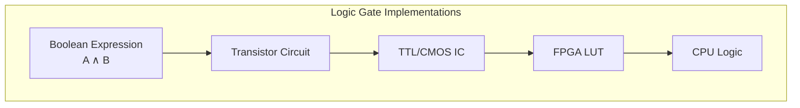
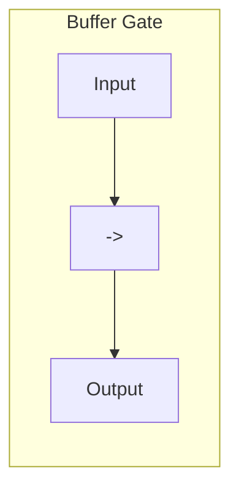
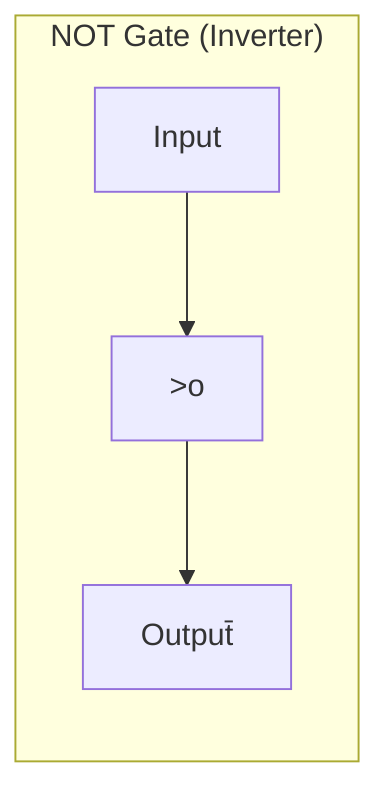
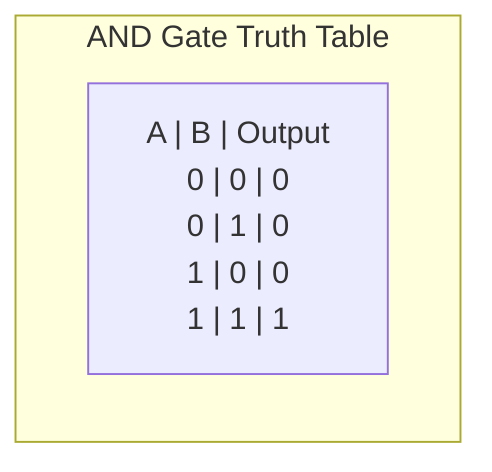
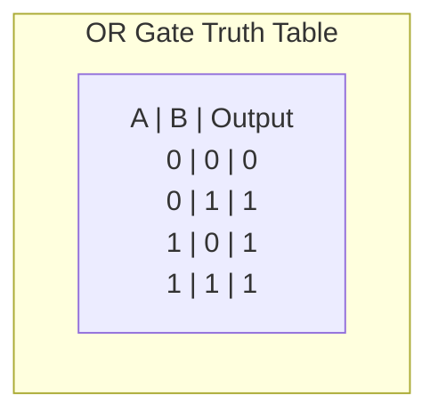
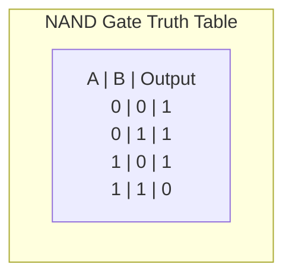
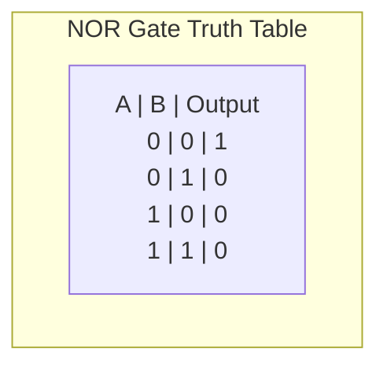
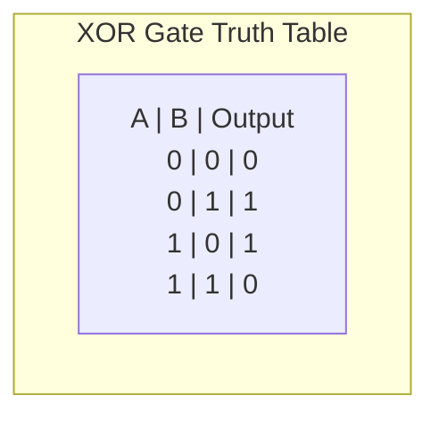

Logic gates represent the physical manifestation of the Boolean algebra concepts I explored in my [previous post on Boolean reduction](https://stevengann.com/posts/Boolean-Reduction/). Where Boolean algebra provides the mathematical framework for manipulating true and false values, logic gates translate those abstract operations into electrical circuits that can process real signals. Whether implemented using vacuum tubes in 1940s computers, discrete transistor circuits in early integrated circuits, or modern CMOS fabrication in today's processors, logic gates remain the fundamental building blocks for all digital computation.

The transition from theoretical Boolean expressions to physical logic gates becomes crucial when designing actual hardware systems. In my work with FPGA-based robot controllers, every Boolean operation I optimize using [Karnaugh maps](https://stevengann.com/posts/Boolean-Reduction/) eventually gets implemented as a network of logic gates consuming real resources on the chip. Understanding how these gates work—and how they can be combined and optimized—directly impacts the performance, power consumption, and cost of the final system.

Modern digital design still relies on the same fundamental gate types that were established decades ago, but the implementation technologies have evolved dramatically. Today's CPU cores contain billions of transistors arranged into logic gates, while GPU architectures parallelize thousands of similar gate networks to achieve massive computational throughput. Even with advanced synthesis tools and automated optimization, understanding the underlying gate-level behavior remains essential for creating efficient digital systems.

## Boolean Algebra Made Physical

Logic gates bridge the gap between mathematical abstraction and physical reality by implementing Boolean operations using electrical circuits. Each gate type corresponds directly to a fundamental Boolean operation, transforming input voltage levels into output voltage levels according to well-defined logical rules.

The concept of representing information using discrete voltage levels—typically 0V for logical false and 5V (or 3.3V in modern systems) for logical true—enables reliable digital computation even in the presence of electrical noise. This digital abstraction allows complex systems to be built from simple, standardized building blocks that can be combined hierarchically without losing logical coherence.



Logic gates can be implemented using various physical technologies, each with distinct characteristics that make them suitable for different applications. Vacuum tube implementations dominated early computers but consumed significant power and space. Transistor-transistor logic (TTL) and complementary metal-oxide-semiconductor (CMOS) integrated circuits revolutionized digital design by providing reliable, compact gate implementations. Modern FPGAs use lookup tables (LUTs) to implement arbitrary Boolean functions, while custom silicon allows for highly optimized gate networks tailored to specific applications.

The choice of implementation technology affects performance, power consumption, cost, and design flexibility, but the logical behavior remains consistent across all platforms. A NAND gate implemented using discrete transistors behaves identically to one implemented in a modern FPGA—the underlying Boolean operation stays the same while the physical substrate evolves.

## Programming Language Parallels

Since Boolean logic forms the foundation of programming language conditional statements, logic gates can be understood through their software equivalents. Most programming languages use operators that directly correspond to fundamental gate operations, making the transition between software and hardware logic more intuitive.

The AND gate corresponds to the logical AND operator (`&&` in C-style languages), producing a true output only when both inputs are true. The OR gate implements the logical OR operator (`||`), outputting true when at least one input is true. The NOT gate inverts its input, corresponding to the logical negation operator (`!`).

```c
// Software Boolean operations
bool and_result = input_a && input_b;  // AND gate
bool or_result = input_a || input_b;   // OR gate
bool not_result = !input_a;           // NOT gate
bool nand_result = !(input_a && input_b); // NAND gate
bool xor_result = input_a != input_b;  // XOR gate (inequality)
```

This parallel extends to more complex operations. The NAND gate combines AND with NOT, equivalent to `!(a && b)`, while the XOR gate implements exclusive OR, often expressed as inequality (`a != b`) or explicit XOR (`a ^ b` in languages that support bitwise operations).

Understanding these relationships helps bridge the conceptual gap between software algorithm design and hardware implementation. When optimizing Boolean expressions for hardware, the same logical transformations that improve software performance also reduce gate count and improve timing in physical circuits.

## Single-Input Gates: Buffers and Inverters

The simplest logic gates operate on single inputs, providing essential functions for signal conditioning and logical inversion. These gates might seem trivial compared to multi-input operations, but they play crucial roles in practical digital systems.

### Buffer Gates

Buffer gates provide unity gain amplification—they output the same logical value as their input but with restored signal strength and timing characteristics. While logically equivalent to a direct connection, buffers serve important electrical functions in real circuits.



In hardware implementations, buffers provide signal isolation between circuit sections, preventing loading effects that could degrade signal quality. They also introduce controlled delay for timing alignment and provide current amplification to drive multiple inputs from a single output. FPGA designs often use buffers to meet timing constraints by adding pipeline stages or to provide signal conditioning for off-chip interfaces.

### NOT Gates (Inverters)

NOT gates implement logical negation, outputting the complement of their input. This seemingly simple operation proves essential for implementing complex Boolean functions and creating complementary signal pairs required by many digital circuits.



Inverters form the building blocks for more complex gates—many gate implementations actually use combinations of NAND or NOR gates with inverters to achieve desired Boolean functions. In CMOS technology, the inverter represents the most fundamental circuit, with all other gates built as extensions of the basic inverter topology.

The timing characteristics of inverters directly impact system performance. Propagation delay through inverter chains limits maximum clock frequencies, while the switching speed of inverters affects power consumption through dynamic switching losses.

## Basic Two-Input Gates: AND and OR

The fundamental two-input gates implement the essential Boolean operations that form the basis for all combinational logic. These gates directly correspond to the AND and OR operations from Boolean algebra, providing the building blocks for more complex logical functions.

### AND Gates

AND gates output true only when both inputs are true, implementing the Boolean conjunction operation (A ∧ B). This gate type proves essential for implementing conditional logic where multiple conditions must simultaneously be satisfied.



In practical applications, AND gates enable control logic where safety interlocks require multiple conditions to be met before allowing operation. In my robot projects, AND gates ensure that motor controllers only activate when both the enable signal is asserted and safety sensors indicate clear operation. This type of conditional activation prevents dangerous behaviors that could occur if any single input failed.

The mathematical representation A ∧ B translates directly to the C-style expression `a && b`, making the software-hardware connection explicit. In circuit implementations, AND gates can be constructed from NAND gates followed by inverters, or implemented directly using transistor networks in custom silicon.

### OR Gates

OR gates output true when either input (or both inputs) are true, implementing the Boolean disjunction operation (A ∨ B). This inclusive OR behavior makes these gates ideal for combining multiple trigger conditions or signal sources.



OR gates commonly appear in interrupt logic where multiple sources can trigger the same response, or in power management circuits where several conditions can initiate wake-up sequences. The mathematical representation A ∨ B corresponds to the software expression `a || b`, maintaining the logical equivalence across implementation domains.

In hardware optimization, OR gates often get replaced with NOR gates followed by inverters when designing with NAND/NOR gate families, taking advantage of the more efficient transistor implementations available for these inverted operations.

## Inverted Gates: NAND and NOR

The inverted versions of basic gates—NAND and NOR—actually prove more fundamental than their non-inverted counterparts in many implementation technologies. These gates combine basic Boolean operations with negation, often providing more efficient circuit implementations while enabling complete logical systems through universal gate properties.

### NAND Gates

NAND gates implement NOT-AND, outputting false only when both inputs are true. The operation corresponds to !(A ∧ B) or `!(a && b)` in software terms. Despite seeming like a specialized gate, NAND actually provides universal functionality—any Boolean function can be implemented using only NAND gates.



The universal property of NAND gates stems from their ability to implement NOT, AND, and OR operations through appropriate combinations. This characteristic made NAND gates particularly valuable in early integrated circuit design, where minimizing the number of different gate types reduced manufacturing complexity and cost.

In modern CMOS technology, NAND gates offer superior performance characteristics compared to AND gates—they typically have faster switching times and require fewer transistors for implementation. This efficiency advantage makes NAND gates preferred for performance-critical paths in processor designs.

### NOR Gates

NOR gates implement NOT-OR, outputting true only when both inputs are false. Like NAND gates, NOR gates possess universal functionality and can implement any Boolean function through appropriate combinations.



The mathematical representation !(A ∨ B) corresponds to the software expression `!(a || b)`, following the same pattern established by other gate types. NOR gates were historically important in certain logic families and remain useful for specific applications where their electrical characteristics provide advantages.

The choice between NAND and NOR implementations often depends on the target technology and performance requirements. Some logic families favor NOR gates for their electrical characteristics, while others optimize for NAND implementations.

## The Exclusive Gate: XOR

XOR gates implement exclusive OR, outputting true when inputs differ but false when inputs match. This gate type proves essential for applications requiring difference detection, parity generation, and arithmetic operations in digital systems.



The XOR operation corresponds to the inequality test (A ≠ B) or the bitwise XOR operation (`a ^ b`) in programming languages that support bitwise operations. This relationship makes XOR gates particularly useful for implementing comparison logic and bit manipulation functions.

In arithmetic circuits, XOR gates form the foundation for addition operations. The XOR of two bits produces the sum bit for binary addition, while AND gates generate carry bits. This relationship makes XOR gates essential components in adders, which serve as building blocks for processors and arithmetic logic units.

XOR gates also play crucial roles in cryptographic applications, where their properties enable efficient encryption and decryption operations. The reversible nature of XOR (A ⊕ B ⊕ B = A) makes it ideal for stream ciphers and other symmetric encryption schemes.

Unlike AND, OR, NAND, and NOR gates, XOR gates do not possess universal functionality—they cannot implement all possible Boolean functions through combinations with themselves alone. However, when combined with AND gates or constants, XOR gates enable complete logical systems.

## Gate Equivalency and Universal Implementation

One of the most powerful concepts in digital logic design is gate equivalency—the ability to implement any Boolean function using different combinations of gate types. This flexibility enables optimization for different implementation technologies and design constraints while maintaining logical correctness.

### Universal Gates

Both NAND and NOR gates possess the remarkable property of universality—any Boolean function can be implemented using only NAND gates, or alternatively, using only NOR gates. This universality stems from their ability to implement NOT, AND, and OR operations, which form a complete set for Boolean algebra.

```mermaid
graph TD
    subgraph "NAND Gate Equivalencies"
        A[NOT: A NAND A = Ā]
        B[AND: (A NAND B) NAND (A NAND B) = A·B]
        C[OR: (A NAND A) NAND (B NAND B) = A+B]
    end
```

The connection to my [Karnaugh map analysis](https://stevengann.com/posts/Boolean-Reduction/) becomes clear here—any simplified Boolean expression derived through K-map reduction can be implemented using only NAND gates, regardless of its original complexity. This flexibility proves valuable when designing with gate arrays or FPGA architectures that favor particular gate types.

### Practical Advantages of Universal Implementation

Using universal gates provides several practical advantages in real design scenarios. Manufacturing benefits emerge when chip designers can use identical gate structures throughout a design, reducing mask complexity and improving yield rates. FPGA architectures often favor lookup tables that can implement any Boolean function, essentially providing universal gate functionality through software configuration.

Performance optimization becomes possible when all gates share similar electrical characteristics, enabling better timing prediction and delay matching. Power consumption becomes more predictable when using homogeneous gate types, simplifying power analysis and thermal management.

The universal property also enables design flexibility during development—logic functions can be modified without requiring different gate types, allowing rapid prototyping and design iteration. This flexibility proved valuable during the development of my robot controller, where changing sensor configurations required frequent logic modifications that could be implemented entirely through NAND gate reconfigurations.

### XOR-Based Implementations

While XOR gates alone cannot implement universal functionality, combining XOR gates with AND gates creates another complete system. This combination proves particularly valuable for arithmetic and cryptographic applications where XOR operations appear frequently.

Some specialized applications benefit from XOR-heavy implementations. Parity generators, checksums, and error correction codes naturally map to XOR gate networks. Arithmetic circuits for addition and subtraction use XOR gates for sum generation, making XOR-based implementations efficient for processor arithmetic units.

The choice between NAND, NOR, and XOR-based implementations depends on the target application and implementation technology. Understanding these equivalencies allows designers to optimize for their specific constraints while maintaining logical correctness.

## Implementation Benefits and Design Optimization

The choice of gate types and implementation strategies directly impacts the performance, cost, and complexity of digital systems. Understanding these trade-offs enables informed design decisions that optimize for specific application requirements and implementation technologies.

### Resource Utilization in Modern Systems

Contemporary digital design focuses heavily on resource utilization efficiency. In FPGA implementations, logic functions map to lookup tables (LUTs) that can implement arbitrary Boolean functions up to their input limits. Using simplified Boolean expressions derived through [K-map reduction](https://stevengann.com/posts/Boolean-Reduction/) directly translates to more efficient LUT utilization, allowing more functionality per chip area.

Custom silicon implementations benefit from gate count reduction through different mechanisms. Fewer gates reduce die area, improving yield rates and reducing manufacturing costs. Simplified logic also tends to have shorter critical paths, enabling higher operating frequencies and better performance.

The relationship between Boolean simplification and hardware resources becomes particularly important in high-volume applications where small efficiency improvements can translate to significant cost savings across millions of units.

### Power and Timing Considerations

Gate selection impacts both static and dynamic power consumption. CMOS gates consume minimal static power but generate dynamic power during switching transitions. Reducing gate count through Boolean simplification directly reduces switching activity, improving battery life in portable devices.

Timing optimization benefits from understanding gate propagation delays and their cumulative effects through logic chains. Using universal gate implementations can improve timing predictability by standardizing delay characteristics across the design. Critical path optimization often involves restructuring Boolean expressions to minimize the number of gate delays between input and output transitions.

Modern processor designs push timing optimization to extreme levels, where gate-level timing analysis determines maximum operating frequencies. Understanding how Boolean expressions translate to gate networks enables designers to optimize for timing closure while maintaining logical correctness.

### Technology-Specific Optimizations

Different implementation technologies favor different gate types and optimization strategies. TTL logic families historically favored NAND gate implementations due to their electrical characteristics, while some older logic families optimized for NOR gates. Modern CMOS technology provides more balanced characteristics but still shows preferences for certain gate types in specific applications.

FPGA architectures typically provide lookup tables that can implement arbitrary Boolean functions, making logic optimization more about minimizing LUT count than optimizing for specific gate types. However, understanding gate equivalencies remains valuable for creating efficient LUT mappings and optimizing routing resources.

Custom silicon design allows for highly optimized gate implementations tailored to specific applications. Processors use specialized gate libraries optimized for performance, power, or area depending on the target application requirements.

## Looking Ahead: From Gates to Systems

Logic gates form the foundation for all digital computation, but their real power emerges through systematic combination into larger functional units. The principles explored here—Boolean operations, gate equivalencies, and optimization strategies—scale up to enable the complex digital systems that power modern technology.

The next step in our logic design journey involves combinational logic circuits, where multiple gates combine to implement more sophisticated functions directly from truth tables. Understanding how to translate logical requirements into efficient gate networks enables the design of arithmetic units, decoders, multiplexers, and other fundamental building blocks that appear throughout digital systems.

These combinational circuits will eventually combine with sequential logic elements to create complete digital systems, including the processors and controllers that manage everything from simple embedded systems to complex CPUs and GPUs. The gate-level understanding developed here provides the foundation for comprehending and designing these higher-level systems.

The path from individual gates to complete processors involves many layers of abstraction, but each layer builds directly on the logical principles and optimization techniques that begin with understanding individual gate behavior. Whether designing FPGA-based controllers, optimizing software algorithms, or creating custom silicon, the fundamental concepts of Boolean logic implemented through physical gates remain central to effective digital system design.

---

*This exploration of logic gates connects to the broader themes of digital system optimization discussed in my [Boolean reduction analysis](https://stevengann.com/posts/Boolean-Reduction/) and provides the foundation for future posts on combinational logic design and processor architecture. Understanding these fundamental building blocks enables more sophisticated digital design techniques across multiple implementation technologies.*
