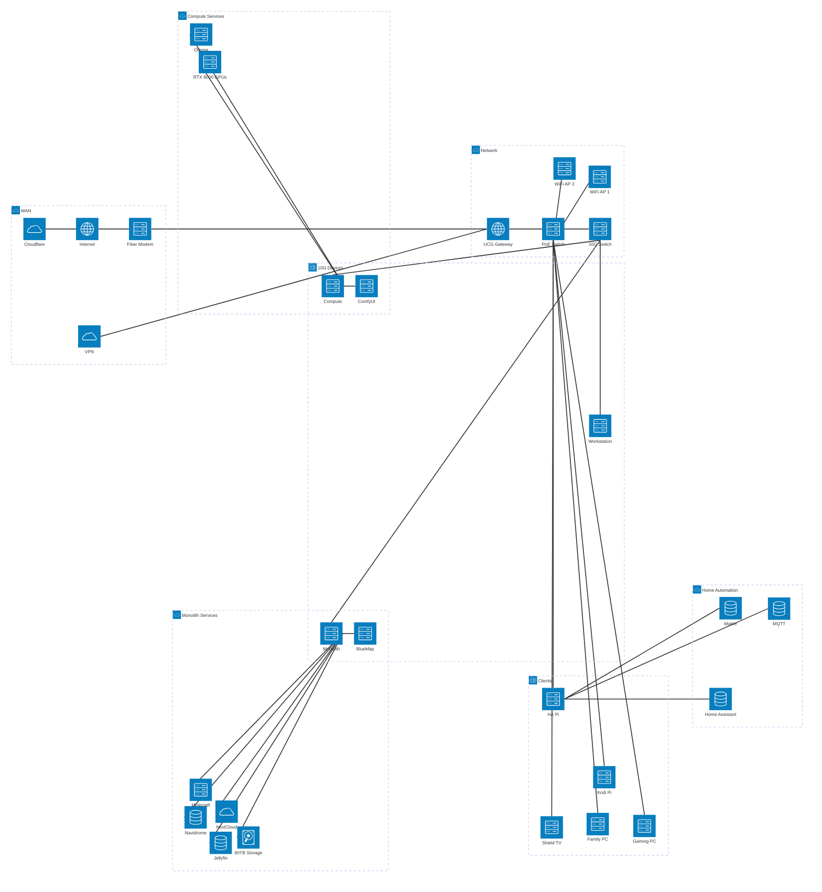

## Introduction

In the previous post, I walked through the evolutionary journey from a simple file server to a full homelab. Now let's take a look at what that homelab actually looks like today and why.

## The Architecture

Here's a high-level view of my current homelab architecture:

THat's a whole lot, and it doesn't include a lot of smaller things like home automation sensors and controllers, the Synology NAS that's still in service, 3D printers, security cameras, and more. Those things are all worth their own blog post later, we're focusing on infrastructure today.

## The Monolith

The Monolith is the shining centerpiece of the lab, as the name might imply. It features a 24-core Xeon CPU, 128GB of RAM, multiple NICs, a ton of storage, and even a Quadro RTX 8000 GPU. The Monolith is the only system directly exposed to the Internet because its primary purpose is to provide remotely accessible services and to store all my data. The system itself runs [TrueNAS](https://www.truenas.com/) and all the services are in Docker containers. Many of the common services, like [Jellyfin](https://jellyfin.org/) and [Minecraft](https://craftycontrol.com/), are deployed straight from the TrueNAS app catalog, but for some more niche applications like [BlueMap](https://bluemap.bluecolored.de/) I use Docker Compose.

The hardware is optimized for the tasks the Monolith is intended for. The CPU has 24 cores at only 2.4 GHz, making it very good for handling a large number of light applications. The huge collection of disks (12 HDDs and 4 SSDs currently) lets it provide a centralized repository of media, databases, and any other data that needs to be stored and served. The big 60TB pool is built from 8TB HDDs in a [ZFS](https://openzfs.org/) RAIDZ2 configuration, with a 250GB SSD set up as cache. THe built-in support for ZFS was a major selling point for TrueNAS for me because of features like software RAIDZ and assigning pools an SSD to serve as fast read/write cache. ZFS is open source and could be installed in virtually any Linux distro, but after a lot of time spent trying to DIY every aspect I have learned the value of built-in support. The Quadro RTX 8000 GPU might seem out of place, but it is there almost solely for media transcoding. Jellyfin uses it to transcode videos with less CPU load when multiple users are streaming simultaneously, and [Unmanic](https://unmanic.app/) uses it to systematically transcode all the videos in my media collection to make them more uniform and compress them to more manageable sizes.

## The Compute Server

The Compute server is less imaginatively named, which is ironic since it is mostly intended for generative AI applications. Equipped with a 16-core 3.6 GHz i7 CPU, 128GB of RAM, and two GeForce RTX 8000 Ada GPUs, it is more structured for a few heavy loads. I chose to run TrueNAS on this system as well, because I had become so fond of it already and having similar confinurations on it and the Monolith will make it easier to move services off the Monolith later, if needed. For example, I am considering moving Minecraft onto this server if the Monolith's CPU becomes a bottleneck.

Compared to the Monolith, the Compute server has very little going on. Most importantly, it has an [Ollama](https://ollama.com/) container for running AI models which allows other applications on other systems to leverage AI. At present, the only other application running on the server is [ComfyUI](https://www.comfy.org/), which is set up for generating images, videos, audio, and even 3D models.

## The Workstation

I have a desktop PC I use for gaming but for serious work that needs more horsepower than my trusty old Thinkpad, I have a dedicated Workstation PC. Equipped with another 16-core i7, 32GB of RAM, and a GeForce Quadro RTX 8000, it can certainly handle the tools I use it for. This is primarily CAD applications, mostly [FreeCAD](https://www.freecad.org/), [KiCAD](https://www.kicad.org/), [Blender](https://www.blender.org/), [MeshLab](https://www.meshlab.net/), and a few other utilities for 3D printing, CNC milling, and other engineering processes. Of course, all of this is accessed remotely via [RustDesk](https://rustdesk.com/) so I can leverage the system from my gaming PC, laptop, etc.

At present, it is just running a debloated Windows 10 install, but in the near future I am planning to increase the system RAM and storage before installing an OS suitable for use as a VM hypervisor so it can host multiple desktop VMs. Windows remains a necessary evil for some things, but I do prefer a Linux distro like [Mint Cinnamon](https://linuxmint.com/) when possible.

## The Automation Pi

Sitting between all these beefy servers, one system is different from the rest: A single Raspberry Pi 5 sits quietly, serving its invisible job. This Pi is running the official Home Assistant OS image, with Matter and Mosquito MQTT installed as extensions.

## Networking Infrastructure
