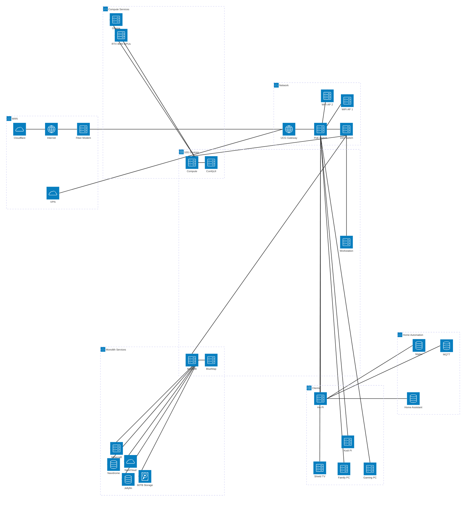

## Introduction

In the previous post, I walked through the evolutionary journey from a simple file server to a full homelab. Now let's take a look at what that homelab actually looks like today and why.

## The Architecture

Here's a high-level view of my current homelab architecture:

## The Monolith

## The Compute Servers

## The Workstation

## The Automation Pi

## Networking Infrastructure
