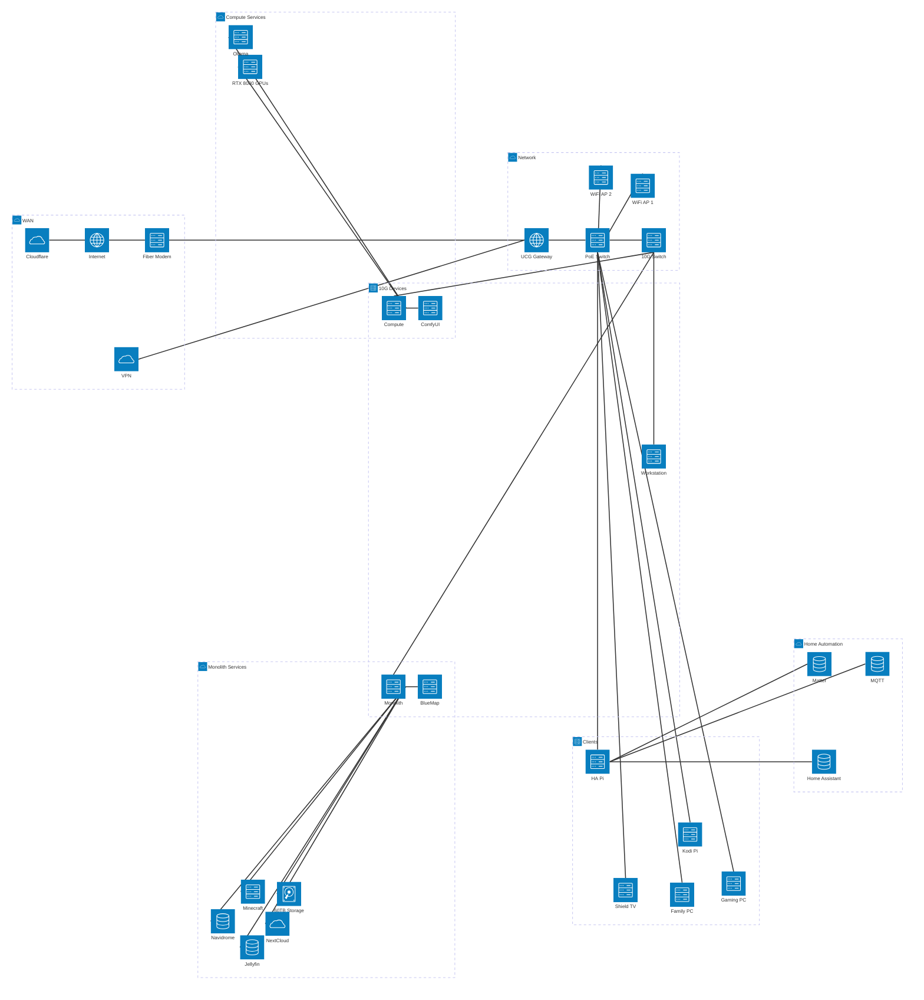
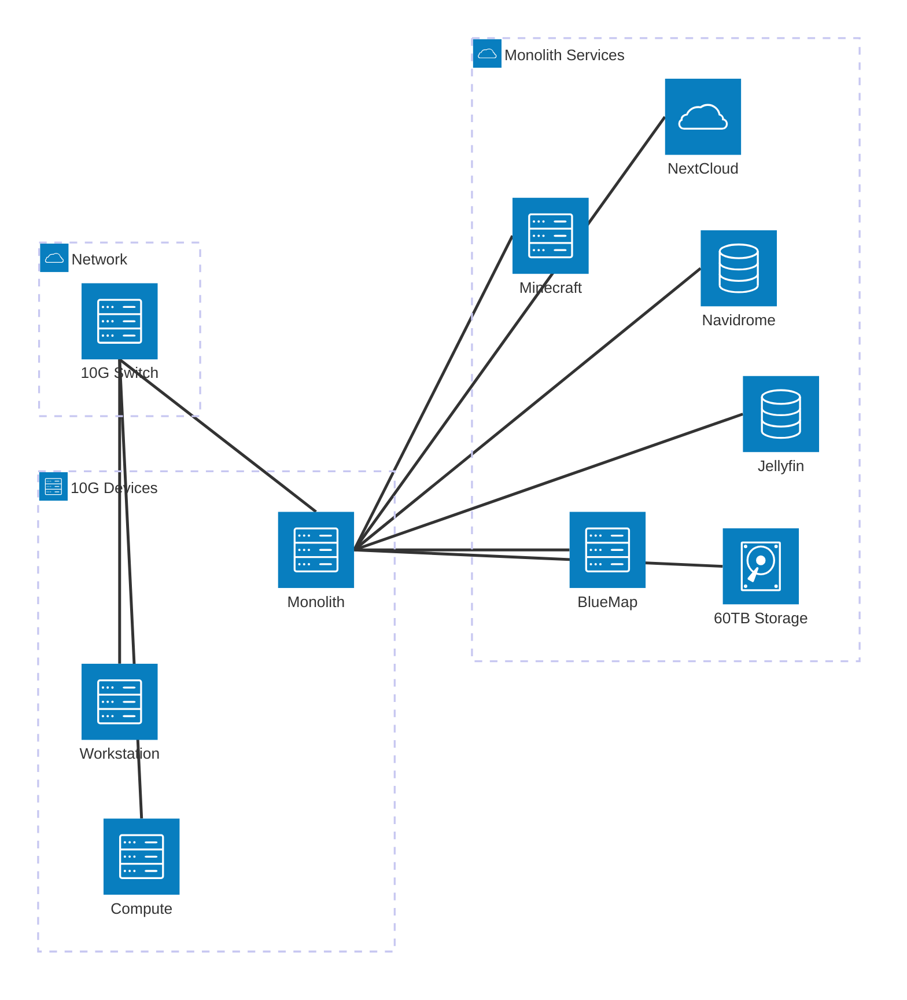
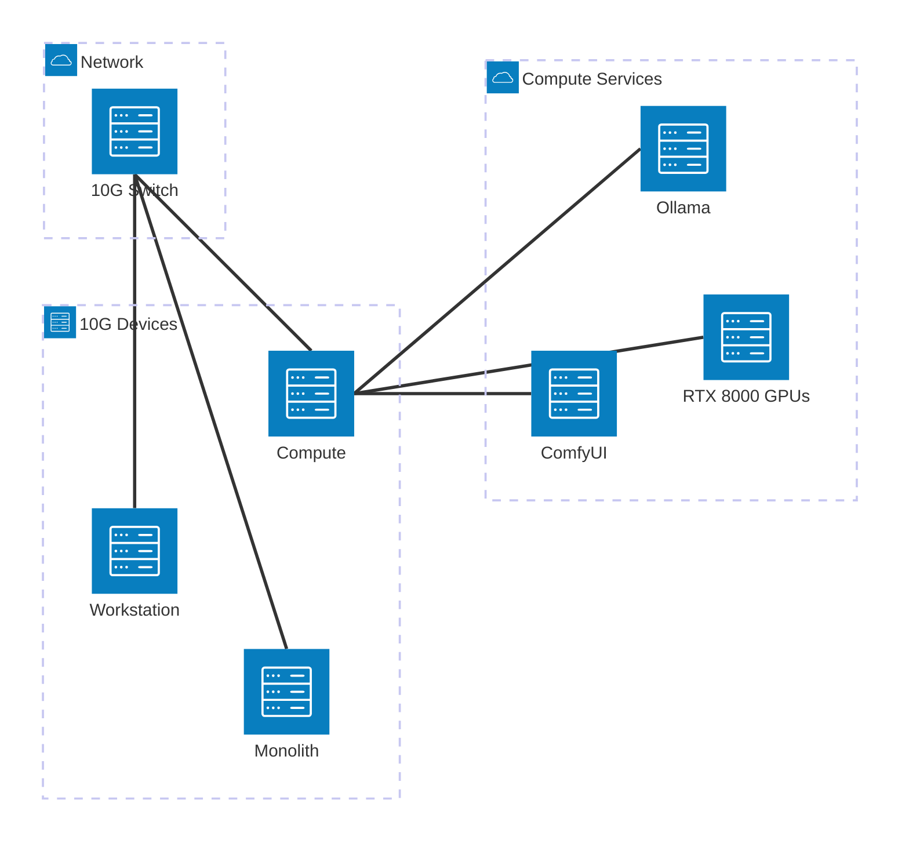
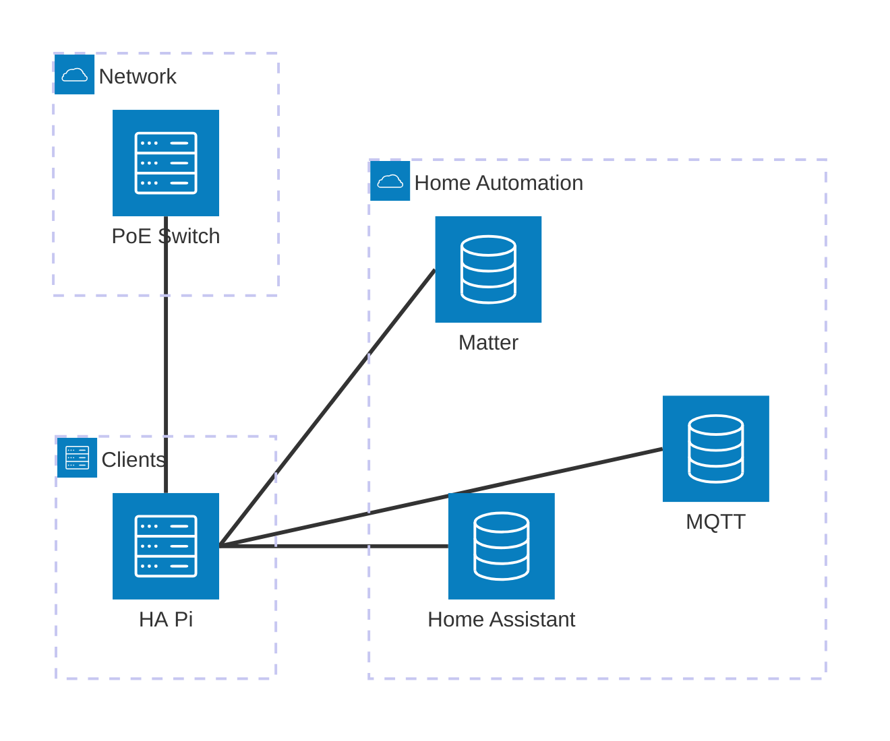
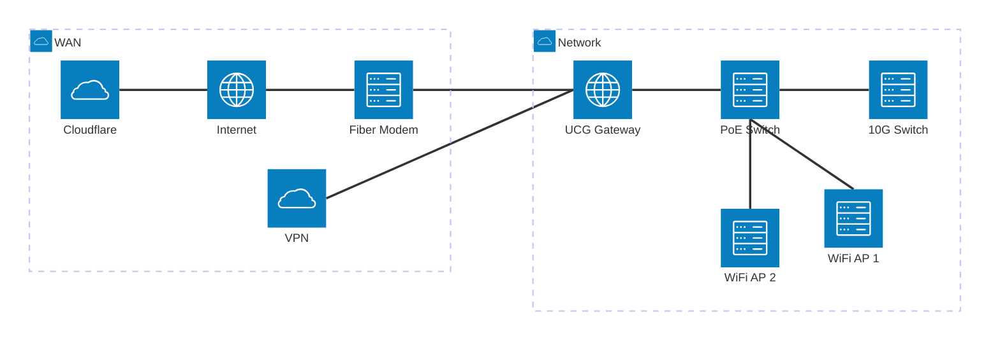

## Introduction

In the previous post, I walked through the evolutionary journey from a simple file server to a full homelab. Now let's take a look at what that homelab actually looks like today and why.

## The Architecture

Here's a high-level view of my current homelab architecture:

That's a whole lot, and it doesn't include a lot of smaller things like home automation sensors and controllers, the Synology NAS that's still in service, 3D printers, security cameras, and more. Those things are all worth their own blog post later, we're focusing on infrastructure today.

## The Monolith

The Monolith is the shining centerpiece of the lab, as the name might imply. It features a 24-core Xeon CPU, 128GB of RAM, multiple NICs, a ton of storage, and even a Quadro RTX 8000 GPU. The Monolith is the only system directly exposed to the Internet because its primary purpose is to provide remotely accessible services and to store all my data. The system itself runs [TrueNAS](https://www.truenas.com/) and all the services are in Docker containers. Many of the common services, like [Jellyfin](https://jellyfin.org/), [Navidrome](https://www.navidrome.org/), [Pi-Hole](https://pi-hole.net/), and [Minecraft](https://craftycontrol.com/), are deployed straight from the TrueNAS app catalog, but for some more niche applications like [BlueMap](https://bluemap.bluecolored.de/) I use Docker Compose.

The hardware is optimized for the tasks the Monolith is intended for. The CPU has 24 cores at only 2.4 GHz, making it very good for handling a large number of light applications. The huge collection of disks (12 HDDs and 4 SSDs currently) lets it provide a centralized repository of media, databases, and any other data that needs to be stored and served. The big 60TB pool is built from 8TB HDDs in a [ZFS](https://openzfs.org/) RAIDZ2 configuration, with a 250GB SSD set up as cache. THe built-in support for ZFS was a major selling point for TrueNAS for me because of features like software RAIDZ and assigning pools an SSD to serve as fast read/write cache. ZFS is open source and could be installed in virtually any Linux distro, but after a lot of time spent trying to DIY every aspect I have learned the value of built-in support. The Quadro RTX 8000 GPU might seem out of place, but it is there almost solely for media transcoding. Jellyfin uses it to transcode videos with less CPU load when multiple users are streaming simultaneously, and [Unmanic](https://unmanic.app/) uses it to systematically transcode all the videos in my media collection to make them more uniform and compress them to more manageable sizes.

## The Compute Server

The Compute server is less imaginatively named, which is ironic since it is mostly intended for generative AI applications. Equipped with a 16-core 3.6 GHz i7 CPU, 128GB of RAM, and two GeForce RTX 8000 Ada GPUs, it is more structured for a few heavy loads. I chose to run TrueNAS on this system as well, because I had become so fond of it already and having similar confinurations on it and the Monolith will make it easier to move services off the Monolith later, if needed. For example, I am considering moving Minecraft onto this server if the Monolith's CPU becomes a bottleneck.

Compared to the Monolith, the Compute server has very little going on. Most importantly, it has an [Ollama](https://ollama.com/) container for running AI models which allows other applications on other systems to leverage AI. At present, the only other application running on the server is [ComfyUI](https://www.comfy.org/), which is set up for generating images, videos, audio, and even 3D models.

## The Workstation

I have a desktop PC I use for gaming but for serious work that needs more horsepower than my trusty old Thinkpad, I have a dedicated Workstation PC. Equipped with another 16-core i7, 32GB of RAM, and a GeForce Quadro RTX 8000, it can certainly handle the tools I use it for. This is primarily CAD applications, mostly [FreeCAD](https://www.freecad.org/), [KiCAD](https://www.kicad.org/), [Blender](https://www.blender.org/), [MeshLab](https://www.meshlab.net/), and a few other utilities for 3D printing, CNC milling, and other engineering processes. Of course, all of this is accessed remotely via [RustDesk](https://rustdesk.com/) so I can leverage the system from my gaming PC, laptop, etc.

At present, it is just running a debloated Windows 10 install, but in the near future I am planning to increase the system RAM and storage before installing an OS suitable for use as a VM hypervisor so it can host multiple desktop VMs. Windows remains a necessary evil for some things, but I do prefer a Linux distro like [Mint Cinnamon](https://linuxmint.com/) when possible.

## The Automation Pi

Sitting between all these beefy servers, one system is different from the rest: A single Raspberry Pi 5 sits quietly, serving its invisible job. This Pi is running the official Home Assistant OS image, with Matter and Mosquito MQTT installed as extensions. I had originally intended to run all three of these services as containers on the Monolith, but I discovered that the Matter service for Home Assistant wasn't able to be run within a container. I possibly could have found a workaround, but the "Happy Path" was to grab a spare Pi and dedicate it to home automantion. In practice, this worked extremely well. The Pi 5 is more than powerful enough for the job and so far it has had much better uptime than the Monolith. The Pi isn't being tinkered on, new services aren't constantly being installed, there's just less that can go wrong on it. Dedicating a Pi to a single group of services has worked so well I am considering moving more services from the Monolith onto a few more Raspberry Pis, services like Pi-Hole that are lightweight and benefit from high uptime.

## Networking Infrastructure

A homelab is only as good as its network, and realizing that helped me understand why many homelabs are a handful of Raspberry Pis and a ton of networking infrastructure. A typical home network is a modem and router and maybe a switch if you're fancy, and then to share things online you forward ports and give everyone your home IP and hope for the best.

A few months ago, a friend who owns [an IT company](https://techmayer.com/) was trying to convince me to give Ubiquiti a chance. I was hesitant so he loaned me a Cloud Gateway Max (UCG-Max) to replace my bunch of Netgear routers running OpenWRT. Once we got the thing set up it blew my mind with all the features and flexibility, not to mention how well it performed compared to Netgear routers of the same price range. I was sold and soon dove head-first into the Ubiquiti ecosystem. I took out all my networking infrastructure and replaced it with a USW Flex 2.5G 8 PoE, a trio of USW Flex 2.5G 5s, and two U6+ wi-fi access points. I don't want to turn this into an ad for Ubiquiti (especially since they aren't paying me), but I have never been happier with networking equipment. The Teleport feature is a wrapper around TailScale VPN that lets me access my whole LAN remotely, so I don't need to forward ports for anything unless I want to share something publicly. Incoming traffic can be filtered by all kind of criteria, such as GeoIP. Additionally, the UniFi tools for wi-fi made it very simple to have a dedicated 2.4GHz SSID for home automation devices to avoid them crowding the channels that I want for higher priority devices like cellphones.

Aside from the Ubiquity devices, I obtained a 10Gbps switch from a coworker and connected the Monolith, Compute, and Workstation servers to it to make sure the network won't be a bottleneck between those systems. The rest of the networking infrastructure is software. For dealing with incoming connections, I use CloudFlare to protect from DDoS or suspicious connections, and dynamic DNS from NoIP so I don't need to share raw IPs and keep them updated. A container on the Monolith runs [DDNS Updater](https://github.com/qdm12/ddns-updater) to make sure the DDNS domains stay updated every five minutes.

For outgoing traffic, I have a Pi-Hole container running on the Monolith. Pi-Hole serves as a basic DNS proxy, blocking DNS requests to domains like ad servers, telemetry servers, and known phishing or other malicious servers. Any requests that don't get blocked are passed along to Cloudflare's DNS service with Google's DNS as a fallback when Cloudflare is down.

## What Now?

I don't know anyone who considers their homelab "complete". It is a living thing that will always require maintenance at least and benefits from careful planning and cultivation. A homelab is like a garden or an aquarium, I suppose. I mentioned a few plans in the text above, but there's no end to the exciting ideas I want to deploy.

- Rebuild Workstation server into a VM hypervisor
- Add additional Raspberry Pis to handle lightweight high-uptime services like Pi-Hole, DDNS Updater, etc.
- Migrate off of Crafty Control for Minecraft server management and into a more generic game server manager that supports server instances spread across systems.
- Deploy n8n to handle scheduled maintenance tasks, simple troubleshooting, and notifying me when there's a significant issue.
- Construct and deploy a full-featured home AI agent that can integrate with Home Assistant, Jellyfin, NextCloud, etc. while interacting with family members through voice.
- Move services to an SSO so the services I share with friends only require one login.

Keep a look out for more posts about my homelab as it continues to evolve!
