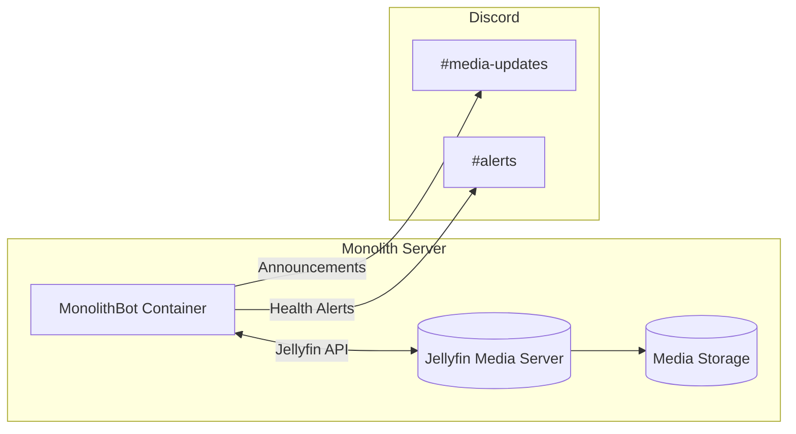
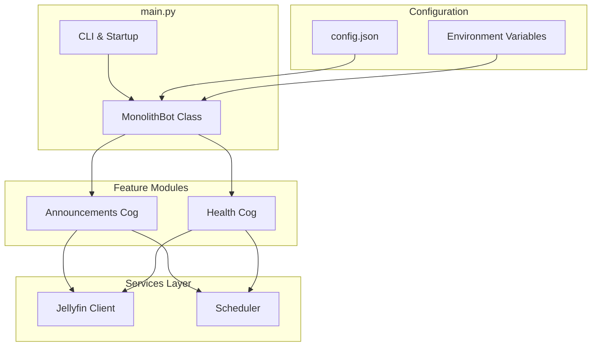
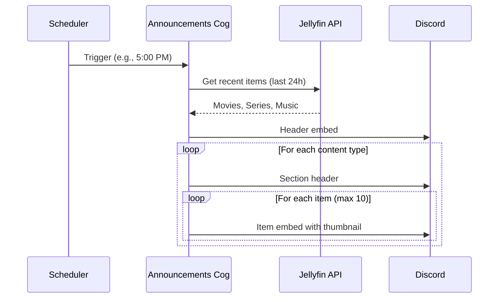
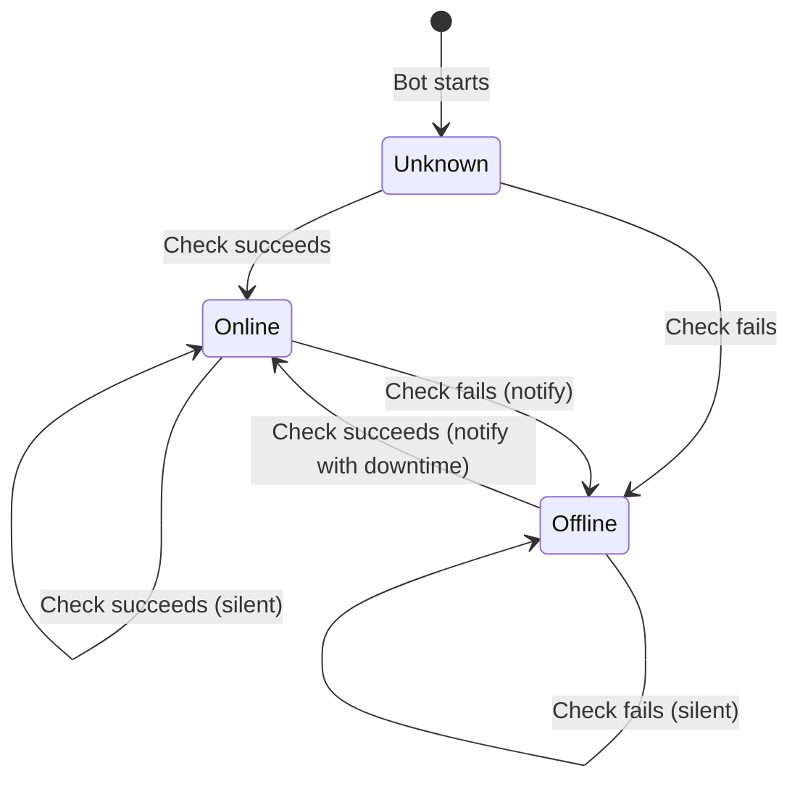
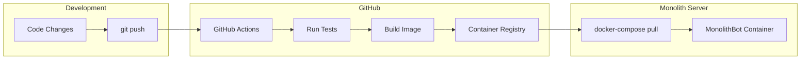

## Introduction

In my [previous homelab post](https://stevengann.com/posts/Homelab-Lessons-2/), I walked through the current state of my homelab infrastructure, including the Monolith server that runs [Jellyfin](https://jellyfin.org/) for streaming media to my family. One thing I mentioned wanting was better notifications. Specifically, a way to let everyone know when new content gets added to the library and to alert me when something goes wrong. Enter MonolithBot.

I've built simple Discord bots before, but usually in C# (my favorite [golden hammer](https://en.wikipedia.org/wiki/Law_of_the_instrument)) and usually with the most basic of API features: responding to text messages, maybe posting to a channel. I'd never done rich embeds with images and metadata, or the newer slash commands that is standard practice on Discord bots now. This project was an opportunity to try something different.

## Why Python?

I originally reached for C# for this project, as usual. I've used [Discord.Net](https://discordnet.dev/) before and it works fine. But as I researched rich embeds and slash commands, I kept finding that [discord.py](https://discordpy.readthedocs.io/) had more examples, better documentation for the features I wanted, and a more active community around bot development. The Python ecosystem for Discord bots just seemed more mature for this use case. It is the Happy Path.

The decision was made easier by another hard-earned lesson from my homelab journey: containerization. I knew from the start that I wanted this bot to run as a Docker container on the Monolith, pulled automatically from GitHub whenever I pushed updates. Python's simpler deployment story (no compilation step, smaller base images) made it a better fit for a lightweight containerized service.

## What MonolithBot Does

MonolithBot has two primary jobs:

1. **Content Announcements**: At scheduled times (5 PM by default), it queries Jellyfin for recently added content and posts beautiful embeds to a Discord channel with cover art, descriptions, and direct links to watch.

2. **Health Monitoring**: Every few minutes, it checks if Jellyfin is responding. If the server goes down, it posts an alert. When it comes back up, it posts a recovery notification with how long the outage lasted.

Both features sound simple, but there are some nuances that made the implementation interesting.

## Architecture Overview

Here's a high-level view of how MonolithBot fits into my homelab:



The bot runs as its own Docker container alongside Jellyfin and the other services on the Monolith. It talks to Jellyfin's API to fetch content and health status, then posts to Discord channels as needed.

### Internal Structure

Inside the bot, I used discord.py's "cog" pattern to keep things modular:



Each cog is self-contained with its own scheduler, Jellyfin client instance, and lifecycle management. This means I can load, unload, or reload features independently without restarting the whole bot.

### Announcement Flow

When the scheduler triggers an announcement, here's what happens:



### Health Check State Machine

The health monitoring was trickier than I expected. The naive approach would be to send a notification every time a health check fails, but that would spam the channel with alerts every five minutes during an outage. Instead, I implemented a simple state machine that only notifies on *transitions*:



This way, you get one "Server Offline" message when it goes down and one "Server Online" message when it recovers, with the downtime duration included. Much more useful than a wall of repeated alerts.

## Key Implementation Details

### Rich Embeds

Discord embeds were new territory for me. In discord.py, you build them like this:

```python
embed = discord.Embed(
    title=item.display_title,
    url=self.jellyfin.get_item_url(item.id),
    color=discord.Color.blue(),
)
embed.description = item.overview[:300] + "..."
embed.set_thumbnail(url=self.jellyfin.get_item_image_url(item.id))
embed.add_field(name="Year", value=str(item.year), inline=True)
```

The result is a nice card with the movie poster, a clickable title that links to Jellyfin, and metadata fields. Much better than plain text.

### Slash Commands

Discord has been deprecating the old `!command` style in favor of slash commands that show up in the UI with autocomplete and descriptions. In discord.py, they're straightforward:

```python
@app_commands.command(name="status", description="Check bot and Jellyfin status")
async def status_command(self, interaction: discord.Interaction) -> None:
    # ... build status embed ...
    await interaction.followup.send(embed=embed)
```

MonolithBot has two slash commands:
- `/status` - Anyone can check if the bot and Jellyfin are healthy
- `/announce` - Admins can manually trigger an announcement without waiting for the schedule

### Configuration: JSON and Environment Variables

One pattern I'm happy with is the dual-source configuration. For local development, I use a `config.json` file:

```json
{
  "discord": {
    "token": "YOUR_TOKEN",
    "announcement_channel_id": 123456789
  },
  "jellyfin": {
    "url": "http://localhost:8096",
    "api_key": "YOUR_KEY"
  },
  "schedule": {
    "announcement_times": ["17:00"],
    "timezone": "America/Los_Angeles"
  }
}
```

But in Docker, environment variables override everything:

```yaml
environment:
  - DISCORD_TOKEN=${DISCORD_TOKEN}
  - JELLYFIN_URL=http://jellyfin:8096
  - SCHEDULE_ANNOUNCEMENT_TIMES=17:00,21:00
```

This means I can develop locally with a config file (which is gitignored) and deploy to production with environment variables (which are managed separately). No secrets in the repo, no code changes between environments.

## Deployment

As I mentioned in my [homelab post](https://stevengann.com/posts/Homelab-Lessons-2/), I've learned the value of containerization the hard way. An early design goal for MonolithBot was to make it deployable as a Docker container that I could pull directly from GitHub.

The Dockerfile is minimal:

```dockerfile
FROM python:3.11-slim
WORKDIR /app
RUN useradd --create-home --shell /bin/bash botuser
COPY requirements.txt .
RUN pip install --no-cache-dir -r requirements.txt
COPY bot/ ./bot/
RUN chown -R botuser:botuser /app
USER botuser
CMD ["python", "-m", "bot.main"]
```

GitHub Actions handles the CI/CD: every push to `main` runs the test suite, and if it passes, builds and publishes the image to GitHub Container Registry. On the Monolith, I just need to run `docker-compose pull && docker-compose up -d` to get the latest version.



This setup means I can fix a bug on my laptop, push to GitHub, and have the fix running in production within minutes. The bot even restarts automatically thanks to `restart: unless-stopped` in the compose file.

## Testing

I'll admit, testing a Discord bot felt awkward at first. How do you test something that talks to external APIs and posts messages to channels? The answer is aggressive mocking.

The test suite uses pytest with pytest-asyncio for the async code, and [aioresponses](https://github.com/pnuckowski/aioresponses) to mock the HTTP requests to Jellyfin. Discord objects get mocked with unittest.mock:

```python
@pytest.fixture
def mock_bot(config, mock_discord_channel):
    bot = MagicMock()
    bot.config = config
    bot.get_channel = MagicMock(return_value=mock_discord_channel)
    return bot
```

With ~160 tests covering the configuration loading, Jellyfin API client, scheduler utilities, and both cogs, I can refactor confidently knowing I'll catch regressions. The CI runs these tests on Python 3.10, 3.11, and 3.12 to make sure I haven't accidentally used syntax that breaks on older versions.

## What I Learned

**discord.py is excellent.** The cog pattern, slash command decorators, and embed builders made it easy to structure the code cleanly. The async-first design fits well with a bot that needs to handle scheduled tasks and API calls without blocking.

**APScheduler is powerful but quirky.** I used it for both the cron-based announcement schedules and the interval-based health checks. It works well, but I had to be careful about timezone handling and making sure jobs don't pile up if a previous run is still going.

**State machines are underrated.** The health check state tracking is maybe 20 lines of code, but it transforms the feature from "annoying alert spam" to "actually useful notifications." I'll be using this pattern again.

**Test modes are invaluable.** I added `--test-health` and `--test-announcement` flags that trigger those features immediately on startup. This made debugging so much easier than waiting for scheduled times or manually breaking things.

## What's Next

MonolithBot is running happily on the Monolith, announcing new content to my family's Discord server and alerting me when something goes wrong. But there's always more to do:

- **Content requests via IMDB links**: Let users share IMDB links in Discord to request movies or shows, then have the bot pass those requests along to the appropriate services.
- **Minecraft server monitoring**: The Monolith also runs a Minecraft server, so why not have the bot announce when players join, report server status, and maybe even relay chat between Discord and the game?

The code is open source at [github.com/StevenGann/MonolithBot](https://github.com/StevenGann/MonolithBot) if you want to run it yourself or contribute.

For now, I'm just happy to have one more piece of my homelab talking to the others. Every time someone in my family sees the "New Movies" announcement pop up in Discord, it feels like a small victory for self-hosting.
