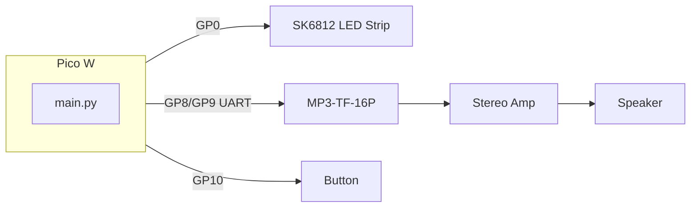
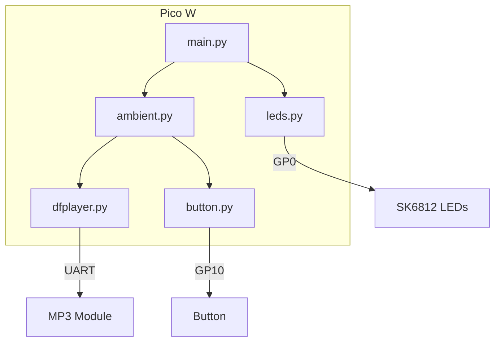
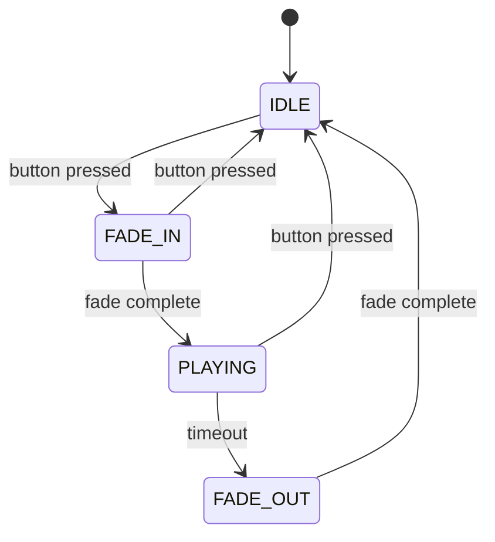

My mom has been wanting a book nook for a while now. She's turned our living room into a little library, and a narrow diorama that sits between the books, one of those scenes that looks like an alley or a room you could step into, would fit right in. She specifically asked for sounds, too. Crickets, crackling fire, maybe some distant village ambiance. So I set out to build one: a Tudor-style alley with warm lighting in the windows and button-triggered ambient audio. The whole project was tailored around her: something she could display in her library and interact with when she wanted a bit of atmosphere.

<!-- TODO: Photo - Finished book nook on shelf in mom's library -->

## The Physical Build

### Starting Point

I started with an existing model from [Printables](https://www.printables.com/model/479760-book-nook), which gave me a solid base to work from. The design was good (the Tudor architecture, the proportions, the general layout), but I wanted to push it further. Specifically, I wanted to add mirrors to create the illusion that the alleys continued deeper than the book nook itself. It's a common trick in dioramas: angled mirrors at the back corners reflect the scene and make narrow spaces feel much larger, as if the alley extends beyond what you can see. Without them, the diorama would feel like a dead end. With them, it feels like a place you could walk into.

<!-- TODO: Photo - Side-by-side: original model vs. modified with mirror cutouts -->

### Mirrors and Blender

I modified the model in [Blender](https://www.blender.org/), creating cutouts for mirrors at strategic angles. Getting the angles wrong would either double-reflect awkwardly or fail to create the illusion at all, so I didn't want to guess. Blender's raytracing let me accurately simulate the mirror reflections. I could place virtual mirrors in the scene and see exactly what would be reflected from every viewing angle. That meant I could iterate in software until the effect looked right, then commit to a print knowing the geometry was correct. The mirrors themselves are cheap "shatterproof" plastic mirrors from the craft store. They're thin enough to cut to fit with a hobby knife and flexible enough to avoid the brittleness of glass. Not the highest optical quality, but for this application they work perfectly.

<!-- TODO: Photo - Close-up of mirror cutouts creating alley depth illusion -->

### Printing and Finishing

I 3D printed all the parts, then tackled the layer lines. [FDM](https://en.wikipedia.org/wiki/Fused_deposition_modeling) prints have that distinctive stepped texture that can ruin the illusion of aged wood or stone. I airbrushed everything with Bondo glazing putty thinned with acetone, a trick that fills the layer lines and sands smooth, giving you a surface that takes paint properly. It's a bit more work than primer alone, but the result is worth it when you're going for a painted, miniature look. After that, I painted the pieces with acrylics and cemented them together with super glue. The super glue wicks into the joints and holds well for something that won't be handled much once it's on the shelf.

<!-- TODO: Photo - Painted pieces before assembly; or layer lines before/after Bondo -->

### LED Diffusion

The [SK6812 RGBW](https://en.wikipedia.org/wiki/Addressable_LED) LEDs sit behind the windows to simulate warm lamp and fireplace light. Raw LEDs are harsh and point-source; you'd see individual bright dots that scream "electronics" rather than "cozy interior." To fix that, I diffused them. I scuffed up clear plastic with a fine-grit sanding sponge until it was evenly frosted, then glued a piece behind each window. The frosting scatters the light so it fills the window opening softly, and the result reads as light coming from inside the buildings rather than from a strip of LEDs. It's a small detail, but it makes a big difference in selling the illusion.

<!-- TODO: Photo - Frosted plastic behind window; lit window detail -->

## The Electronics

The brain of the system is a [Raspberry Pi Pico W](https://www.raspberrypi.com/products/raspberry-pi-pico/) running [MicroPython](https://micropython.org/). The bill of materials is fairly modest: the Pico W itself, an SK6812 RGBW LED strip (I'm using about 20 LEDs for the windows), an [MP3-TF-16P](https://www.digitaltown.co.uk/components17dfminiplayer.php) or [DFPlayer Mini](https://wiki.dfrobot.com/DFPlayer_Mini_SKU_DFR0299) module for audio, a micro SD card, a momentary push button, and a speaker or amplifier. The whole system is powered by a 12 V wall wart through a barrel jack. The 12 V is regulated down to 5 V by a cheap adjustable [DC-DC buck converter](https://en.wikipedia.org/wiki/Buck_converter) module, and the 5 V feeds the Pico W, the MP3 module, the amplifier module, and the LEDs. The SK6812 strip needs that separate 5 V supply when you're driving many LEDs. Don't try to source that current from the Pico. The LEDs and MP3 module are all 5 V logic while the Pico W is 3.3 V. I didn't bother with level shifting. The Pico only ever sends signals to those devices; it never reads back (I found that leaving UART1 RX disconnected worked fine for the MP3 module). In most digital logic, 3.3 V is high enough to register as a "high" on a 5 V input, so the one-way signaling worked without a level shifter. If you run into glitches or unreliable behavior, a level shifter (e.g. [74AHCT125](https://www.ti.com/product/SN74AHCT125)) on the data lines would be the next thing to try. Optional but handy: a 1 kΩ resistor in series on the UART lines to the MP3 module if you run into buzzing or noise.

The MP3 module talks to the Pico over [UART](https://en.wikipedia.org/wiki/Universal_asynchronous_receiver-transmitter) at 9600 baud, 8N1. Its audio output can go either to the DAC pins (4 and 5) for a line-level signal to an amp, or to the SPK pins (6 and 8) for direct speaker drive. I use the DAC output into a cheap stereo amplifier board. The module could drive a small speaker directly from SPK, but the amplifier gives better headroom and, more importantly, a volume control knob on the back. That's essential for tuning the sound to the room (and to my mom's preferences) without digging into the firmware or reflashing the Pico every time the volume needs adjustment.

Here's the wiring at a glance:



| Pico W Pin | Function | Connects To |
|------------|----------|-------------|
| **GP0** | SK6812 data | LED strip DATA IN |
| **GP8** | UART1 TX | MP3 module pin 2 (RX) |
| **GP9** | UART1 RX | MP3 module pin 3 (TX) |
| **GP10** | Button | Momentary switch → GND |
| **GND** | Ground | All peripherals |
| **3V3** | 3.3 V | Shared rail |

The button uses the Pico's internal pull-up: one leg goes to GP10, the other to GND. Pressed = logic low. Debouncing is handled in firmware (`BUTTON_DEBOUNCE_MS` in config).

**Do not use** GP23, GP24, or GP25: those are tied to the onboard WiFi module and will cause problems if you repurpose them.

<!-- TODO: Photo - Interior wiring: Pico W, MP3 module, amp, LED strip -->

## The Firmware

I'll be honest: the firmware was mostly [vibe-coded](https://stevengann.com/posts/Vibe-Coding/). I had little interest in the programming for this project and wanted to focus on the visual aspects: the design, painting, LED animation tuning, and sound design. The code does what it needs to do, and I was happy to treat it as a means to an end. If you're curious about making AI-assisted development work for this kind of project, my posts on [Effective Vibe Coding](https://stevengann.com/posts/Effective-Vibe-Coding/) and [building the Mite robot](https://stevengann.com/posts/Robot/) cover similar territory.

The architecture is straightforward. A main loop runs every 50 ms, calling `leds.update()` and `ambient.update()` in sequence. That's it. The loop is simple so the rest of the system can stay modular: `leds.py` handles the strip, `ambient.py` orchestrates the audio and button, `dfplayer.py` talks to the MP3 module over UART, and `button.py` provides debounced press detection.



### LED Effects

The LED module supports three modes: `off`, `lamp` (warm orange, oil-lamp style), and `fireplace` (redder and dimmer). The trick to making the light look organic rather than robotic is per-LED configuration and random flicker.

Each LED has a base color defined in [HSV](https://en.wikipedia.org/wiki/HSL_and_HSV) (hue, saturation, value) plus flicker magnitudes for each channel. In `config.py`, you define a list of 6-tuples: `(h, s, v, dh, ds, dv)`. The first three are the base color, e.g. hue 20–30 for orange, high saturation, medium value. The last three are how much random variation gets added each frame: `dh` for hue, `ds` for saturation, `dv` for value. The flicker uses a triangular-like distribution so small variations are more likely than extremes, which gives a natural, candle-like effect.

For fireplace mode, a mode-specific offset is applied: the base hue shifts redder (+15°), and saturation and value are reduced so the light reads as dimmer and less saturated. Lamp mode uses no offset. The mode offsets live in a dict, and the sampling logic applies them plus random flicker before conversion:

```python
_MODE_OFFSET = {"lamp": (0, 0, 0), "fireplace": (15, -30, -20)}

# In _sample_led_color:
h, s, v, dh, ds, dv = _get_led_config(led_index)
oh, os_, ov = _MODE_OFFSET.get(_mode, (0, 0, 0))
h = (h + oh + _rand_diff(dh)) % 360
s = max(0, min(255, s + os_ + _rand_diff(ds))) / 255.0
v = max(0, min(255, v + ov + _rand_diff(dv))) / 255.0
r, g, b = _hsv_to_rgb(h, s, v)
```

The color pipeline runs like this: sample HSV with flicker → convert to RGB (standard hexagonal cone model) → convert to RGBW. The HSV to RGB conversion uses the standard hexagonal cone model, splitting hue into six 60° sectors and computing chroma, secondary term, and minimum for each:

```python
def _hsv_to_rgb(h, s, v):
    h = h % 360
    s = max(0, min(1, s))
    v = max(0, min(1, v))
    c = v * s
    x = c * (1 - abs((h / 60) % 2 - 1))
    m = v - c
    if h < 60:
        r, g, b = c, x, 0
    elif h < 120:
        r, g, b = x, c, 0
    elif h < 180:
        r, g, b = 0, c, x
    elif h < 240:
        r, g, b = 0, x, c
    elif h < 300:
        r, g, b = x, 0, c
    else:
        r, g, b = c, 0, x
    r = max(0, min(255, int((r + m) * 255)))
    g = max(0, min(255, int((g + m) * 255)))
    b = max(0, min(255, int((b + m) * 255)))
    return (r, g, b)
```

RGBW strips have a dedicated white channel. To avoid washing out the color, the firmware moves the common component into W and subtracts it from R, G, and B:

```python
# RGBW: move common component to W so we don't wash out the color
if "W" in config.LED_ORDER.upper():
    w = min(r, g, b)
    r = max(0, min(255, r - w))
    g = max(0, min(255, g - w))
    b = max(0, min(255, b - w))
    w = max(0, min(255, w))
else:
    w = 0
return (r, g, b, w)
```

Some strips swap red and green in hardware, so the code sends `(g, r, b, w)` to compensate. The [Neopixel](https://github.com/blaz-r/pi_pico_neopixel) driver (e.g. pi_pico_neopixel) uses `transfer_mode="PUT_CRITICAL"` to avoid glitches during `show()` when interrupts fire.

Frame updates are throttled to about 35 ms per frame (roughly 28 fps), so the animation stays smooth without hammering the strip. If you call `update()` more often (which the 50 ms main loop does), the throttle ensures you don't waste cycles or cause visible flicker from updates that are too fast.

### Ambient Audio

The ambient audio behaves like this:



Press the button once: volume starts at 0, a random track is selected, and playback begins. The volume fades in over a configurable duration (e.g. 500 ms). After a timeout (e.g. 30 seconds), it fades out and stops. Press the button again at any point during playback or fade: immediate stop, back to IDLE. The config lets you tune `AMBIENT_TIMEOUT_SEC`, `AMBIENT_FADE_IN_MS`, `AMBIENT_FADE_OUT_MS`, `AMBIENT_VOLUME`, and `BUTTON_DEBOUNCE_MS` to taste.

When a track finishes before the timeout, the firmware picks another random track and keeps going. That required a bit of care: the MP3-TF-16P v3.0 doesn't support `random_all()` the way the original DFPlayer Mini does, so the code uses `play_track(n)` with `poll_track_finished()` to detect when a track ends and then queues the next one manually.

The firmware is [open source on GitHub](https://github.com/StevenGann/BookNook) if you want to adapt it for your own book nook. The [Village README](https://github.com/StevenGann/BookNook/blob/main/Village/README.md) has a full wiring summary, BOM, and quick start; the `docs/` folder has detailed notes on LED control, the MP3 module, and MQTT topics for when that's implemented.

## Audio

All the ambient audio and music came from [Pixabay](https://pixabay.com/), which offers royalty-free sound effects and music. The selection is decent for this kind of project: crickets, rain, crackling fire, distant crowds, that sort of thing. I used [Audacity](https://www.audacityteam.org/) to normalize the tracks and convert them into a consistent format: MP3, same sample rate (8–48 kHz is supported), so they'd play reliably on the module. Normalizing matters because the raw downloads varied wildly in volume; without it, one track would blast and the next would be a whisper.

A quick note on the MP3 module: many boards sold as "DFPlayer Mini" are actually the MP3-TF-16P v3.0, which uses a different chip (GT3200B vs. the original's MH2024K-24SS). They look almost identical and use the same pinout and command set, but the MP3-TF-16P is pickier. It needs at least 100 ms between commands (the firmware enforces 120 ms via `MP3_CMD_DELAY_MS`) and it needs a few seconds after power-up to scan the SD card before it'll accept playback commands. If you're having trouble with commands being ignored or odd behavior, [Digital Town has a useful write-up](https://www.digitaltown.co.uk/components17dfminiplayer.php) on the differences and workarounds. The manual section 3.3.2 mentions the delay requirement; it's easy to miss if you're assuming full DFPlayer compatibility.

The SD card uses FAT16 or FAT32 (max 32 GB; exFAT won't work). Supported formats are MP3, WAV, and WMA. The layout is flexible: files can live at the root (playable by global index 1–N in copy order), in an `mp3/` folder as `0001.mp3`, `0002.mp3`, etc., or in numeric folders like `01/001.mp3`. The firmware uses root-level files for the ambient tracks and picks a random one on each button press. Keep `AMBIENT_TRACK_COUNT` in config in sync with how many files you've put there.

<!-- TODO: Photo - SD card with folder structure; or Audacity screen -->

## The Real Challenge

The biggest challenge in this project wasn't the wiring, the mirrors, or the code. It was overcoming my own ambition and perfectionism.

When I started, I had grand plans. LCDs in the windows showing animated scenes. Simulated weather. All sorts of features that would have turned a simple diorama into a months-long engineering project. The hardware and software would have been the easy part. The real trap was the endless refinement of the art. After a week of obsessive washes and dry-brushing, I had to make a decision. I declared the paint job "good enough" and forced myself to move on. Not because it was perfect, but because I'd never be 100% satisfied. There would always be one more wash, one more highlight, one more shadow to tweak.

Learning to embrace imperfection and reign in ambition has made this otherwise basic project into a valuable exercise, as an engineer and as an artist. Sometimes the right move is to ship. The book nook sits on my mom's shelf now, and she's happy with it. That was the goal.

## What's Next

[MQTT](https://en.wikipedia.org/wiki/MQTT) support for remote control is on the to-do list. The topics are already documented in the repo: `booknook/village/leds/mode` (payload: `lamp`, `fireplace`, or `off`) and `booknook/village/leds/brightness` (0–255). The idea is to wire that up to [Home Assistant](https://www.home-assistant.io/) or another controller so the LEDs can be switched and dimmed from a dashboard without opening the diorama. It's not implemented yet, but the config structure is there (WiFi, broker, client ID), so it's mostly a matter of connecting the dots.

I want to do a few more book nooks. Next up: one inspired by *The Hobbit*. I'm thinking about trying some basic animatronics, or maybe a [Pepper's Ghost](https://en.wikipedia.org/wiki/Pepper%27s_ghost) illusion to create a fire-breathing Smaug. We'll see how far the ambition creeps back in.

## The Result

Here's the finished book nook in action:


