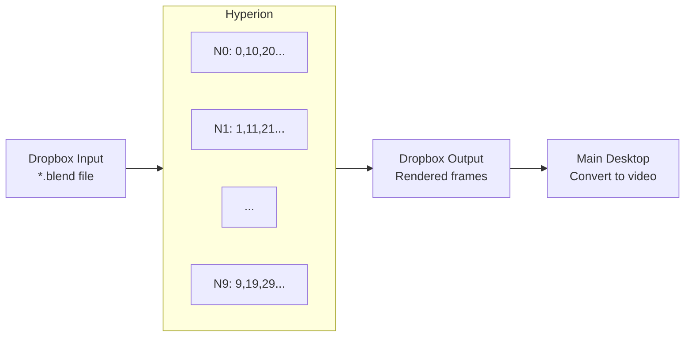
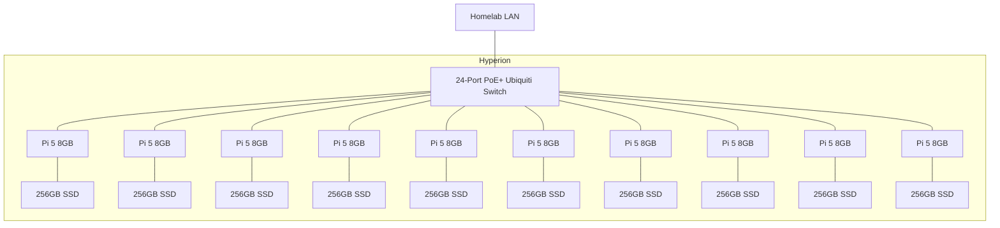

## Introduction

I finally decided to bite the bullet and build a Raspberry Pi cluster for my homelab. This is hardly an original idea, considering Pi clusters have been popular since the original Raspberry Pi back in 2012. But today the [Raspberry Pi 5](https://www.raspberrypi.com/products/raspberry-pi-5/) has some of the best performance-per-watt at hobbyist prices, and as my Monolith grows and I get more serious with my homelab as a learning platform, I can finally justify building one of my own.

## What's a Cluster, and Why Do I Want One?

At its core, a cluster is nothing more than a bunch of independent computer systems all networked together for a common goal. Probably the simplest is the old-school [Beowulf cluster](https://en.wikipedia.org/wiki/Beowulf_cluster) which is a bunch of PCs put together to work on a single task in parallel. I built a Beowulf cluster of my own in college, also named Hyperion: a stack of 10 mini desktop PCs that ran on 12V, each with a Core2 Duo CPU and 2GB of RAM, running Windows XP. I set them up in a stack with the same [Dropbox](https://www.dropbox.com/) folder synchronized across all of them and wrote a Python script that would monitor for [Blender](https://www.blender.org/) files to appear in a specific folder. When a `*.blend` file showed up, each node would open it and render every 10th frame with an offset of N—each node configured with a different offset. The rendered images went into a different Dropbox folder that synced back to my main desktop, where I could convert the sequence of frames into a video file. Crude, but it worked.

These days I render my Blender animations on GPUs. The new Hyperion is a much more sophisticated approach using the more flexible and modern concept of [container orchestration](https://www.ibm.com/think/topics/container-orchestration) and tools like [Kubernetes](https://kubernetes.io/) or [K3s](https://k3s.io/). With the Pis operating as worker nodes, a central orchestration server running on my Monolith handles moving containers onto each Pi in the cluster, running them, and piping their network traffic back to the Monolith and my reverse proxy. The flexibility of this system means I can have some of the Pis even power down when not needed, and when performance demand rises the containers can shuffle around to ensure heavier services have the resources they need, up to a single container consuming a whole Pi while any containers it had been sharing with get shuffled onto other Pis. This approach brings a lot of resiliency as well, because if one or two Pis go offline the containers can be quickly started up again on one of the remaining nodes.

## Planning The New Hyperion

I began planning around a handful of Raspberry Pi 5s I had on hand, each with 8GB of RAM. I set 10 aside, along with some Pi HATs that provided Power-over-Ethernet (PoE) and M.2 NVMe support. I sourced a rackmount chassis to hold them all, and then I got a 24-port PoE+ [Ubiquiti](https://ui.com/) rackmount switch to tie the whole Raspberry Pi cluster into the rest of my homelab network. That was my cue to pull the trigger and launch into the project.

## Assembly

I assembled each Pi with a beefy aftermarket heatsink. The cluster is destined for a server cabinet in my garage alongside the rest of my homelab, and while my garage doesn't get very hot during Silicon Valley's mild summers, I wanted to give the cluster every protection I could. From there, I assembled the PoE+ NVMe HATs with a 256GB SSD on each so that every node would have fast local storage instead of relying on SD cards.

Then I mounted the whole stack on the individual sleds for the 2U 19" rackmount chassis, giving the Raspberry Pi 5 cluster a home alongside the other rackmount gear in my lab.

With the Pis in the sleds and the HATs installed, all that remained was to plug each Pi into the switch with CAT6 patch cables and power the whole thing on. On paper, it should have been a clean PoE-powered boot for a shiny new homelab compute cluster.

## First Boot — And the First PoE Problems

I was greeted with all but one of the Pis starting up. Within a few minutes, though, four had gone dark. This is where my troubles began.

## Troubleshooting PoE Power Issues

I knew pretty quickly the problem was related to PoE. I designed and debugged PoE systems back when I was an embedded systems designer, so I knew what to look for. I could hear a high-pitched, stuttering whine coming from the transformers on some of the PoE HATs, and the 5V indicator LEDs were turning on and then fading out. My first thought was poor connections between the PoE regulators and the Pis' Ethernet ports, but attempts to improve the contacts didn't help at all. In fact, as I disassembled and reassembled the stacks trying to get better connections, they seemed to be getting worse—even dying completely.

I tried plugging a USB-C power supply into one of the failing Pis and confirmed it was booting. The problem was definitely in the PoE, but where? I was starting to think the PoE HATs were defective or poor quality. I began to resign myself to abandoning PoE for the cluster and plugged in USB-C power and Ethernet at the same time so I could at least move on with the project. When I did, I heard a fizzing and popping noise. I brought my ear close to the board to try to guess where the noise was coming from—just in time for the large capacitor on the board to explode with a loud pop and a spray of insulation fluid. Electrolytic caps only blow like that when given extremely high voltage or reverse polarity. There was no source of HV in the circuit, so it had to be reverse polarity. I inspected the PCB under the cap to see if this was an assembly error, but the cap had been soldered in the correct orientation. This is when the root cause dawned on me: a seemingly harmless heatsink mod had turned into a perfect short-circuit trap for the PoE hardware.

I looked under the HAT's PCB at the SMT ferrite inductor soldered to the underside, along with most of the final 5V buck converter circuit. Sure enough, one of the lead tabs on the inductor was touching that stout heatsink I'd put on the Pi. Disassembling revealed that enough paint had been worn off the heatsink to create a short circuit.

That specific Pi HAT was shot. Even after replacing the blown cap, the PoE regulator refused to start up. Fortunately, the Pi and SSD were unharmed, so after swapping it out and covering the inductor with a square of electrical tape, all was well. I repeated this remediation across the other 9 Pis and was rewarded with a fully operational 10-node Raspberry Pi cluster—exactly the kind of resilient, low-power compute layer I wanted to add to my [existing homelab setup](/2026/01/21/homelab-lessons-2/).

## Conclusion

With the hardware sorted, the Hyperion cluster is ready for the next phase: software configuration and deployment into the homelab. In the next post, I'll cover the OS setup, container orchestration, and how these 10 nodes will fit into the rest of my infrastructure as a Kubernetes-style cluster.

If you're curious how this all fits into the bigger picture, you can read the earlier parts of this series: [Homelab Lessons 1 - The Road To Homelab](/2026/01/20/homelab-lessons-1/) and [Homelab Lessons 2 - My Little Kingdom](/2026/01/21/homelab-lessons-2/).
