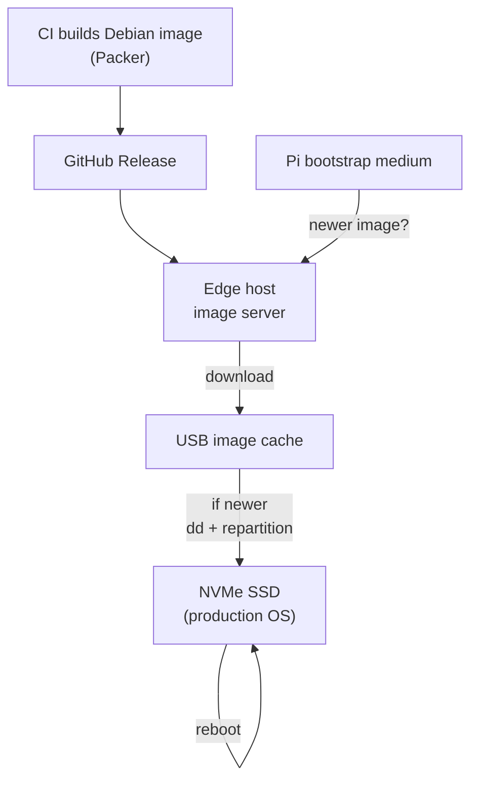
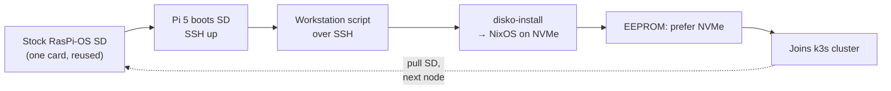
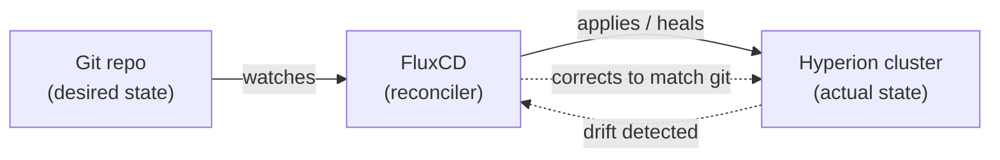

## Introduction

[Last time](/posts/Hyperion-Cluster/) I built the hardware: ten [Raspberry Pi 5s](https://www.raspberrypi.com/products/raspberry-pi-5/), each with an NVMe SSD on a PoE+ HAT, racked in a 2U chassis, all sipping power off a single Ubiquiti switch. By the end of that post I had a beautiful stack of blinking lights and one exploded capacitor's worth of hard-won wisdom. What I *didn't* have was a cluster. I had ten independent little computers that happened to be bolted together.

This post is about the other half of the job — the half that doesn't photograph well. Turning those ten bare Pis into a single, self-managing [k3s](https://k3s.io/) cluster that runs containers, heals itself, and updates from a `git push`. It took longer than the hardware did, sent me down at least one expensive dead end, and ended with me throwing away a design I was genuinely proud of. Which, it turns out, was the right call.

So let's talk about the software.

## The Goal

The dream is simple to state and annoying to achieve: I want to hand the cluster a description of "what should be running" and have it figure out the rest. Containers should land on whichever node has room. If a Pi dies, its workloads should restart elsewhere. If I want to deploy a new service, I want to commit a YAML file to a Git repo and walk away. No SSHing into ten machines. No snowflake servers I'm afraid to reboot because I can't remember how I set them up.

That last part is the real point. The whole reason I bother with [infrastructure-as-code](https://en.wikipedia.org/wiki/Infrastructure_as_code) is so I'm never again the guy who can't reproduce his own homelab. Ten nodes is exactly the scale where doing things by hand stops being charming and starts being a liability.

## The First Approach — and the Wall

My first plan was the one every "build a Pi cluster" tutorial nudges you toward: golden images. Build one perfect [Debian](https://www.debian.org/) image with [Packer](https://www.packer.io/), bake k3s and all the configuration into it, and stamp it onto every node. Cattle, not pets.

The wrinkle is *how* you get that image onto ten NVMe drives that live inside ten Pis bolted into a rack. Pulling the SSDs to flash them on a desktop is exactly the kind of manual toil I was trying to avoid. So I designed something clever — too clever, in hindsight.

The scheme went like this. Each Pi would boot from a small bootstrap medium (an SD card or USB stick). That bootstrap would phone home to my edge host, check whether a newer node image was available, cache it locally, and then — if the cached image was newer than what was on the NVMe — `dd` the image onto the SSD, repartition, and reboot into the freshly-flashed production OS. No bootstrap medium inserted? Boot straight into the NVMe and run normally. Network → USB cache → NVMe, never network → NVMe directly, so a flaky download could never brick a node mid-write.



On paper this is elegant. It's network-resilient, it's idempotent, the identity of each node travels on a removable stick so the hardware stays interchangeable. I was proud of it.

In practice, the SSDs *would not reliably re-flash.* I cannot overstate how many evenings I poured into this. I tried different `dd` invocations, different repartition steps, different ordering of the reboots, boot-loop protection so a half-flashed node would give up gracefully instead of cooking itself in a loop. I caught and fixed a dozen real bugs. And after fixing all of them, the core problem remained: sometimes the flash took, sometimes it didn't, and I could never get it to 100% reliable across all ten nodes. I was debugging a Rube-Goldberg reimaging pipeline of my own construction, and the machine kept dropping the ball at the very last gear.

There's a particular flavor of frustration that comes from a system you designed yourself refusing to work. You can't even be mad at anyone.

## The Pivot — Stop Fighting, Start Describing

Eventually I did the thing I should have done sooner: I stopped, walked away from the keyboard, and asked whether the whole *approach* was wrong rather than whether I had one more bug to find.

The golden-image scheme is fundamentally *imperative*. It's a sequence of steps — copy these bytes here, then repartition, then reboot — and every step is one more place for the procedure to go sideways. For a single machine that's fine. For a fleet, every imperative step is a coin flip you have to win ten times in a row.

What I actually wanted was *declarative*: describe the desired end state of a node once, and have a tool build a machine that matches it — reproducibly, every time, with no "flash" step to fail. That's not a tweak to my pipeline. That's [NixOS](https://nixos.org/).

I'll be honest, I did not commit to this lightly. NixOS has a real learning curve, and rewriting the whole software story for the cluster after sinking weeks into the Debian path felt like admitting defeat. I sat with it for a few days, sketched out what the Nix version would actually look like, and slept on it more than once before I pulled the trigger. The thing that finally sold me: with NixOS, each node's entire operating system is a single reproducible *closure* built from one configuration file. There's no image to flash and re-flash. If I want to change something, I change the config and rebuild — and the result is bit-for-bit reproducible whether it's node one or node ten.

One config. One reproducible system per host. Defined in the same Git repo as everything else. That was worth the rewrite.

## The NixOS Bring-Up Gauntlet

Of course, "just use NixOS" hides a gauntlet of Pi-specific papercuts that no tutorial warned me about. Here are the war stories.

### kexec is dead on the Pi 5

The slick way to install NixOS onto a remote machine is [nixos-anywhere](https://github.com/nix-community/nixos-anywhere), which uses a Linux trick called [`kexec`](https://en.wikipedia.org/wiki/Kexec) to boot a fresh kernel in place, wipe the disk out from under the running OS, and install onto it — all over SSH, no physical media.

On the Pi 5, `kexec` is a non-starter. The kernel is missing `/proc/kcore`, which the tooling depends on, and the whole remote-flash dance falls apart before it begins. I burned a little time confirming this was really, truly dead and not just me holding it wrong.

The unlock was realizing I'd been overthinking it. On a normal server, `kexec` exists to solve a chicken-and-egg problem: you can't reformat the disk you're currently booted from. But on these Pis the **NVMe is a completely separate disk from the boot SD.** There's no chicken-and-egg at all. I can boot from a stock [Raspberry Pi OS](https://www.raspberrypi.com/software/) SD card, and from that running system install NixOS *onto the NVMe* — a disk I'm not booted from and am free to wipe. The tool for that is [`disko-install`](https://github.com/nix-community/disko), which partitions the target disk and lays down the closure in one shot.

So the model became: one single stock Raspberry Pi OS SD card, with SSH enabled. Pop it into a node, power on, run a script from my workstation that does everything over SSH. When it finishes, pull the SD and move it to the next Pi. One card, physically walked down the row. No network image server, no re-flash pipeline, no coin flips.



### "It installs perfectly. It just won't boot."

This one cost me an evening of pure confusion. The install would run to completion, report success, reboot the Pi… and then nothing. A black screen and a Pi that just sat there. No kernel panic, no error, no boot. The install said it worked. The Pi disagreed.

The culprit was a missing tool on the `PATH` during the offline install. NixOS uses [sops-nix](https://github.com/Mic92/sops-nix) to decrypt secrets at activation time, and during the `disko-install` activation it expects `mount` (from `util-linux`) to be available — and it wasn't. That made activation abort *just before* the step that actually stages the bootloader files onto `/boot/firmware`. So I'd get a fully-installed root filesystem on the NVMe and a completely empty boot partition. The Pi's firmware would look for a kernel, find nothing, and shrug.

The fix, once I understood it, is to finish the bootloader step inside [`nixos-enter`](https://nixos.org/manual/nixos/stable/) — a chroot into the freshly-installed system — with `util-linux` explicitly on the `PATH`, so `kernel.img`, the initrd, and `config.txt` actually land where the Pi's EEPROM expects them. Maddening to diagnose; a few lines to fix.

### k3s wouldn't start: the missing memory cgroup

Node boots into NixOS. k3s comes up. k3s immediately falls over with `failed to find memory cgroup (v2)`. Cool.

This one is a known Pi gotcha that I'd somehow never hit before: the Raspberry Pi kernel **disables the memory [cgroup](https://en.wikipedia.org/wiki/Cgroups) by default.** Kubernetes absolutely needs it to track and limit container memory, so without it k3s just dies. The fix is a one-liner in the kernel command line — `cgroup_enable=memory cgroup_memory=1` (plus the cpuset friends) — baked into the base NixOS module so every node gets it from first boot. Like a lot of these, it's a one-line fix that takes an hour to find and five seconds to apply once you know the magic words.

### EEPROM boot order

Last piece: I need the Pi to *prefer* the NVMe over the SD card once NixOS is installed. The boot order lives in the Pi's EEPROM (in the SPI flash, below the OS), so I set `BOOT_ORDER` to try NVMe first, then fall back to the SD, then USB. The beauty of this is that a blank or old NVMe falls through to whatever bootstrap SD is inserted, but an *installed* NVMe always wins and the SD is simply ignored. So I can leave the bootstrap card in, or pull it — doesn't matter, the installed node boots itself.

### The payoff: one command per node

Every one of those papercuts is now baked into a single turnkey script. The entire per-node experience is:

```bash
./setup-hyperion-node.sh --name hyperion-alpha
```

Behind that one command, the script handles bootstrap SSH access, generates and registers a per-node encryption key, installs Nix on the bootstrap, runs `disko-install` onto the NVMe, works around the bootloader gotcha, sets the EEPROM boot order, reboots, and waits to confirm the node has joined the cluster and gone `Ready`. Bootstrap-SD-in, NixOS-on-NVMe-out, joined to the cluster — no babysitting.

Then I pull the SD, walk it to the next Pi, and run it again. The nodes are named after Greek letters — `hyperion-alpha` through `hyperion-kappa` — and one by one they came up as healthy k3s workers. After all the thrash of the Debian path, watching ten nodes fall into line from one shell script and one SD card was deeply satisfying. The fanciest design lost to "one SD card and a script." I'll take it.

## The Brain — a Containerized Control Plane

A k3s cluster needs a control plane — the "brain" that schedules workloads and keeps the cluster's desired state. My ten Pis are all *workers*; the control plane runs on my edge-services host, Heimdall, where it lives in a Docker container alongside my reverse proxy and DNS.

I'll own a piece of honest technical debt here, because real homelabs have it and pretending otherwise helps no one. Running the control plane in a *bridge-networked* container creates a networking quirk: the workers can't reach the control plane's internal cluster-overlay endpoint. Everything important works — the Pis register, take workloads, and report health — but a couple of conveniences (like live resource metrics) don't, because that traffic rides the overlay the workers can't see.

My workaround for now is a [taint](https://kubernetes.io/docs/concepts/scheduling-eviction/taint-and-toleration/) on the control-plane node so no app workloads schedule onto it, plus a scheduling rule that pins all real workloads to the Pi cluster where the networking is clean. It's not the final answer — the proper fix is to relocate the control plane onto a host where it can join the overlay directly — but it's stable, it's documented, and it lets the cluster do real work today. Known debt, written down, with a plan. That's the homelab way.

> **Update:** The lab was later rebuilt into a 42U rack with hosts renamed under a mythological scheme, reworking where the control plane and edge services like Heimdall live. See [Homelab Lessons 5 - Into the Rack](/posts/Into-The-Rack/).
{: .prompt-info }

## Self-Managing with GitOps

Here's where it gets genuinely fun. With workers joined and a control plane scheduling them, I wired up [GitOps](https://about.gitlab.com/topics/gitops/) with [FluxCD](https://fluxcd.io/).

The idea behind GitOps is that your Git repo *is* the source of truth for what runs in the cluster. Flux watches the repo, and whatever I commit, it reconciles onto the cluster — continuously. I run it read-only, with no write-back token: the repo describes the desired state, Flux makes reality match, and reality never edits the repo. If something drifts, Flux drags it back. If I want a change, I commit it and Flux applies it within a minute or two.



Alongside Flux I run [MetalLB](https://metallb.io/), which hands out real LAN IP addresses to cluster services. On a cloud provider a "LoadBalancer" service gets a public IP for free; on bare metal in my garage, MetalLB is what makes that work, dealing out addresses from a pool I carved out of my home network. So a service in the cluster gets a stable IP I can point my reverse proxy at, just like a normal box on the LAN.

The first tenants of the new cluster were a couple of housekeeping services to prove the whole loop end-to-end: the [Headlamp](https://headlamp.dev/) dashboard for eyeballing the cluster in a browser, and an [Uptime Kuma](https://github.com/louislam/uptime-kuma) instance to watch my services and yell at me when something falls over. Both deployed the same way everything will from now on — a YAML file committed to Git, reconciled by Flux, exposed by MetalLB. The cluster now heals and updates itself from `git push`.

## Taking Flight

The moment Hyperion stopped being a science experiment and became *infrastructure* was when I deployed something I actually cared about onto it.

That something was Hermes — a self-hosted AI agent of mine, backed by [DeepSeek](https://www.deepseek.com/) — deployed onto the cluster entirely through GitOps, secrets and all. No hand-placed config, no SSHing in to drop an API key. The deployment manifest and its encrypted secrets live in Git, Flux reconciles them onto the cluster, and Hermes comes up running on the Pis. That's the whole promise made good: a real workload, with real secrets, brought up by committing files to a repo.

And it's not stopping there. The next tenant I'm lining up is a full media-automation stack — the [\*arr](https://wiki.servarr.com/) suite — to handle the unglamorous plumbing of my media library. But that's a story for another post.

The cluster has taken flight. It runs real things now.

## Lessons

Pulling the threads together, because this series is supposedly about *lessons*:

- **Declarative beats imperative for a fleet.** A sequence of steps that works 95% of the time works 60% of the time across ten machines. Describing the end state and building to match it reproducibly is the only thing that scales — and NixOS makes that the *default* rather than a discipline you have to maintain by willpower.
- **Sunk cost is a liar.** I'd poured weeks into the Debian re-flash pipeline. Walking away from it *felt* like losing all that work. It wasn't — the work taught me exactly why the approach was wrong, which is what let me pick the right one. The courage to throw out a clever design that isn't working is worth more than the design.
- **The elegant design usually loses to the boring one.** My network-cached, USB-staged, self-updating image pipeline was genuinely clever. It got beaten, cleanly, by one SD card and a shell script. Boring and reliable wins.
- **The Pi has papercuts no tutorial mentions.** Dead `kexec`, the disabled memory cgroup, the EEPROM boot order, a bootloader step that silently no-ops if a tool isn't on the `PATH`. Every one of them is a one-line fix that costs an evening to find. Write them down so future-you doesn't pay twice.

## What's Next

This series has quietly outgrown its own premise. What started as a few lessons from a modest homelab has turned into a running chronicle of a lab that keeps getting more serious — and the next post is the biggest leap yet. I'm finally migrating off the ad-hoc stack of PCs my homelab has accreted into over the years and onto a proper 42U server rack, along with some major evolution in how the whole lab is structured. Hyperion was the first citizen of that new order; next time, the rest of the lab catches up. It should be a fun one.

If you want the earlier chapters: [Homelab Lessons 1 - The Road To Homelab](/posts/Homelab-Lessons-1/), [Homelab Lessons 2 - My Little Kingdom](/posts/Homelab-Lessons-2/), and the hardware build that started Hyperion, [Homelab Lessons 3 - Rise of Hyperion](/posts/Hyperion-Cluster/).
