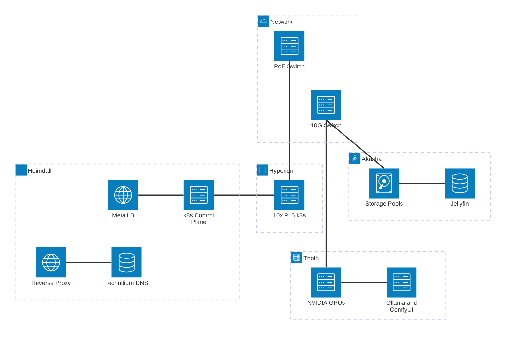
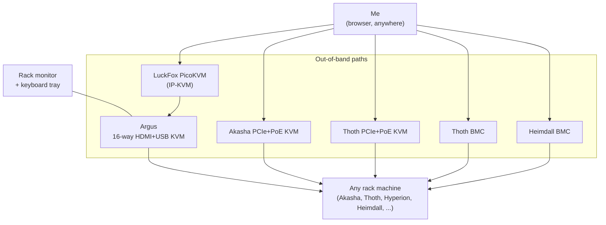

## Introduction

[Last time](/posts/Hyperion-Takes-Flight/) I promised the next post would be the biggest leap yet: dragging my homelab off the ad-hoc stack of PCs it had accreted into over the years and onto a proper 42U server rack, with some real structural changes to how the whole thing is organized. Hyperion was the first citizen of that new order. This is the post where everyone else moves in.

If you've read the earlier chapters you know the shape of the old lab: a Monolith doing far too much, a Compute server doing a little, an Automation Pi quietly doing its one job better than anything else, and a tangle of cables holding it all together on a wire shelf in the garage. It worked. It also made me nervous every time I rebooted anything.

So I tore most of it down and built it back up properly. New rack, new names, clearer roles, and (the part I'm most pleased with) I can now administer every machine in the lab without walking out to the garage at all.

## The Rack

The centerpiece is a 42U server rack, now living in my garage. After years of stacking servers on a wire shelving unit and threading 10G DACs between them like I was defusing a bomb, having everything bolted into a single frame with real cable management is almost emotional. Every host, every switch, the Pi cluster: all of it racked, all of it labeled.

Power is its own small system. There's a **networked PDU** with per-outlet metering, plus **two StarTech "dumb" PDUs** for everything else. The four servers (**Akasha, Thoth, Heimdall, and Hyperion**) each plug straight into the metered PDU, so I can watch every one of them draw power *individually*. (That's how I caught the Thoth driver-branch idle-power win I'll get to below; I could actually see the number drop.) Everything else hangs off the two dumb PDUs, which themselves feed back into the metered one, so the lab's total draw nets out through a single set of eyes too. Per-host visibility where it matters, aggregate everywhere else.

_The whole lab in one frame: every host, switch, and the Pi cluster, finally racked and labeled._

The detail that's changed my day-to-day the most is mundane: a **monitor and a pull-out keyboard tray** mounted right in the rack. For years, "I need to see the console on this box" meant dragging a spare monitor and keyboard out to the garage, finding a flat surface, and crouching. Now there's a screen and a keyboard at eye level, permanently. Combined with the KVM setup I'll get to below, the rack has a real local console for the first time, and that single quality-of-life upgrade has made me far more willing to actually maintain the thing.

## A Pantheon Instead of a To-Do List

The old machines had descriptive names: Monolith, Compute, the Automation Pi. Descriptive names are honest, but they bake an assumption about a machine's *job* into its identity, and that assumption ages badly. "Compute" had become my AI box, "Monolith" was doing storage *and* a dozen services *and* hosting the cluster brain. The names had stopped describing reality.

So as part of the overhaul I retired the descriptive names and gave the lab a mythological roster. It's a small thing, but decoupling a host's *name* from its *current role* means I can repurpose a machine without it being a lie. The pantheon now:

- **Akasha**: formerly Monolith. The big storage box.
- **Thoth**: formerly Compute. The GPU/compute server.
- **Hyperion**: the Raspberry Pi cluster, doing the containerized-workload heavy lifting.
- **Heimdall**: the edge-services host that watches the gate.
- **Argus**: not a server at all, but the many-eyed thing that lets me see all of them. (More on Argus later; the name is a better joke once you know what it is.)

Let's walk the rack.

## Akasha: Becoming Pure Storage

Akasha is the machine that used to be Monolith, and the whole point of this overhaul was to let it finally do *one* thing well.

In the old world, Monolith was [the shining centerpiece I described in Lessons 2](/posts/Homelab-Lessons-2/) precisely because it did everything: 60TB of ZFS, Jellyfin, Navidrome, NextCloud, Minecraft, the works, all crammed onto one 24-core Xeon. That was the original sin I've spent this whole series slowly undoing: a single server with every service competing for the same CPU, so that a Jellyfin transcode could make the Minecraft server stutter.

With Hyperion online to run containerized services and Heimdall handling edge duties, I finally had somewhere for all those workloads to *go*. So I moved them off. Service after service migrated off Akasha, most of them landing on **Hyperion** (as GitOps-managed k8s workloads) or on **Heimdall** (the edge stuff). What's left behind is what Akasha was always best at: being a giant, reliable pile of disks. It's a pure storage server now, exporting its pools over the network for everything else to consume.

There's exactly one holdout: **Jellyfin**. It's still on Akasha for now, mostly because it's the service my family notices the instant it breaks. (It's the one I cared enough about to build [a whole Discord bot, MonolithBot](/posts/Discord-Bot/), to babysit.) I don't reorganize the thing people are actively watching TV through without a plan. But its days on Akasha are numbered: Jellyfin will most likely move to **Thoth**, where the GPUs live, so transcoding happens right next to the silicon built for it. I've already got a containerized Jellyfin running on Thoth in parallel as a proving ground; once I'm happy with it, Akasha gets to be *only* storage, full stop.

That's been the through-line of this entire series, finally reaching its conclusion: stop asking one machine to be everything.

## Thoth: Lighter, Cooler, Cheaper at Idle

Thoth is the old Compute server, and it got the most invasive surgery of the bunch.

Compute had been running [TrueNAS](https://www.truenas.com/), same as Monolith, a choice I made originally so the two boxes would feel similar and services could move between them easily. In practice, running a storage-appliance OS on what is fundamentally a *GPU compute node* was a lot of overhead for very little benefit. TrueNAS wants to be a NAS; Thoth wants to run heavy CUDA workloads and not much else. The fit was wrong.

So I rebuilt it from scratch on plain **[Ubuntu Server](https://ubuntu.com/server)**. No appliance layer, no ZFS-management UI it wasn't using, no middleware between me and the GPUs, just a lean server OS with Docker and the NVIDIA stack. Lighter footprint, fewer moving parts, and a system that's honest about what it is.

The surprise win came from the GPU drivers. Thoth runs NVIDIA cards, and I'd been on the **Data Center driver branch** out of habit; it's the "serious" branch, so surely it's the right one for a server, right? Turns out, for my workload, the data-center branch held the GPUs in a higher-power idle state. Switching over to the **Workstation driver branch** dropped my idle power draw noticeably. These cards spend most of their lives idle, waiting for a transcode or an inference request, so idle watts dominate the electricity bill far more than peak watts do. A driver-branch swap I expected to be a wash turned into one of the better efficiency wins of the whole project. File that one under "the 'enterprise' option is not automatically the right option."

## Heimdall: Watching the Gate

If Hyperion is the muscle and Akasha is the memory, **Heimdall** is the gatekeeper. It's the edge-services host, and it carries the jobs that sit at the front door of the whole lab:

- the **reverse proxy** that fronts every service,
- a **[Technitium](https://technitium.com/dns/) DNS server** for internal name resolution and ad-blocking (the spiritual successor to the old Pi-Hole),
- the **[MetalLB](https://metallb.io/) load balancer** that hands real LAN IPs to cluster services, and
- the **k8s control plane**, the brain that schedules the Hyperion cluster.

That last one is also the one honest piece of technical debt I confessed to [last post](/posts/Hyperion-Takes-Flight/), and I want to be straight that it's *not* fully paid off yet. The control plane still runs in a bridge-networked container on Heimdall, which means it can't join the cluster's overlay network, so a couple of conveniences (live metrics, mainly) still don't work and real workloads stay pinned to the Pis. I said the proper fix was to relocate the control plane onto a host where it can join the overlay directly, and that's exactly what's coming: it's moving to a **dedicated Pi** of its own. That's a near-future project, big enough to deserve its own post when I actually pull it off, so I won't pretend it's done here. For now, the debt is still on the books, just with a firm plan and a date getting closer.

_The new layout at a glance: Akasha as pure storage, Thoth on GPUs, Hyperion running the workloads, and Heimdall at the edge with the proxy, DNS, load balancer, and control plane. (Live version below.)_

## Argus: Seeing Everything Without Leaving My Chair

This is the part I'm most smug about. The whole lab now has true lights-out management, and it's layered.

At the center is **Argus**: a 16-way **HDMI + USB KVM switch**. Argus is wired into the rack's built-in monitor and keyboard, so from the pull-out tray I can flip between the console of any machine in the rack with a keypress: no dragging monitors around, no crawling behind the rack to reseat a cable. Sixteen many-eyed inputs, one set of eyes. Hence the name.

But a local console only helps when I'm *standing at the rack*, and the whole point of a homelab in the garage is to never have to. So Argus's monitor-and-keyboard side also feeds a **[LuckFox PicoKVM](https://www.luckfox.com/)**, a tiny IP-KVM that captures that same HDMI output and exposes keyboard and mouse over the network. The chain looks like: any of 16 machines → Argus → PicoKVM → my browser, from anywhere. I can reach the BIOS of any rack machine from my couch, or from my phone on the other side of the country.

That covers the rack at large, but the two machines I least want to lose remote access to get their own dedicated out-of-band paths, so they don't depend on Argus being healthy:

- **Akasha** and **Thoth** each have their own **PCIe + PoE IP-KVM** cards: independent KVM-over-IP that doesn't share the Argus chain at all. Even if Argus is down or mid-switch, those two have a private door.
- **Thoth** and **Heimdall** both have proper **BMCs** (baseboard management controllers, the IPMI-style lights-out boards), so I get full power control, sensor telemetry, and remote console at the firmware level, completely independent of the host OS being alive.

The result: there is no machine in this lab I have to physically touch to recover, short of a dead power supply. After years of "ugh, I have to go out to the garage and plug a monitor in," that feels like a genuine superpower.

## Coming Soon: The Lab Goes On the Air

With the compute side finally in order, I'm letting myself get distracted by the fun stuff. The next wave of additions is all **radio**:

- **Four low-power FM transmitters**: a little garage broadcast project I've been wanting to do for ages.
- A **[Meshtastic](https://meshtastic.org/) node**: joining the off-grid LoRa mesh, because a homelab that only speaks Ethernet feels incomplete.
- An **[SDR](https://www.rtl-sdr.com/)** (software-defined radio): to listen to, well, everything. ADS-B, weather satellites, the local mesh, whatever's in the air.

None of this is racked yet, but the rack has the space and the power for it now, and "homelab" was always supposed to mean a *lab*. Expect a post when the antennas go up.

## An Aside: GUPPI

I can't write a post about administering this lab without introducing the thing that increasingly administers it *with* me.

> If you've read Dennis E. Taylor's **[Bobiverse](https://en.wikipedia.org/wiki/We_Are_Legion_(We_Are_Bob))**, you'll recognize the name. GUPPI is Bob's faithful subsystem: the tireless not-quite-a-person that runs the ship, handles the grunt work, and lets Bob focus on the interesting problems. Naming mine GUPPI was not a difficult decision.

GUPPI is my own instance of the **[Hermes Agent](https://github.com/NousResearch/hermes-agent)**, a self-hosted AI agent, given standing access to the whole homelab. It **supervises** the lab (watching health and metrics across every host), **live-debugs** problems with me when something misbehaves, and generally **monitors** the place so I don't have to keep sixteen dashboards open. It's the natural evolution of that "deploy n8n to notify me when something breaks" bullet point from way back in Lessons 2, except instead of a rigid workflow it's [a real AI agent](/posts/RAGs-And-Agents/) I can actually *talk to* about what's wrong.

And it's not only an ops tool. GUPPI doubles as a general-purpose assistant, with access to my entire **[Obsidian](https://obsidian.md/)** vault through **Caldera**, a little service I wrote that exposes an Obsidian vault to programs over a clean REST/MCP API. It serves each note along with its links, backlinks, tags, and frontmatter, plus [vector search over the whole vault](/posts/Embeddings/), so GUPPI can read and write my notes the way Obsidian means them, not as a dumb pile of Markdown. I've written before about [leaning on AI and my notes as assistive technology](/posts/AI-As-Assistive-Technology/); GUPPI is that idea wired directly into the lab. The result is a resident intelligence that knows both the infrastructure *and* my notes about the infrastructure. It deserves its own post, and it'll get one.

## Lessons

This series is nominally about *lessons*, so:

- **Names shouldn't encode jobs.** "Monolith" and "Compute" told you what those boxes did right up until they didn't. Decoupling identity from role meant I could repurpose hardware without the name becoming a lie. Akasha can stop being a Swiss Army knife and just be storage.
- **One machine, one job, for real this time.** Every prior post in this series circled this lesson and didn't quite land it. The rack and the cluster finally gave the overloaded services somewhere to *go*, so Akasha could become what it should always have been.
- **The "enterprise" option isn't automatically right.** TrueNAS on a GPU node and the data-center driver branch both *felt* like the serious, correct choices. Ubuntu Server and the workstation drivers were lighter, simpler, and, in the driver case, measurably cheaper to run at idle.
- **Build the recovery path before you need it.** Layered out-of-band management (Argus plus PicoKVM, dedicated KVMs on the critical two, BMCs where I can) means there's no host I have to physically touch to bring back. The time to wire that up is *before* a 2 a.m. kernel panic, not during one.
- **A console you'll actually use beats a clever one you won't.** A monitor and a pull-out keyboard bolted into the rack is the least sophisticated thing in this entire post, and it changed my maintenance habits more than anything else.

## What's Next

The lab has finally caught up to Hyperion. Everything's racked, everything's named, everything has one clear job, and I can reach all of it from my couch. For the first time in this whole journey, the infrastructure feels less like a pile of accidents and more like a *system*.

Which means I get to play. Next up is either the radio gear going on the air, or a proper deep-dive on GUPPI and Caldera, whichever I can't stop tinkering with first.

If you want the earlier chapters: [Homelab Lessons 1 - The Road To Homelab](/posts/Homelab-Lessons-1/), [Homelab Lessons 2 - My Little Kingdom](/posts/Homelab-Lessons-2/), [Homelab Lessons 3 - Rise of Hyperion](/posts/Hyperion-Cluster/), and [Homelab Lessons 4 - Hyperion Takes Flight](/posts/Hyperion-Takes-Flight/).
