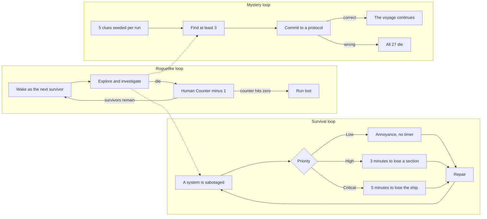

_The key art. That amber rectangle at the end of the hall is the only thing in the game that will ever be happy to see you._

## Introduction

On March 26th I made the first commit to a repository called `27-Survivors`. On July 17th, the morning [OpenSauce 2026](https://opensauce.com/) opened its doors in San Mateo, I tagged v1.0. In between: 831 commits, 285 GDScript files, roughly 63,000 lines of code, one engine version bump, two decks of the ship deleted six days before the show, and a monster that at one point learned to simply stop existing.

This is the postmortem, and it is mostly about the things that didn't ship.

That's the honest way to write one of these. Every finished game is a small pile of things that worked sitting on top of a much larger pile of things that didn't, and the second pile is where all the interesting engineering lives. The features that shipped are visible in the game and you can go look at them. The features that died only exist in the git history, and those are the ones that actually taught me something.

The toolchain, for anyone curious, is deliberately unglamorous: [Godot 4](https://godotengine.org/) and GDScript for the game, [Blender](https://www.blender.org/) for models and animation, [GIMP](https://www.gimp.org/) for textures and 2D work, [Audacity](https://www.audacityteam.org/) for audio, [DaVinci Resolve](https://www.blackmagicdesign.com/products/davinciresolve) for the trailer, and VS Code for everything else. All of it free, or free enough. None of it was ever the bottleneck.

_An April build, debug overlays and all. The counter in the top-left corner is the entire game in three words._

## Why This Game Exists

I've wanted to make games since I was a kid. That's true, and it explains nothing about why *this* game got made in *these* four months.

The real answer is that I was laid off from Meta.

If you've been through one, you know the shape of it. It isn't grief exactly, and it isn't anger exactly. It's the floor moving. Somebody you will never meet, in a room you'll never see, makes a decision that rearranges your entire life, and the decision has nothing to do with you, or your work, or whether you were good at it. It's about a number going up somewhere else. You are a line item. And there is nothing whatsoever you can do about it.

So I spent four months, six days a week, turning that into something a stranger could feel for a couple of hours.

Once you know that, the ship stops looking like set dressing. The *Orpheus* is not a government mission. It's a commercial venture by a private operator called Blue Space, corporate-led and state-subsidized, which in the lore document's own words "answers only to its investors." Berths were *sold*. Most colonists paid for the privilege of being aboard, a handful won a lottery, and the stratification by purchase price shows up in where your pod sits and what color your badge is. Nobody has independently verified a single thing about the destination. Everything anyone knows about the colony comes from Blue Space's own reports.

One of the sixteen endings is that the mission was never real. The ship was never equipped for planetfall. No landing systems, no entry shielding, nothing. It was launched as a publicity spectacle to inflate a stock price, and then quietly written off as lost once the markets had moved on. There's another thread where the *Orpheus* passes her sister ship adrift and broadcasting a distress call, and the ship's AI declines to investigate, because a course change isn't on the mission profile and therefore isn't a thing that can be considered.

The two hardest rules in the design are the ones I'd defend to the end: **you cannot kill the antagonist**, and **the counter only ever goes down**. You can ward the thing off. You can buy time. You can be clever, and careful, and lucky. You cannot win the fight, and nothing you do puts a single person back in their pod. All you get to decide is what the remaining people are spent on.

I'll be honest about what this was. *27 Survivors* is less a game I set out to build than a chapter of my life I needed to process, and as a therapeutic tool it worked extremely well. Everything below (the dead ends, the deleted decks, the panic week) happened inside that.

## What 27 Survivors Is

The elevator pitch I wrote in the design document, back when the whole thing was still a working title:

> [_Amnesia: The Dark Descent_](https://en.wikipedia.org/wiki/Amnesia:_The_Dark_Descent) crossed with [_Clue_](https://en.wikipedia.org/wiki/Cluedo), set in the cold silence of deep space.

You are aboard the *Orpheus*, a [generation ship](https://en.wikipedia.org/wiki/Generation_ship) carrying colonists to a habitable star. Everyone is asleep. Something has gone very wrong, and the ship's AI has been waking crew members one at a time to deal with it. They have all died. You are next.

The ship departed with 100 passengers. By the time you first open your eyes, 27 remain. That number is on your HUD at all times, and it is also your life counter. When you die, you don't respawn, you *continue as the next person on the manifest*, and the counter ticks down by one. Your previous character's body stays where it fell, with everything they were carrying still on it. When the counter hits zero, the run is over. There is no recovery.

The design document has a line I kept coming back to whenever I was tempted to soften something:

> 27 is not an abstraction. 27 is a tragedy.

_The hibernation bay. Everyone you will ever play as is asleep in this room right now._

Three loops run simultaneously, and the friction between them is the whole game:

The mystery is a 4×4 matrix: four possible answers for *what* the antagonist is, four for *why* it's doing this, generating sixteen distinct endings. The truth is rolled fresh every run and five clues are scattered to point at it. You need three to make an accusation; all five removes the ambiguity. Guess wrong at the terminal and everyone dies, including the 26 people still asleep who never got a vote.

The look is PSX/N64 on purpose, not as nostalgia but as a horror tool: vertex-snapped geometry, affine texture warping, fog used as a draw-distance excuse the way [the fifth generation](https://en.wikipedia.org/wiki/Fifth_generation_of_video_game_consoles) used it, everything crushed through a 3D lookup-table palette pass with an amber CRT overlay on the HUD. Low fidelity is a gift to a horror game. Your brain fills in the low-poly monster with something far worse than I could have modeled.

_Every survivor is a real person in the manifest with a name, a job, a bio, and their own stat line. Abel Tessema, atmospheric engineer, nine years in Addis Ababa orbital service, is a little tougher and a little stronger than average. It will not be enough._

Now let's talk about the graveyard.

## Dead End: The Ship's AI That Improvised

The ship's AI is the player's only companion. It reports sabotage, confirms repairs, announces each death out loud in a synthesized voice, and answers questions at any terminal. It woke you up. It is *ostensibly* on your side.

In mid-April I decided it should be able to actually talk to you. Not menu topics, but a real conversation with [a language model running locally](/posts/RAGs-And-Agents/), so the AI could improvise, so a second playthrough wouldn't hand you identical text, so the thing could feel like a mind instead of a lookup table. I wired in a `DialogProvider` interface with two implementations behind it: a static one that read authored text, and one that talked to a locally hosted model. Two commits later, logged with the ever-informative "Added local LLM" and "LLM improvements", it worked.

It worked badly, in two directions at once.

The first problem was quality. Models small enough to bundle with a game and run on a consumer gaming PC were not smart enough to hold the roleplay. I wanted a cold institutional intelligence that has been alone with 100 sleeping people for years and has recently started to wonder whether it's the one who's been killing them. What I got was a chipper general-purpose assistant that would break character at the slightest provocation and cheerfully offer to help me with something else instead. Every prompt-engineering trick I tried bought me a few more exchanges before the mask slipped.

The second problem was performance, and it was the one that actually killed it. Even on my main gaming machine, which is not a modest machine, responses were slow enough to be annoying. In a horror game where the terminal is a place you stand still with your back to the room, "annoying delay" is not a neutral cost. It converts dread into impatience. And that was on *my* hardware. The whole point of the PSX aesthetic is that the game should run on anything.

So I cut it and hand-authored everything instead. The `DialogProvider` abstraction survived and the static provider is still what ships. The console eventually grew into a genuinely nice system: a random-access records browser you interrogate like a wiki, plus a [Morrowind](https://en.wikipedia.org/wiki/The_Elder_Scrolls_III:_Morrowind)-style conversational mode where the AI picks the topic instead of you. Every line has three variants depending on whether the AI is neutral, compromised, or the antagonist itself.

Here's the part I didn't expect: hand-authoring made the game *better*, not just cheaper. In a mystery, every line the AI says is potential evidence. A model that improvises can accidentally contradict the truth the run rolled at startup, and in a whodunnit an accidental contradiction isn't flavor, it's a lie the player will build a theory on and then get punished for. Authored text can be audited. Improvised text can't. I went in chasing replayability and came out understanding that in this specific genre, determinism *is* the feature.

## The Voice

The ship's AI doesn't just print text at you, it speaks. Not recorded voice acting, but [DECtalk](https://en.wikipedia.org/wiki/DECtalk), a [formant](https://en.wikipedia.org/wiki/Formant) synthesizer running as a native extension and generating audio at runtime, so the AI can say your current survivor's name, the deck the fault just occurred on, and how many people are left.

DECtalk is the family of synthesizer behind the most recognizable computer voice of the last forty years, and that was the whole point. The first version I tuned was a deliberate nod to [Stephen Hawking](https://en.wikipedia.org/wiki/Stephen_Hawking). I spent a long evening pushing pitch, rate, and formant parameters around, trying to land as close to that voice as I could get, and I got reasonably close.

Then the photographs of Hawking on Epstein's island surfaced, and I no longer wanted the reference in my game. It wasn't a difficult call and it took about a minute. The homage was the only reason the tuning existed, and once the homage had soured the tuning had no reason to exist either.

What replaced it turned out to be better, which is how these things tend to go. I retuned the voice soft and high and slightly child-like, modeled on the speaking voice of a friend of mine. Friendlier, and *far* more unsettling. A grave, sonorous machine announcing that another passenger has died sounds like a machine doing its job. A small, gentle, faintly sweet voice announcing that another passenger has died sounds like something that doesn't understand what it's saying.

Or, worse, like something that does.

## Dead End: Teaching a Monster to Be Afraid of Light

The antagonist obeys one rule above all others: it will not enter light. That's the contract the whole game is built on. Light is safety, darkness is not, and the player's flashlight is a wall they carry.

Getting the monster to actually respect this took three architectures.

**Version one** was the obvious approach: before pathing anywhere, check whether the destination is lit, and if so, don't go. This works right up until the monster is already moving, or the path between two dark rooms happens to cross a lit corridor, or the destination is dark but every route to it isn't.

**Version two** was version one plus patches. Four software gates: a target-safety check, a per-frame segment-versus-cylinder intersection test against every armed light volume, a boundary stop, and obstacle injection into the avoidance solver. Then, because the monster genuinely *does* need to break the rule sometimes (fleeing a welder burn, walking past on a scripted beat), five bypass clauses layered on top. My own notes on it are unkind and accurate: *three rounds of regressions, each fix adding another layer.* Every bug I closed was a real bug, and closing it added a new interaction with the four gates already there. The system had reached the point where I couldn't predict its behavior by reading it.

**Version three** was an architectural reset, and it's one of my favorite things in the codebase because the insight is embarrassingly simple: *stop asking the monster to be disciplined and make the light physically solid.*

Every armed light volume now carries an `Area3D` and a sibling `StaticBody3D` on a dedicated collision layer. The monster's collision mask has one bit for that layer. When the bit is on, the light is a wall. Not a suggestion, not a preference, a wall, and `move_and_slide()` cannot pass through it because the physics engine will not permit it. When the monster is allowed to break the rule, I flip one bit.

Five clauses of tangled predicate logic became a one-line mask toggle, and the correctness argument got much stronger, because the engine enforces it in C++ at sub-step resolution. Software gates have edge cases: intermediate waypoints, single-tick prediction, directional gradients in the avoidance solver. Physics doesn't have edge cases. It just has physics.

The general lesson, which I have now relearned in three different domains: when a rule keeps leaking, stop adding checks and go find a lower layer that can enforce it for you. It's the same thing I took away from [rebuilding my Pi cluster on NixOS](/posts/Hyperion-Takes-Flight/), where describing the end state and letting the tool guarantee it beat a pile of careful imperative steps every time. If you can express your invariant in terms of something the engine already guarantees, do that instead of guarding it yourself.

_The ship hologram on the command deck. The banner in the top-left corner says "SYSTEM FAULT," which it will keep saying for as long as you fail to do anything about it._

## Scrapped: The Jefferies Tubes

This is the big one, and it hurts the most, so let's do it properly.

The *Orpheus* was designed with five levels: an upper deck, a lower deck, engineering, and two levels of maintenance crawlways I called [Jefferies tubes](https://en.wikipedia.org/wiki/Jefferies_tube), because I am who I am. The tubes were the best idea I had. Crawling on your hands and knees through a cramped service duct while something that also fits in a cramped service duct is somewhere in the network with you. That's the horror beat the whole ship was arranged around. It changed your posture, your speed, your field of view, and your ability to run away, all at once.

I built a *lot* of machinery for them:

- An [`AStar3D`](https://en.wikipedia.org/wiki/A*_search_algorithm) routing graph over the tube network, with junction obstruction so segments could be blocked and rerouted around.
- Player posture swapping, with the camera and collider dropping to crawl height.
- Per-cluster light gating so the light contract still held in a space full of small wall-mounted fixtures instead of ceiling cones.
- Vertical connectors between tube levels, which shipped, but via a completely different architecture than the one I planned. The planned fade transitions and pair tables were never built.
- A [wave function collapse](https://github.com/mxgmn/WaveFunctionCollapse) maze generator, so the tube layout could vary between runs while still producing a solvable, canon-consistent network.

I want to be clear that most of this *worked*. The WFC generator is genuinely nice. Unfortunately, it's also where the single most stubborn bug in the project lives: during the monster's stalking behavior, if it and the player are both inside the same tube cluster, the monster reaches a spot near a segment seam and stops. Velocity zero. I ruled out path instability, capsule clipping, the anti-oscillation guard, and the light-safety check. I never found it. It's still in the known-issues doc, formally shelved, with a list of diagnostic next steps for whenever I come back to it.

On July 11th, six days before OpenSauce, I cut both tube levels from 1.0.

The commit is clinical in a way I find funny in retrospect. Two level scenes deleted, one of them 1,017 lines. Six files gone. The level manager's path tables shrunk from five entries to three. The achievement tracker's deck list from five to three. The turbolift lost two floor buttons. Eighteen per-deck weighting entries stripped out of the antagonist's beat catalog across all nine beats. One ending's epilogue text rewritten so it stopped referring to a place that no longer existed. Five test suites updated. 1,322 tests still green.

Deleting a feature is a *refactor*, and it is exactly as invasive as adding one. I had the usual reflex, that cutting scope will save time, and it's true in the aggregate and completely false in the moment. That cut cost me most of a working day I did not have, six days from a hard external deadline.

Why do it at all? Because the tube levels were the last item in the art queue, and the art queue was the critical path. Every line of code had been done since day one of the release sprint. What I was actually waiting on was *models*. Cutting the tubes converted "I might not have art for a whole deck" into "every prop that can spawn in 1.0 has final art," and it did that by construction rather than by hope. It was the right call, made about four days later than it should have been.

I ran into the same wall building [a book nook for my mom](/posts/BookNook/), where the hard part turned out to be not the wiring or the code but reining in my own ambition and calling the work good enough. Same lesson, higher stakes, and apparently I needed it twice.

The engineering deck absorbed the tubes' traversal space, so the network still exists in a reduced form. The scenes are still in git.

## The Rest of the Graveyard

Things that were designed, sometimes built, and did not make 1.0:

**Randomized survivor stats.** The original design had each new survivor roll random values for health, endurance, speed, strength, and aim. It's the obvious [roguelike](https://en.wikipedia.org/wiki/Roguelike) move and it was wrong for this game. If the person you become is a stat block, the Human Counter is just a life bar, and I'd written a whole design document about how it isn't. So I replaced the roll with a hand-authored roster of 27 named people, each with their own stats, height, and bio, awakened in manifest order. Mira Okafor, chief mechanic, propulsion and coolant-loop certified, eight years in the Lagos shipyard. There's a companion document listing the 73 who died before you woke up, feeding the dossiers you find on their corpses. 27 + 73 = 100. That's the whole point.

**The Crew Log accusation.** Originally you'd gather clues and then make your accusation from a journal UI on a hotkey. It shipped, and it was fine, and it was completely undramatic. Naming the killer from a menu you can open anywhere costs you nothing. So the accusation moved out of the journal and into a physical Emergency Protocols terminal that you have to *walk to*, on a deck the antagonist knows you have to reach, with the protocol list narrowing as you file more evidence. The Crew Log survived, demoted to a read-only evidence viewer. Retiring that mechanic rippled through seven documents and a batch of the ship AI's voice lines, all of which cheerfully kept pointing at the old flow for weeks afterward.

**Quest VR.** Listed as a target platform for months on the strength of pure optimism. When I finally audited it, the project had exactly zero XR scaffolding: no origin node, no controller nodes, no OpenXR plugin. Worse, the entire post-processing chain that *makes* the game look like the game is screen-space and renders to one eye. Retrofitting it for stereo, plus world-space HUD, comfort options, and an action map, is a multi-month project on its own. Demoted to "future target," honestly this time.

**Live microphone echo.** A feasibility study on routing your actual microphone through the game's spatial reverb, so the room could whisper back at you in your own voice. Verdict: mechanically feasible, latency budget fine, needs headphone enforcement and a privacy disclosure. Also: not a shipping feature, it's a party trick, and it needs a calibration flow I didn't have time to design. Never implemented. I still think about it.

**Three red herrings.** The mystery seeds fake evidence alongside real evidence, and the rule I'd set was that a prop's *model quality must not correlate with its truthfulness*. If the real clues have bespoke art and the herrings are amber placeholder blocks, the player learns to read the art budget instead of the mystery. With four days left, three herrings still had no models. Rather than ship a tell, I pulled them from the spawn pool. Scenes and design briefs retained.

**The convention trailer.** A dedicated OpenSauce cut was on the schedule for the final week, on top of the store trailer that already existed. Dropped, and replaced by just running the game live at the booth and mirroring it to a projector. Nobody at a maker convention wants to watch a trailer standing up when there's a machine right there they could be playing instead.

**Menu music.** Dropped from launch as a deliberate decision. The one gameplay track ships as-is.

_There is nothing out there. That's sort of the problem._

## The Sprint

_Somebody left their personal log open in the briefing room. This is not a good sign._

On June 29th I wrote a pre-release checklist and a fifteen-working-day schedule, six days a week, Sundays off. The external milestone was immovable: OpenSauce ran July 17–19, and I needed a demoable build in hand by the 16th.

The commit graph tells the story better than I can. March: 23 commits. April: 89. May: 194. June: 231. July: 294, all of them in the seventeen days before the tag.

Nineteen tagged builds went out between July 1st and July 17th. v0.1 was the first Steam upload. v0.3 was the first build on a stable engine, because Godot 4.7 went stable mid-sprint and I'd been sitting on 4.6 waiting for exactly that. An analysis I'd written back in April concluded "wait for stable, do not upgrade during beta," and I'm glad past-me was disciplined about it, because the upgrade landed clean and the framerate got noticeably better. v0.6 through v0.8 were content. v0.13 was the opening cinematic. v0.14 was a four-tier overhaul of the monster's pathfinding: fifteen commits, thirty files, six days out, which is exactly the kind of thing you are not supposed to do six days out. v0.15 cut the tube decks. v1.0 shipped on the 17th.

Day one of the sprint overran the plan in the good direction. Everything release-gating that I'd scheduled through day six landed on day one instead, including a [softlock](https://en.wikipedia.org/wiki/Softlock) in the endgame protocol logic that I found *while* building something else. From day two onward the critical path was never code again. It was art, and it stayed art.

The best bug of the whole sprint came from a tester on day three. With several clues logged, they reported, the monster simply stops appearing. Forever. For the rest of that survivor's life.

They were right, and the cause is a lovely little piece of [state machine](https://en.wikipedia.org/wiki/Finite-state_machine) negligence. The attacking state had no termination watchdog, because its only exits were "player wounds it" or "player dies." Every other state had timeouts. This one didn't, because I'd written in its own docstring that it was terminal and therefore couldn't get stuck, which is the kind of comment that should be treated as a confession. Sure enough, when the monster spawned at a deliberately hidden point that turned out to have no navigable route to the player, it would sit there recoiling from a player it could never reach, holding the manager's single active-encounter slot, forever. And because *every* other part of the antagonist system checks "is an encounter already active?" before doing anything, one parked monster silenced the entire threat system. The game just got quiet. Which, for a horror game, is either the worst possible bug or an unusually elegant one.

The fix was watchdog rails on every state, with one hard rule: a monster the player can currently *see* is never watchdogged. Nothing is allowed to despawn on camera.

The last week was less about building and more about the unglamorous machinery of actually shipping something. A license manifest covering every dependency in the build, packaged into all three platform zips and both Steam depots with a loud failure if it's missing. [Steam Deck](https://www.steamdeck.com/) controller glyphs tokenized so the game shows the right button icons. Auto-pause when the Steam overlay opens or a controller disconnects, both of which came back as real feedback from Valve on the Deck Verified submission. A device-aware skip hint on the cinematic that says "any button" on a gamepad and "any key" on a keyboard. None of this is fun. All of it is the difference between a project and a product.

I also spent a chunk of the final week fighting my own test suite, which broke because I'd refactored a level's props into individual scene files, and a test that verified prop coverage did so by *text-parsing the level file* looking for tokens that were no longer literally in it. The game was fine. The test was measuring an authoring pattern rather than a behavior. Four red builds in a row before I diagnosed it. If you write tests that grep your scene files, you have quietly coupled your test suite to your authoring style, and you will find out about it at the worst possible moment.

{: width="360" .normal}
_The colony mission patch. One of the game's real clues is a burned, defaced copy of it, a prop that sat blocked in the art queue until the patch itself existed. [Orpheus](https://en.wikipedia.org/wiki/Orpheus) went into the underworld to bring someone back and looked over his shoulder at the worst possible moment, which felt about right for a colony ship._

## What I'd Do Differently

**Cut earlier.** Not "cut more," because the cuts I made were correct. But the Jefferies tubes were visibly at risk for at least a week before I killed them, and every day I waited made the deletion more expensive, because more systems had grown references to a thing that was going to be deleted anyway. There's a bias where holding a decision open feels like preserving optionality, and for scope cuts it's the opposite: you're accruing interest on a debt you've already privately decided to pay.

**Audit the plan against the build sooner.** Two of my dead ends, VR and the light-aversion gate stack, survived for weeks purely because I never sat down and checked whether the thing worked the way my own documents claimed. In both cases, the moment I actually looked, the answer was immediate and unambiguous. Documents rot faster than code, and they rot silently, and a design document that has drifted from the build is worse than no document at all because you'll make plans against it.

**Guard the onboarding as hard as the systems.** More on this below, because it's the one that actually matters.

## What Went Right

The three-loop structure was the correct bet. Sabotage timers pull you one way, clues pull you another, and the antagonist explicitly weights *toward* sabotage that's far from you and *away* from sabotage near clues you haven't found, so the pressure system is also a misdirection system. Nothing about that needed to change from the original design.

The mystery matrix scales for almost nothing. Adding one new "what the antagonist is" option generates four new combinations with zero new infrastructure. That's the expansion vector, and it was designed in from day one.

Rewriting the antagonist's scheduling was worth every hour. It started as a flat 60-second timer rolling five weighted actions, which produces exactly the metronome you'd expect. It ended as a beat catalog gated by four pressure bands (rest, build, peak, fade) where a rest band locks for 75 to 110 seconds unless you take a big hit, and a peak band can't sustain past 40 seconds before it's forced to fade. The monster knows what to do this second. The scheduler knows what you're *feeling*, tracked through dwell time, how much you're leaning on your flashlight, how fast you're testing theories, and where you've been dying. They never share coordinates. The scheduler only ever names a room.

And the PSX aesthetic paid for itself several times over. It's a genuine art-budget multiplier, it hides an enormous number of sins, and because the whole game renders into a small viewport and gets blown back up with [nearest-neighbor](https://en.wikipedia.org/wiki/Nearest-neighbor_interpolation) filtering, the look *is* the optimization. Pointing the opening cinematic through the same downscaled path as everything else cut its 3D fragment count by roughly nine times, which is the kind of win you don't usually get from a consistency fix.

_The command deck. Every surface in this game is about six hundred triangles and a texture small enough to have shipped in 1998._

## What Comes Next

1.0 is not the game in my head. It's a very good draft of it, shipped on a hard date to a room full of people, and I'm continuing to work on it.

**Onboarding is the priority, and it's not close.** The most common feedback since release, by a wide margin, is that players often don't know where to go or what to do. That's on me, and the reason is not mysterious: I have played this game more times than anyone alive. I wrote every clue, I know where every terminal is, I know what the protocol list is asking before I've read it. What is intuitive after a hundred hours of building something is not intuitive on minute three, and I let the version of the game that lives in my head stand in for the version that reaches the player.

The irony is sharp enough that I want to put it on the record. There was a teach-moment on the schedule: a single scripted encounter about a minute into every run, where the monster approaches while you're standing in light, stops dead at the boundary, watches you for a few seconds, and silently withdraws. No damage, no attack. It teaches the game's most important rule wordlessly, by demonstration, which is how you should always teach a rule. Of course, it touched the antagonist's code with days left and no playtest budget, so I cut it and put a physical sign on the booth table instead. At the booth, the sign worked fine. Everywhere else, there is no sign.

So the current work is a real pass on guiding the player: making the ship's AI a more active partner in the investigation instead of a records browser that waits to be asked, making objectives legible without turning the game into a waypoint chase, and teaching the light contract the way it was always supposed to be taught. Dread comes from understanding the rules and being unable to satisfy them. Confusion isn't dread. It's just confusion, and it reads as a broken game rather than a hostile one.

**The Jefferies tubes come back.** The scenes are in git, the maze generator works, and the traversal beat they provide doesn't exist anywhere else in the ship. I want them restored properly rather than restored quickly, which means finally hunting down that stalking-in-tubes bug.

**More mystery, and more of the AI to talk to.** The three cut herrings go back into the spawn pool with real models. 1.0 shipped with only two conversational threads with the ship AI, both of them front-loaded onboarding and lore. The interrogation loop deserves mid-run conversations: the AI volunteering something about a passenger, walking back a claim it made an hour ago, declining to answer a question it answered freely before. That's where a suspicious machine becomes genuinely unsettling, and there's a whole system built for it that 1.0 barely used.

None of this is a roadmap with dates on it. It's the honest list of the gap between what shipped and what I was aiming at, and I intend to keep closing it.

_The Orpheus, still underway. It has somewhere to be._

## Conclusion

Four months from empty repository to a Steam release and a booth at a convention, on a game with three interlocking systems, sixteen endings, and a hundred named people. I cut two decks of the ship, an entire conversational AI, a VR platform, a microphone feature, three pieces of evidence, a convention trailer, and the menu music, and I would cut every one of them again.

Thanks are owed: to Dal Deem for the graphic design, to Captain Pepper for lending the narrator a voice, and to the testers who found the things I'd stopped being able to see, including the one who noticed that sometimes the monster just gives up and goes home.

I also got the thing I actually came for. I started this with a knot in my chest over a decision made somewhere far above me, and I finished it with a shipped game, a store page, and a room full of people at a convention playing it. None of them had any idea what was underneath it, and none of them needed to. Making the helplessness into something with rules, and a shape, and an ending you can reach is a real trick, and it works on the person building it at least as well as on the person playing it. Recommended, if you've got four months.

**[27 Survivors is on Steam.](https://store.steampowered.com/app/4773130/27_Survivors/)** There are 27 people left. Try to do better than I usually do.

> **AI Disclosure:** Unlike most of my blog, this post was mostly drafted by an AI agent based on all of the notes and git history that had been accumulated over the course of the project, and the draft was manually rewritten for clarity and accuracy. I did this because I do not believe it undermines the value of the post because it serves to communicate the journey that was involved in developing the game. Also, I believe an AI agent generating the postmortem based on the historical record of the project is likely more objective than I could be.
> 
> This post is an exception to the rule. For everything else, see my [AI policy]().
{: .prompt-info }
