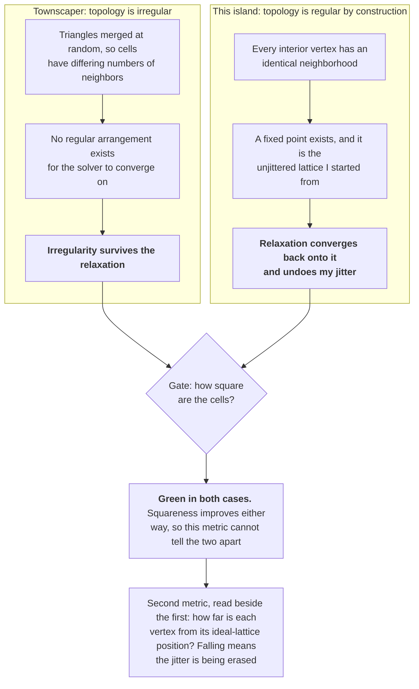
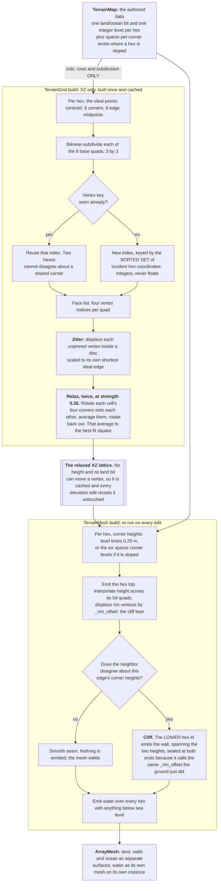
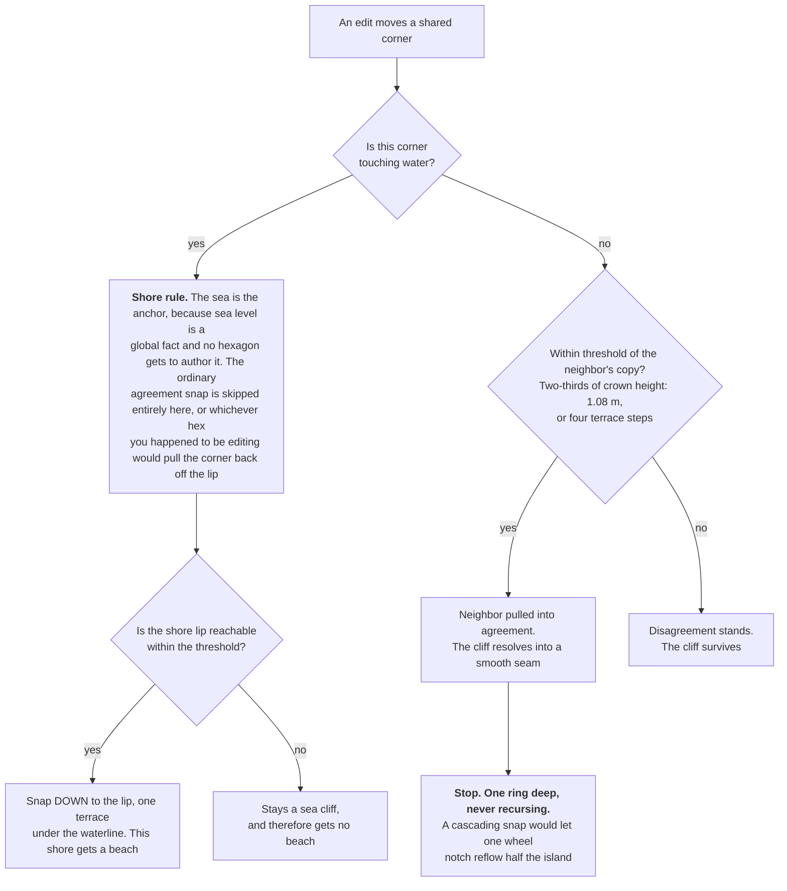
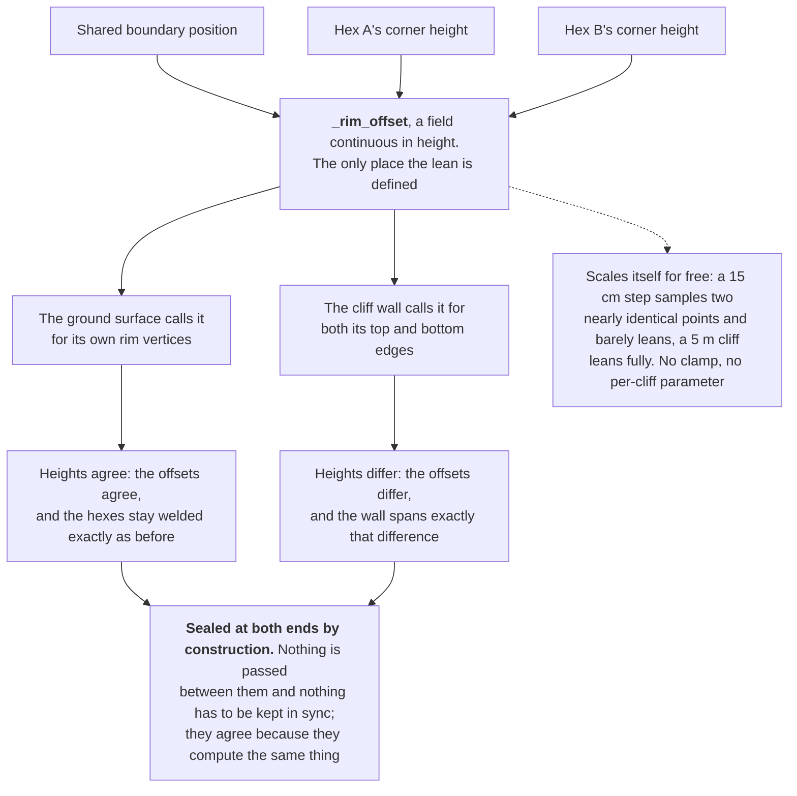
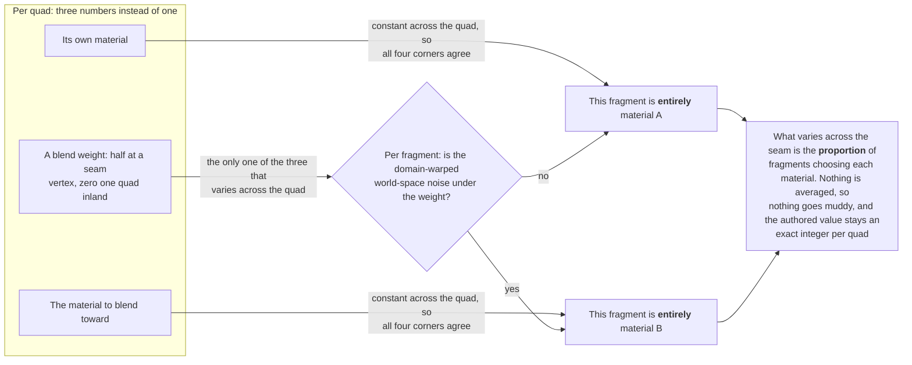
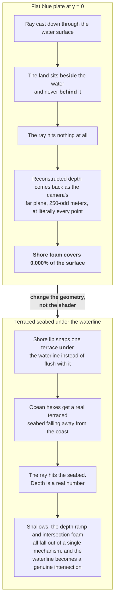
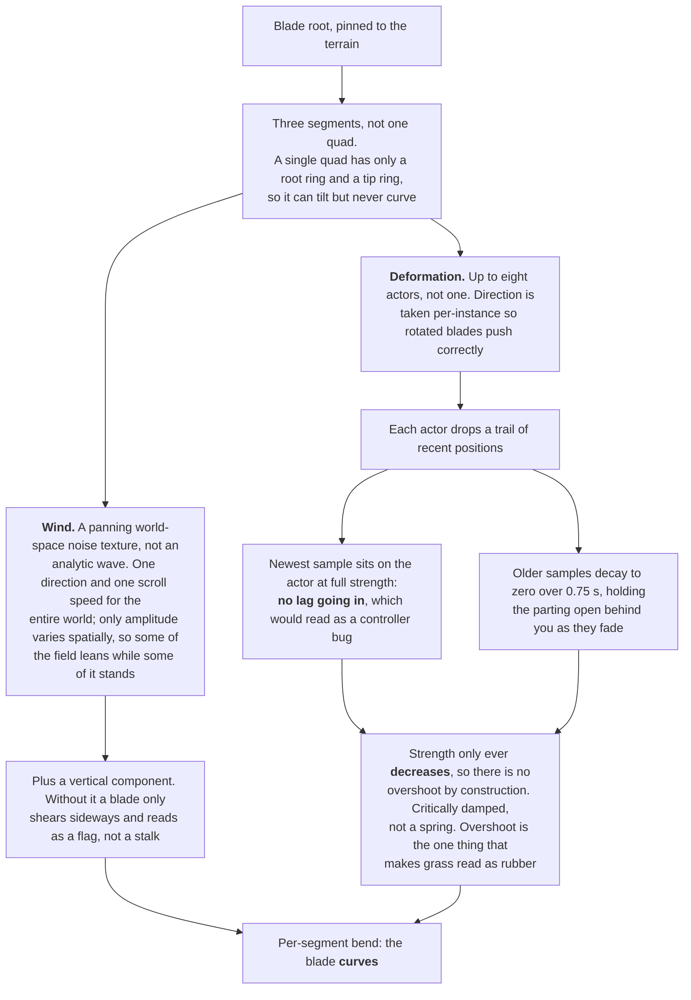
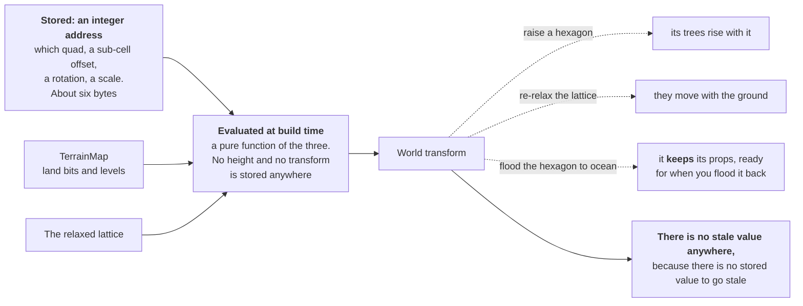
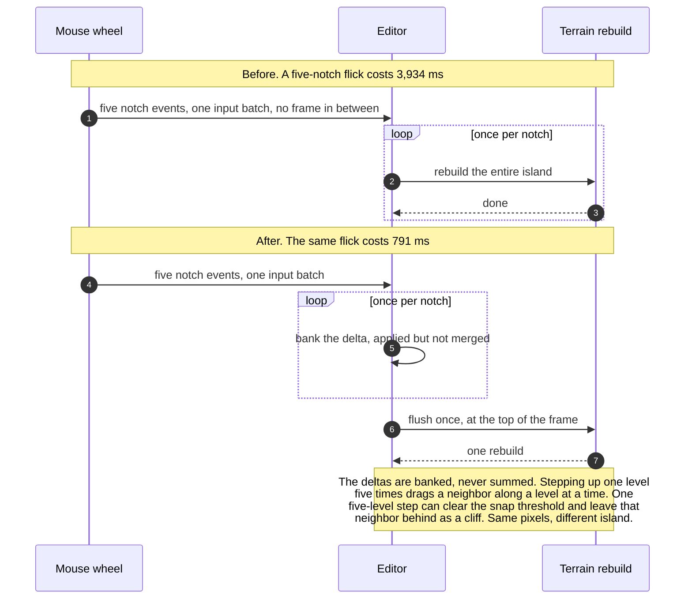

## Introduction

[Last week]() I mentioned the terrain system I was working on, but glossed over it because it was interesting enough to warrant its own post, and now here we are. Good thing, because the terrain system evolved a lot in the past week.

## Where the idea came from

The thing that put me onto this was a video: [_How One Guy FIXED Procedural Generation_](https://www.youtube.com/watch?v=Y19Mw5YsgjI) by Game Dev Buddies, about Oskar Stålberg and [_Townscaper_](https://en.wikipedia.org/wiki/Townscaper), his little town-building toy. If you've played it you know the thing I mean: you click, a house appears, and the streets that emerge are wonky and organic and read as a real Mediterranean hill town. But the whole thing is still a grid underneath, and you can absolutely feel that you're placing tiles.

That video sent me to Stålberg's own talk, [_Organic Towns from Square Tiles_](https://www.youtube.com/watch?v=1hqt8JkYRdI) from IndieCade Europe 2019, and between the two of them I had the technique. The core trick is that the grid isn't square, it's an irregular quad grid: scatter some points, triangulate them, randomly merge pairs of triangles into quadrilaterals, then run a relaxation pass that nudges every vertex toward making its surrounding cells as square as possible. What comes out is a mesh of four-sided cells that are all *roughly* the same size and all *slightly* different. Regular enough to snap things to, irregular enough that your eye stops seeing a lattice.

That's the part I wanted. What I didn't want was the payload. _Townscaper_ is a toy with infinite replayability and no authored content, and every source I read while researching this was selling *variety per run*. I have exactly one island, permanent, identical in every playthrough. So the rule I set was: **take the geometry assembly, refuse the world generation.** How the cells are shaped is a technique. What goes on them is mine.

## The lattice

Here's the model I landed on.

A hexagon carries the authored data: one land-or-ocean bit, and one integer elevation level. That's it. Each hexagon subdivides into 6 base quads (center plus the six edge midpoints), and each of those subdivides again 3×3, so 54 quads per hex. Every quad is about a square meter, which means the subdivision number sets the *hex size, not the quad size*: crank it up and the quads stay 1 m² while the hexagon grows to hold more of them.

That knob matters more than it looks like it should. At one quad per base cell, a 1 km² island needs about 166,700 hexagons, which is more than any human is going to sit down and sculpt. Each step of subdivision cuts that by the square. At the current setting a hexagon is 9.12 m across, which is roughly "one clearing," a comfortable size to click on.

Then every vertex gets jittered (pushed off its ideal position by a random offset) and the whole lattice gets relaxed.

The relaxation is the part I ported most directly from the talk. For each four-sided cell you rotate its corners about the cell's center so all four land on top of each other, average them, and rotate them back out. That average *is* the best-fit square for that cell. Every vertex then moves a fraction of the way toward the average of what all its cells want. Plain [Laplacian smoothing](https://en.wikipedia.org/wiki/Laplacian_smoothing) would just blur the noise; this actually makes the *cells* well-formed, which is what "relaxed" means and what jitter alone can never give you.

### The thing the technique doesn't tell you

I built it, ran it, looked at it, and it was beautiful for about four passes and then it got worse. Not subtly worse. The island slid back toward looking like graph paper the longer I relaxed it.

It took me an embarrassing amount of time to work out why, and the answer is a genuinely interesting property of the method. **Relaxation preserves _Townscaper_'s irregularity because _Townscaper_'s topology is irregular.** When you randomly merge triangles into quads you get cells with differing numbers of neighbors, and there is no regular arrangement for the solver to converge on, so squarifying makes the cells nicer without making the grid uniform.

Mine is perfectly regular by construction. Every interior vertex has exactly the same neighborhood as every other one. So squarification has a target: the perfectly regular lattice I started from and jittered away from. Relax hard enough and it just… undoes my jitter. The technique's whole purpose, defeated by the technique.

Measured on a test fixture, it converges to a fixed point after about 16 passes at roughly half the original cell-shape irregularity, and it does that at *any* strength. Turning the dial down just gets there slower. The knee is at two passes. That's where it sits now.

The lesson I'd hand to anyone else porting this: **a "how square are the cells" metric alone cannot see this failure**, because relaxation improves squareness precisely *by* regularizing. I had that gate. It was green the entire time the thing was going wrong. I now measure "how far is every vertex from where it would have been in a perfect lattice" right beside it, and read the two numbers together.

The two topologies diverge at the second step, and the gate sits below the point where they part:

### The whole pipeline, in one picture

Here's every step from the authored data to the mesh on screen. The rest of this post unpacks the right-hand half; the thing I'd point at first is the split down the middle.

The left half depends only on the map's dimensions. The right half depends on everything you author. That's why raising a hexagon costs a mesh rebuild and not a lattice rebuild, and the lattice is the expensive one.

## Elevation: terraces, cliffs, and one integer

The island is terraced. That was an early call and it has paid for itself about six times since. A hexagon is a flat plate at one integer level; height is `level × 0.25 m`, and there is nowhere in the data model to express anything else.

Two hexagons that disagree about their level is a cliff. The wall between them is geometry generated from the two hexagons' own copies of their shared border vertices. Two that agree is a smooth seam and the mesh just welds. There's no cliff object, no cliff flag, no cliff authoring step. Disagreement is the cliff.

Storing height as an integer level instead of a float has one specific virtue: **an unwalkable step is unrepresentable rather than merely forbidden.** Godot bakes navigation meshes on a voxel grid, and at the cell height this project uses, a riser has to be at or under 0.25 m or at or over 0.35 m, and *never* 0.30 m. At 0.30 m, whether villagers can walk up it depends on what solid geometry happens to sit under the tread. With a float height that's a tuning hazard forever. With `level × 0.25` it isn't a rule anyone has to remember. You can't type it. This is the same move I ended up at in [_27 Survivors_](), where three architectures of careful monster-versus-light logic lost to giving the light a collider and letting the physics engine refuse the illegal state outright.

Slopes exist as the exception, stored sparsely as six per-corner levels for the hexes that need them. The two editing gestures are that split made physical: the plain scroll wheel moves a whole hexagon so it *steps* against its neighbors and a cliff appears; ctrl+wheel moves one shared corner in every hexagon that touches it, so they stay in agreement and the seam stays smooth.

### Snapping

Sculpting purely by cliff gets you a wedding cake very fast. So there's a snap: when an edit leaves a shared corner within a threshold of its neighbor's copy, the neighbor is pulled into agreement, and the cliff resolves into a smooth seam. Small steps consolidate into plateaus and only the real cliffs survive.

The threshold defaults to two-thirds of the player character's crown height, about 1.08 m or four terrace steps, because that's roughly the height a person reads as "step up here" rather than "that's a wall." It's stored in *meters, not in levels*, so the number stays meaningful if I ever retune the terrace step. A threshold in levels would silently start meaning a different physical height.

There's one exception, and it's the whole coastline. At the shore the *sea* is the anchor instead of the hexagon you just edited. Sea level is a global fact, not something a hexagon gets to author, so it can't be pulled. A land corner touching water snaps down to the shore lip, one terrace under the waterline; a corner too high to reach it within the threshold simply stays a sea cliff, and therefore gets no beach. Which is exactly the distinction a coastline wants.

Two things about that are load-bearing and both were bugs first.

A shore corner has to skip the ordinary agreement snap entirely, because running both would let whichever hexagon you happened to be editing pull the corner straight back off the lip. And the shore rule used to exist *twice*, once in the map generator and once inline in the editor, so when the shore moved under the waterline only the generator got updated. The editor's snap-everything command then lifted the entire coastline one terrace, a riser opened all the way around the island, and the water lost the depth its color ramp and foam are keyed on. Two reported symptoms, one duplicated rule. The fix wasn't to correct the second copy, it was to delete it: divergence is now unrepresentable rather than merely repaired. It's the lesson I got the expensive way [rebuilding my Pi cluster on NixOS](), where describing the end state once beat maintaining a careful sequence of steps that had to agree with each other. **Hold onto that shape. It comes back twice more in this post.**

The other is that snapping is one ring deep and never recurses. A cascading snap lets one wheel notch reflow half the island, and an edit tool that does more than you asked isn't a tool. There's a trap on the calling side too, which I'll come back to at the editor: **how many times you run this matters as much as what it does.** Five separate one-level steps and one five-level step produce genuinely different islands.

The whole rule, with the coastline branching off before the ordinary case gets a chance to run:

### Cliffs lean

This one came out of just looking at the thing. Vertical risers everywhere read as extruded, like the island was cut with a cookie cutter. So now every rim vertex is displaced by a function of its position and its own height. The important part is that **the ground and the wall both call the same function.** Nothing is passed between them and nothing has to be kept in sync; they agree because they compute the same thing from the same two inputs.

It's the elevation model extended by exactly one word. Two hexagons always agree about *where* a boundary vertex is and may disagree about *how high*, and that disagreement is the cliff. Now they may also disagree about *where*, by the same mechanism. At a cliff the heights differ, so the offsets differ, and the wall spans the difference. That *is* the lean, and it's sealed at both ends by construction. At a smooth seam the heights agree, the offsets agree, and the hexes stay welded exactly as before.

The riser also scales itself for free. The lean is the difference between two evaluations of a field that's continuous in height, so a 15 cm step samples two nearly identical points and barely leans, while a 5 m cliff leans fully. No clamp, no budget, no per-cliff parameter.

There is only one arrow into the offset, and everything downstream falls out of that:

The interesting part is what the formulation *deleted*. Getting here took four passes, and the three failed ones produced a seam taper, a burial constant, a soffit, an up-facing twin for the soffit, a lighting cheat for that twin, a lip, and a whole corner-symmetry apparatus. Every single one of them existed to patch a seam that this version never opens. **A patch that exists only to undo your own earlier choice is a reason to re-examine the choice.** I got there in the end by asking why the *ground* wasn't distorting along with the cliff, instead of asking how to hide the gap.

## Painting the ground

The artist ask was: paint individual quads with preconfigured materials, get organic-looking boundaries at runtime, and get different footstep sounds and villager travel costs off the same tag.

Storage is dense-per-hex plus sparse-per-quad, the same shape elevation already uses. My first instinct was per-hex only, on the reasoning that ground surfaces don't change at sub-meter scale. Then I measured the hexagon: 9.12 m across. A per-hex surface class cannot express a 1 m footpath *at all*. It isn't a coarser version of the requirement, it's unable to state it. Per-quad it is.

The tag rides along in a spare vertex attribute and joins the mesh's weld key, which turns out to be the whole geometry cost. And the shape of that cost is the nice part: **vertices grow with the _length_ of a painted boundary, not its area.** Big flat regions, which the art direction wants anyway, are nearly free.

### Blending the coverage, not the color

A per-quad tag means every triangle carries one constant value, which gives you hard polygon edges between materials. To soften them the shader needs a second layer to sample, so each quad carries three numbers instead of one: its own material, the material to blend toward, and a blend weight. The first two are chosen per quad so all four corners agree. Interpolating a layer *index* between corners that named different partners would sample a layer neither of them meant. Only the weight varies, and it's half at a seam vertex and zero one quad inland, so the transition band is about two meters wide and resolves to pure material outside it.

Then the trick, which I'm pleased with: **the shader doesn't blend the colors, it blends the coverage.** The weight is compared against world-space noise and each fragment resolves to *one* material or the other. What varies across the seam is the proportion of fragments choosing each one.

Two reasons that's better than a gradient. Nothing is ever averaged, so nothing goes muddy. A straight `mix()` between two swatches produces a midpoint color belonging to neither material, which is worse than a hard line. And the edge stays categorical at every single pixel, so what softens is the *render*, never the data. The authored value is still an exact integer per quad. It just softens into an interlocking contour instead of a fade.

Note that the two material slots never reach the comparison. Only the weight does:

Getting the noise right took three wrong turns, and the useful one is the middle:

- **Raw cellular noise reads as crystalline, not organic:** flat cells with straight polygon edges, which is not obviously an improvement on the straight lattice edge it replaced. A [domain warp](https://iquilezles.org/articles/warp/) bends those edges into wandering contours while keeping the flat interiors that stop the seam degenerating into dither.
- Then I shipped it with the noise cell at 78 cm against a 1.00 m quad, which is wrong in a way that looked fine in code. If a noise cell is about the size of a quad, the noise is near-constant across each quad, so the threshold degenerates into a plain threshold on the *weight*, and the weight's iso-lines inside a quad are straight lines parallel to its edges. **The boundary snapped back onto the lattice**, showing exactly the straight edges the noise exists to hide. Every other assertion about the blend stayed green throughout. The relationship that actually governs it is *cells per transition band*, not cells per quad: I had 2.6 across the band, and there are now about 8.
- And widening the band to fit bigger cells is the wrong fix. I tried it: at a 6 m band the 1 m sand path (the exact feature per-quad painting exists to author) dissolved into a smudge. **The band is fixed by what you need to draw. The noise is what has to move.**

## The sea

The ocean started as a flat blue plate at y = 0. One material, no seabed, done in ten minutes.

The reference I wanted to hit was the classic depth-buffer toon water: see-through shallows, a shallow-to-deep color ramp, foam where the water intersects the land. And it *cannot work* on a flat plate, for a reason that's obvious in hindsight and wasn't at all in advance. **Every one of those effects reads the depth buffer**, and a ray cast down through the water passes below y = 0 and hits nothing, because the land sits *beside* the water and never *behind* it. Mocked up on my actual coastline, the reconstructed water depth came back as the camera's far plane (250-odd meters) at literally every point, and shore foam covered 0.000% of the surface.

The fix was to change the geometry rather than the shader. The shore lip now snaps one terrace *under* the waterline instead of flush with it, and ocean hexes get a real terraced seabed that falls away from the coast. That one change makes shallows, the depth ramp, and intersection foam all fall out of a single mechanism, and it turns the waterline into a genuine intersection instead of two coplanar surfaces butted against each other.

Both versions run the identical shader. The only thing that changed is whether the ray has anything to hit:

The seabed is just terrain. Same lattice, same integer levels, same shader, same blending, tagged as sand. Walls between its terraces, smooth-versus-cliff seams and corner snapping all came free from machinery that already existed and was already under test.

One trap worth writing down for anyone porting water shaders to Godot 4: **4.x is reverse-Z.** The Godot 3.x depth reconstruction, *and* the `vec3(SCREEN_UV, raw) * 2.0 - 1.0` form that most "ported to Godot 4" tutorials on the internet use, both return −0.05 for a wall standing 30 meters away. Only running it through `INV_PROJECTION_MATRIX` gives you 29.98. The wrong form looks completely right, compiles fine, and produces a number.

The beach, by the way, is generated, not painted, and it's the one place I let the island generate anything, because it's a *material*, not a place. Every quad along a land edge that snapped to the water is sand unconditionally; everything else has a chance of sand that falls off with distance from that edge, with the width scaled inversely to the hexagon's own gradient. A flat shore hex gets about a 3.6 m beach; a steep one gets 2.0 m.

## Tall grass

The most recent thing, and the one that changed how the island reads more than anything else on this list.

The inspiration here is a specific shader: [Stylized grass with wind and deformation](https://godotshaders.com/shader/stylized-grass-with-wind-and-deformation/) on godotshaders.com, MIT-licensed, written for Godot 3.2. I didn't port it; I read it line by line and rebuilt it, keeping the mechanisms and dropping the parts that don't fit this project.

**What I took from it.** Wind as a panning world-space noise texture instead of an analytic wave. My first build used a single `sin()`, and the whole field travels in clean parallel bands. It's coherent, and it's mechanical, and it looks like a screensaver. A panning noise gusts: some of the field leans while some of it stands. There's still exactly one wind direction and one scroll speed for the entire world; what varies spatially is *amplitude* only. Then a vertical wind component, without which a blade only shears sideways and reads as a flag, not a stalk. One extra term, disproportionate payoff. And the deformation system: a position, a radius, a falloff, a push strength, with the direction taken per-instance so rotated blades push correctly.

**What I changed, and why it's the interesting one.** The reference author states outright that only one object can affect the grass. That's the one thing this project can't take. With no anonymous NPCs, every bend in this world is *someone you know*, and the read I actually want is seeing the grass part along a path *before* you see who's walking it. A player-only deformer inverts that into "the world responds only to you," which is precisely the opposite feeling.

So it takes up to eight actors, and each one drops a short trail of recent positions whose strength decays to zero over three-quarters of a second. The trail is what buys the recovery curve without needing a render target: the newest sample sits on the actor at full strength (no lag going in; lag on entry reads as a controller bug, immediately), and the older samples hold the parting open behind you as they fade. And because strength only ever *decreases*, **there's no overshoot by construction.** Grass is critically damped, not a spring. Overshoot is the single thing that makes it read as rubber.

A blade is also segmented into three sections instead of being one quad. With a single quad a blade has only a root ring and a tip ring, so *every* bend, wind or trample, pivots it as a rigid dart. It tilts; it doesn't curve. That's the one place in this whole system where I spent triangles instead of saving them.

Everything above lands on the same three segments, and the damping property is a consequence of the trail rather than a curve anyone tuned:

The numbers, for anyone budgeting something similar. Blades sit on a stratified grid at 21 cm mean spacing, batched into `MultiMesh` instances binned by 8 m of world space. That spacing is the artist's, and getting there had one small trap in it: blades sit on a grid, so count goes as *area ÷ spacing²*, and doubling the density means dividing the spacing by √2, not by 2. Halving it would have quadrupled the grass.

Whole island, everything painted: 333,264 blades in 282 bins. At a standing eye height with a 64 m draw distance only a couple of hundred of those bins are inside the radius, and the GPU sees about 150 draw calls. Ten times the grass submits roughly the same per-frame work as one small field, which is the binning doing its job. Doubling the density didn't move the bin count, so it didn't move the frame either.

What *does* scale is build time, and that's the finding: 4.2 seconds to re-emit the whole island, linear in blade count, because rebuilding currently drops and re-emits every bin. That's fine for a test harness and completely unacceptable for a paint tool: repainting one quad must not rebuild the island. It's the next thing on the list for this system, and the density increase made it acute instead of theoretical.

### A bug worth the price of admission

The first version of the grass field derived each bin's bounding box from the bin's key. That's correct for x and z, and completely meaningless for y, because a key says nothing whatsoever about height. So every bin's bounds sat centered on y = 0 while its blades stood on terrain 3 to 11 meters up. **No bin's bounding box contained a single one of its own blades.** Bins were being culled against boxes nowhere near them, and the grass vanished depending on where the camera happened to stand.

It looked exactly like a fade bug. And my test said nothing, because the assertion I'd written was *"the bounding box is set,"* which was true the entire time it was wrong. **Presence was never the property worth checking.** The check now derives the bins itself and asserts that every blade lies inside its own bin's box.

### The same machinery, a second time

The artist wanted growth along the cliff rims, the ragged fringe that stops a terrace edge reading as a cut. Completely different feature from grass, and it turned out to be the same *question*: many small derived objects, visible only near the camera. So it's built on the same shape, and it reads `GrassField`'s LOD constants instead of copying them, with a check that asserts equality, so "the same draw range as tall grass" can't quietly stop being true.

Two mistakes the grass work had already paid for. **The rim had moved:** since cliffs started leaning, the drawn edge is the displaced rim, not the lattice perimeter, so placing on the raw lattice hangs every tuft in mid-air off the lip. And **the distance fade has to shrink, not blend.** Anything fading via alpha or `visibility_range` drops below Godot's opacity threshold, gets forced into the transparent pass, misses the motion-vector branch, and ghosts under TAA for exactly as long as it fades. Opaque geometry, scale-about-root, fade explicitly disabled, asserted, not remembered.

Then the artist looked at the first version and asked for a border instead of a scatter: cylinders lying along the edge, ends touching, each matching the segment it sits on. That changed the model from *points on the rim* to *segments of it*: one cylinder per straight piece of the rim polyline, subdivided toward a target length but never merged across a bend, so a straight cylinder always lies on a straight piece of edge and cannot cut a corner.

**The ends meet because they are the same value, not because two computations agree.** The polyline is built complete (displaced onto the leaned rim, and inset at its *points* instead of per segment, since a per-segment inset parts the joins at exactly the bends where a border most obviously must not) and only then cut into pieces. Adjacent segments share an endpoint by construction.

One rule fell out that I wouldn't have predicted: **length must never carry a random factor.** Girth can vary; length belongs to the span it covers. Red-tested: multiplying length by the same factor that varies girth takes dangling ends from 5.9% to 90.4%. About a thousand segments around the current island, still green placeholder cylinders until the real art lands.

## Props are authored data, not output

The last piece is scatter: trees, rocks, the stuff that makes a hillside a place instead of a slope. There's a brush with a radius and a spacing, and a per-object tool for nudging individual things until they're right.

The rule the whole thing is built around: **the brush is an input device, not a generator.** The dice are rolled while you're painting, and only the *outcome* is ever stored. There is no seed anywhere in the map, and there is no re-roll button. That distinction is the entire difference between "I placed these trees" and "the computer placed these trees and I can't argue with it."

The stored record is an integer address: which quad, plus a sub-cell offset, a rotation, and a scale. About six bytes. Notably it does *not* store a height, or a transform. A prop's position in the world is a pure function of the map, the lattice, and the record, computed at build time. Which means: raise a hexagon and its trees rise with it. Re-relax the lattice and they move with the ground. Flood a hexagon to ocean and it *keeps* its props, ready for when you flood it back. There's no stale value anywhere, because there's no stored value to go stale.

Three inputs, one arrow out, and nothing on the right-hand side ever written back:

Props snap to quad centers only, never to vertices, and the reason is a measurement I didn't expect: about 20% of the lattice's points carry more than one height, and every single one of them is on a hexagon perimeter. That's the cliff wall system doing exactly what it should, and it means a prop anchored to a perimeter vertex sits half-buried in a cliff face.

Two more things the tool taught me by being rendered instead of reasoned about. The authored minimum-spacing figures were *lying about their own assets*: a 3.57 m boulder had been authored at 1.8 m separation, so brushed rocks interpenetrated into dark clumps on the first render, and every entry's footprint is measured from the actual mesh now. And 4% of the relaxed quads turn out to be non-convex, a few with their centroid outside the rendered surface entirely. Relaxation optimizes cell *shape*, and convexity was never something I'd asked it for. Those needed a fallback anchor before "the prop is inside its own cell" could be claimed at all.

## The editor

All of this is driven from a map editor, which is its own scene in the game instead of a Godot editor plugin. That was a real decision and I'd make it again: a plugin runs `@tool` code on the editor's main thread, so a 355 ms rebuild becomes a 355 ms editor freeze, and a crash takes the Godot editor down with all my unsaved scenes. A separate process can hang, crash, or be killed at zero cost. The camera controls are deliberately a copy of Godot's own freelook, because I live in that editor daily and it costs nothing to learn.

Three bugs from it that I think are generally instructive.

**WASD did nothing.** The fly camera was reading Godot's built-in `ui_left`/`ui_right` actions, which are bound to the arrow keys, while the on-screen readout cheerfully advertised WASD. Nothing could have caught this: the code was valid, the readout was a string, and no assertion connected the two. A user who presses the advertised key concludes the tool is broken. The check now presses every advertised movement key through Godot's real input pipeline and asserts the camera moves the advertised direction, so the *binding* is under test, not my intent. Every button caption in the tool is now generated from the same table that binds the key, so a caption that lies about its shortcut isn't expressible.

**Scrolling to raise a hexagon froze the tool for seconds.** I assumed snapping; snapping measured at 0.1 ms. The actual cause is that a notched mouse wheel sends one event per notch, all in a single input batch with no frame in between, and each notch rebuilt the entire island. A five-notch flick: 3,934 ms. Edits are now banked and flushed once at the top of the frame, giving 791 ms for the same flick. The care in that fix is that the deltas are *not summed*: stepping +1 five times drags a neighbor up a level at a time, while one +5 can clear the snap threshold and leave that neighbor behind as a cliff. Same pixels on screen, different authored island.

**The wireframe overlays had been floating off the ground for four days.** Teaching the rim to lean touched the function that emits the surface. The hex-border and quad-wireframe overlays are drawn from a *second* copy of the same arithmetic, which never got the change. So every overlay near every cliff sat off the ground by up to the lean amplitude, and I'd been looking at it the whole time. The file containing both copies literally says, in a comment, *"an overlay that lies is worse than none, because it will be believed,"* and it happened anyway, because the warning was attached to the intent and not to the structure. Fixed at the cause: the displacement lives in one function now and the other delegates to it, so they can't disagree by construction rather than by discipline.

The gate that should have caught that was itself asserting the stale premise, *"every hex-border endpoint sits on an exact lattice point,"* true only while the surface and the lattice coincided. It compares against the shipped surface now, and I red-tested it by leaving the surface leaning and pinning only the overlay: 7,056 stray endpoints, which it caught.

That's the third time in this post: the shore rule in two places, the ground and the wall agreeing about the lean because they call one function, and now this. **When two functions compute the same thing and only one gets updated, the check between them is usually written in the vocabulary of the old agreement.** The version that works isn't a better test. It's not having two copies.

(The hover cursor got fixed in the same pass. It was a fixed-radius ring, and the artist reported both of its failures: it hid the hex it was meant to indicate, and it clipped into the ground. One cause: a disc at one radius and one height cannot describe a cell that is neither round, nor flat, nor level. A hex on a relaxed lattice is a bent hexagon whose six corners sit at six different heights, so the only shape that fits it is its own perimeter, which is what it draws now.)

And the one I'm fondest of, from the terrain harness and not the editor: I added an FPS counter to the corner of the screen and it immediately reported 6 fps. Picking a hexagon under the mouse was calling a brute-force scan once per hexagon, making it quadratic, at 180 ms a frame with 576 hexes. Screenshots had never shown it, and I'd been using the tool for days. It's now a closed-form calculation at 0.15 ms, and the brute-force version is still in the file as the oracle the fast path gets tested against.

## Where it stands

The island can be sculpted, terraced, snapped, painted with three materials, planted with grass, bordered along its cliff rims, scattered with props, saved to disk, and walked around at eye height with the real player rig. There's a check suite that runs headless and catches the regressions, plus a screenshot pipeline so I can look at the thing from a script instead of by flying around.

What's left before I'd call terrain done: incremental rebuilds, so painting one quad doesn't re-emit the island. That's the four-second stall and it's first. Occlusion culling, which the terracing was designed for and which currently doesn't exist. Chunking and streaming. Trading the triangle-mesh collider for a heightmap, which the terracing legalizes, because a terraced island has no overhangs, so the render surface can stay irregular while the collider gets simple.

## Done for now

The funny thing is that after 4–5 days of working on nothing but terrain I had to force myself to stop and call it good enough, which, as I've written about [when I built a book nook for my mom](), is very difficult for me to say. Nothing is ever perfect and I instinctively want to chase that perfection anyway. I had to put myself in the shoes of a past manager and declare it not worth more time to improve, because of diminishing returns versus real priorities. I've made it a goal to have a full Boba Island demo ready in time for the autumn 2026 NextFest on Steam, and the scope of that demo is the early game, so the terrain won't be anything more than backdrop.

## Actually useful progress

To make up for the days spent going down an interesting rabbit hole, I built up prototypes of the drink-making mechanic that is the core gameplay and the cart the player starts the game with, two key elements for that NextFest demo. I also got a little distracted on Saturday and built a prototype for a fishing minigame, since it seems every cozy game has fishing somewhere. A creative soul cannot be bound to a roadmap for too long.
